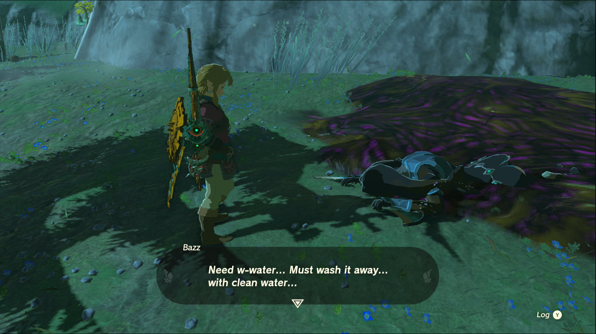
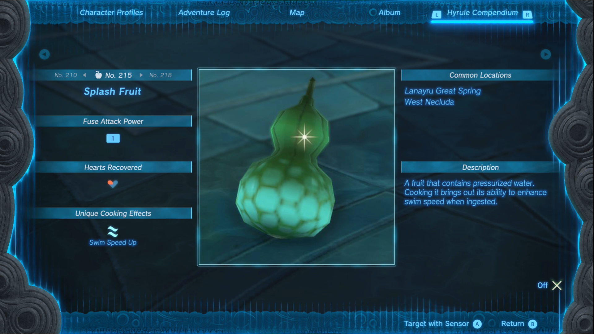
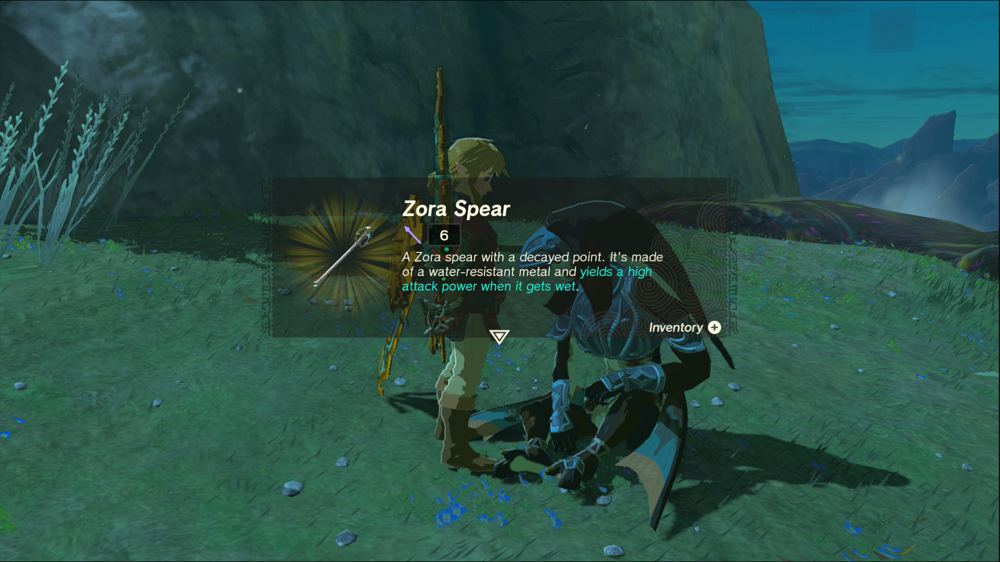

Mired in Muck is one of the Side Quests you’ll discover in the Lanayru Great Spring region. Side Quests are quests in The Legend of Zelda: Tears of the Kingdom that are relatively short or simple chores that can earn you small rewards or services. 

## Mired in Muck

To start the Side Quest “Mired in Muck” you need to head to the Lanayru Great Spring region. 

Just in front of the skyview tower, you’ll see a zora named Bazz stuck in some muck, just like the tower itself. Speaking to him reveals that he just needs some water to clean off the sludge. There are a few solutions to this problem, like using an opal-fused weapon, or a hydrant Zonai device. 

If you have neither of those, there are a few Splash Fruit growing around you and Bazz. Gather them and throw them at Bazz, and the tower if needed, to free them from the muck. Speak to him once he’s free to receive a Zora Spear for your assistance. 

You can also use employ the same method you used to free Bazz to clear up the muck around the Skyview Tower. 

Mired in Muck

See the complete List of Side Quests and Side Adventures

### Up Next: Walkthrough

Previous

About IGN's Zelda TotK Guide Writers

Next

Walkthrough

### Top Guide Sections

  * Walkthrough
  * Zelda: Tears of The Kingdom Switch 2 Edition Guide
  * Zelda Notes Voice Memories
  * List of Side Quests and Side Adventures

### Was this guide helpful?

Leave feedback

Go to comments