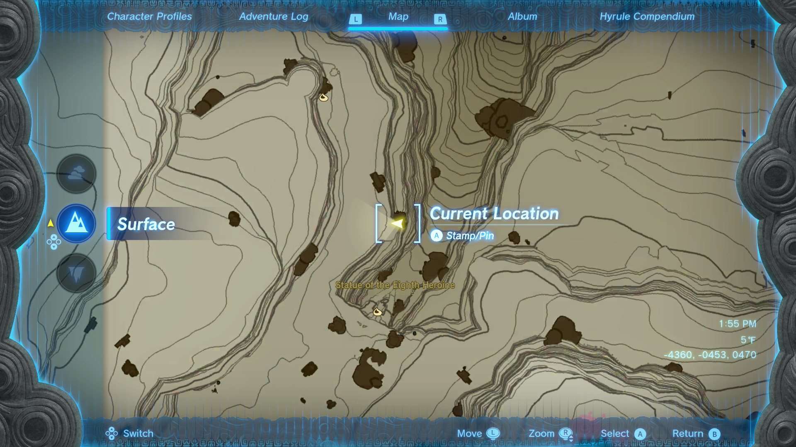

Misko has dropped his treasures all over Hyrule, but the Heroines Manuscript will help you find them. Well, one of them, at least. Here's how to complete **Misko's Treasure: Heroines Manuscript** in The Legend of Zelda: Tears of the Kingdom. 

## Misko's Treasure: Heroines Manuscript Walkthrough

To unlock the Heroines side quest, speak to Domidak at the **Cephla Lake Cave** after completing the Misko's Cave of Chests quest. Pay him the 100 rupees he asks for, and he'll tell you what the Heroines Manuscript says. Beware that you need to ask for **the heroine statues** to start this quest, as the others will either begin the Misko's Treasure: Pirate Manuscript quest or the Misko's Treasure: Twins Manuscript quest. 

Misko's treasure is inside the **Statue of the Eighth Heroine Cave** in the Gerudo Highlands, at the start of the canyon just north of the Otutsum Shrine. You'll find the cave entrance at coordinates -4364, -0504, 0465. 

Beware that this cave only opens after you solve a puzzle, which requires the use of a Zonai Mirror. To obtain a stack of three mirrors, open the treasure chest on the nearby ledge (coordinates -4360, -0453, 047). 

With the Zonai Mirrors in your pocket, look towards the large yellow panel on the Statue of the Eight Heroine's chest (stay on the same ledge!), then redirect a beam of sunlight onto this panel by holding up a mirror. This only works if it's **noon** \- if you need to skip some time, make a campfire from wood and flint. 

The panel will turn green, and the Statue of the Eighth Heroine Cave will open. 

After defeating some enemies inside, approach the little shrine and clear the sand using the nearby Zonai Fan or a Korok-Frond Guster. Open Misko's treasure chest to obtain Tingle's Hood and complete Misko's Treasure: Heroines Manuscript. 

Misko's Treasure: Heroines Manuscript

See the complete List of Side Quests and Side Adventures

### Up Next: Walkthrough

Previous

About IGN's Zelda TotK Guide Writers

Next

Walkthrough

### Top Guide Sections

  * Walkthrough
  * Zelda: Tears of The Kingdom Switch 2 Edition Guide
  * Zelda Notes Voice Memories
  * List of Side Quests and Side Adventures

### Was this guide helpful?

Leave feedback

### In This Guide

The Legend of Zelda: Tears of the KingdomNintendo EPD

Initial Release: May 12, 2023

Learn more

Go to comments