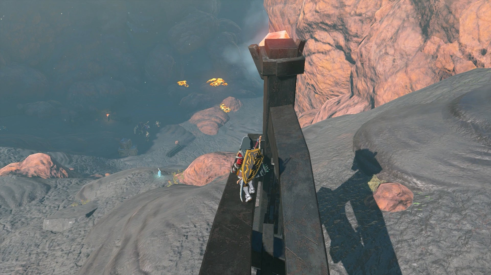
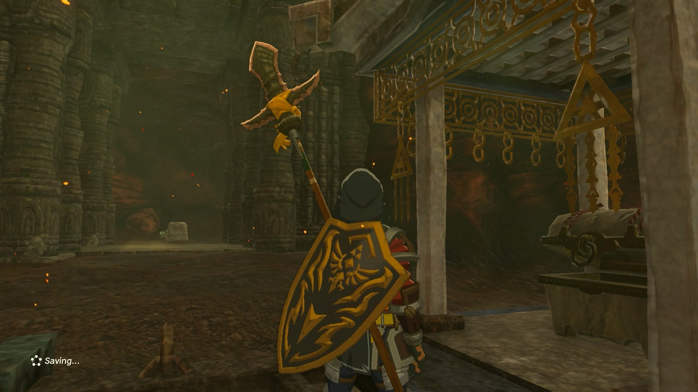
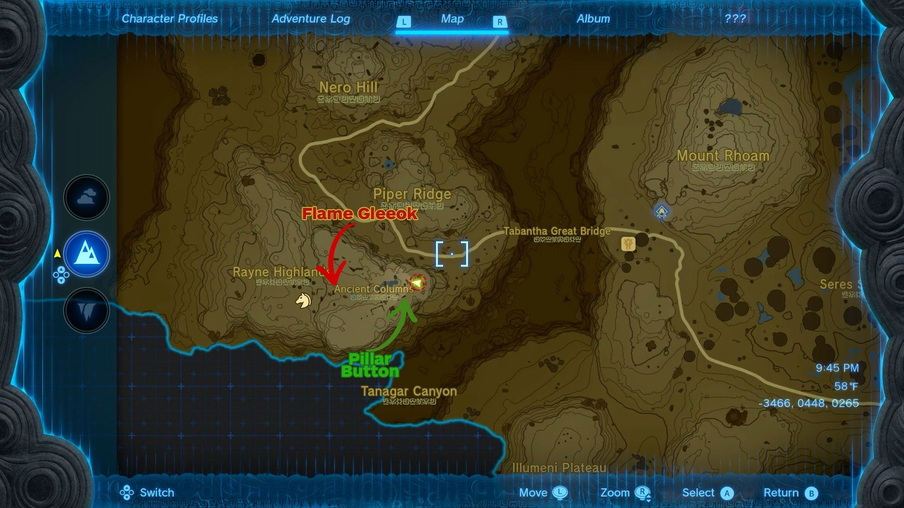
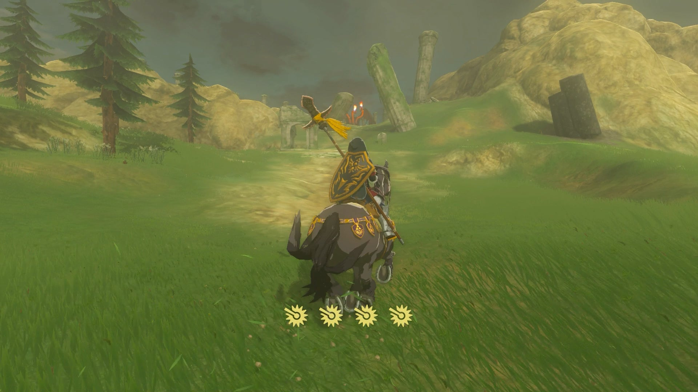
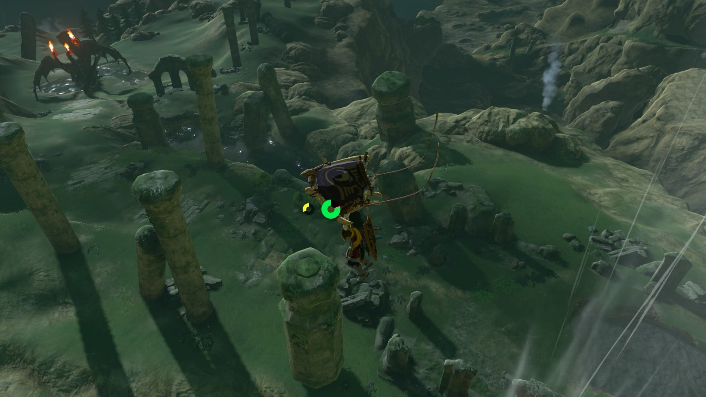

**Misko's Treasure of Awakening I** is one of the Side Quests associated with the Great Bandit Misko and his riddles. This collection of quests will lead you to different pieces of the Armor of Awakening Set. 

  * **Quest Giver:** Misko's Letter
  * **Prerequisites:** N/A
  * **Reward:** Tunic of Awakening

The first part of Misko's Treasure of Awakening questline, to unlock this quest, you need to clear the **Goronbi River Cave** in the western part of Eldin. 

First, travel south from Goron City until the road splits in two, then walk past the two Goron merchants in the west. Look down from the cliffs to see the cave entrance below, at coordinates 1415, 2106, 0287. 

Defeat the Horriblin and Fire Like inside, and use the floating platforms to ride the river lava until you spot an opening on the right near the end of the cave. This leads to one of Misko's armor treasure chests, and holds the Ember Shirt \-- but it will also make the stone wall next to you disappear, revealing a stone slab with writing. Interact with this slab to read a riddle that starts Misko's Treasure of Awakening I. 

The riddle from Misko will read: 

"On the Tabantha Frontier, where Rayne, Piper, and Tanagar meet, ruined pillars stand together. One of those mighty pillars opens the way to my treasure."

If you look at your map of the Tabantha region in northwest Hyrule, you'll find that Rayne Highlands, Piper Ridge, and Tanagar Canyon form a triangle around a bluff known as the Ancient Columns, south above the road past Tabantha Great Bridge. 

The treasure, Misko's Tunic of Awakening, is inside the **Ancient Columns Cave** in the Hyrule Ridge and Tabantha Frontier region. To find your way to the cave, you can either ride along the road until it curves and head around the bluff to go up the slope in the Rayne Highlands, or if you can warp to the Sky Islands above, you can drop in from there. 

The area is guarded by a Flame Gleeok, so if you approach the Ancient Columns from the front, you might run into it and be locked into a tough fight. Luckily, there are ample rocks along the right of the ruins to climb around and bypass the Gleeok entirely. 

Check out our Flame Gleeok guide for some tips to help you out in the fight!

There are quite a few columns here, but only one correct one. The column you’re after has a button on top. You can find the right column near the edge of the cliff pointing toward Tabantha Bridge Stable. 

**Ancient Column Cave coordinates** : -3484, 0421, 0292. 

Stand on the pressure plate to open the entrance to the Ancient Columns Cave. Drop in to claim your reward: The Tunic of Awakening. Be sure to also read the stone slab next to the chest, as it will start Misko's Treasure of Awakening II! 

If you need more help finding the correct spot, use our Tears of the Kingdom interactive map. 

Misko's Treasure of Awakening I

See the complete List of Side Quests and Side Adventures

### Up Next: Walkthrough

Previous

About IGN's Zelda TotK Guide Writers

Next

Walkthrough

### Top Guide Sections

  * Walkthrough
  * Zelda: Tears of The Kingdom Switch 2 Edition Guide
  * Zelda Notes Voice Memories
  * List of Side Quests and Side Adventures

### Was this guide helpful?

Leave feedback

### In This Guide

The Legend of Zelda: Tears of the KingdomNintendo EPD

Initial Release: May 12, 2023

Learn more

Go to comments