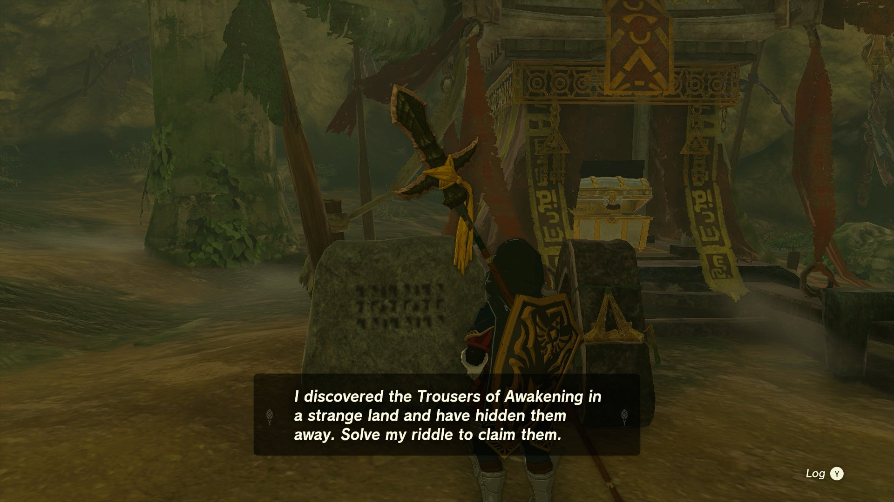
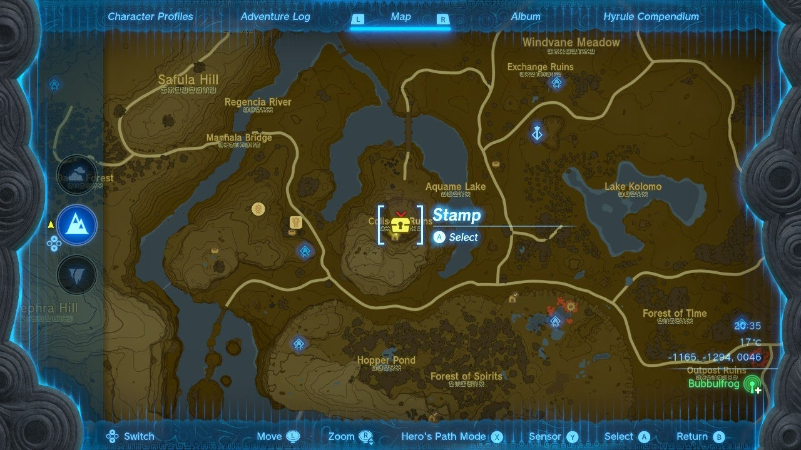
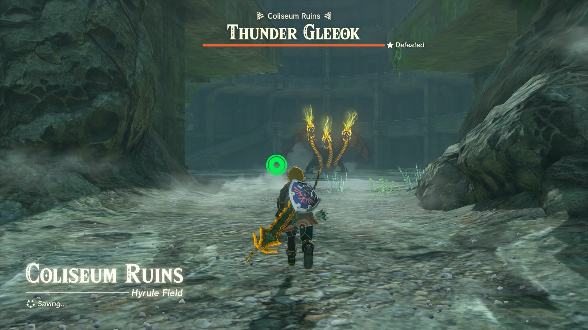
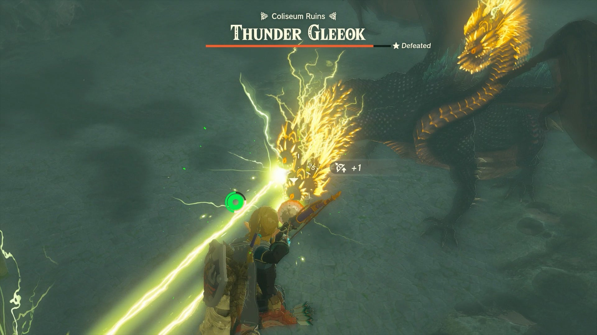
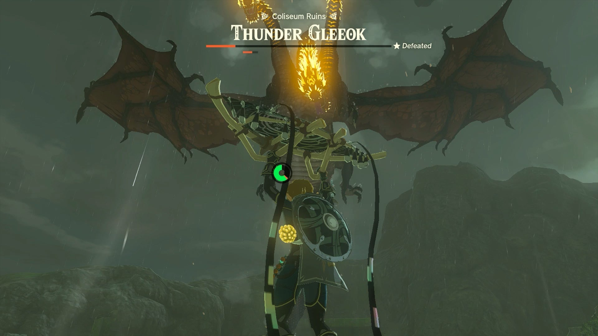
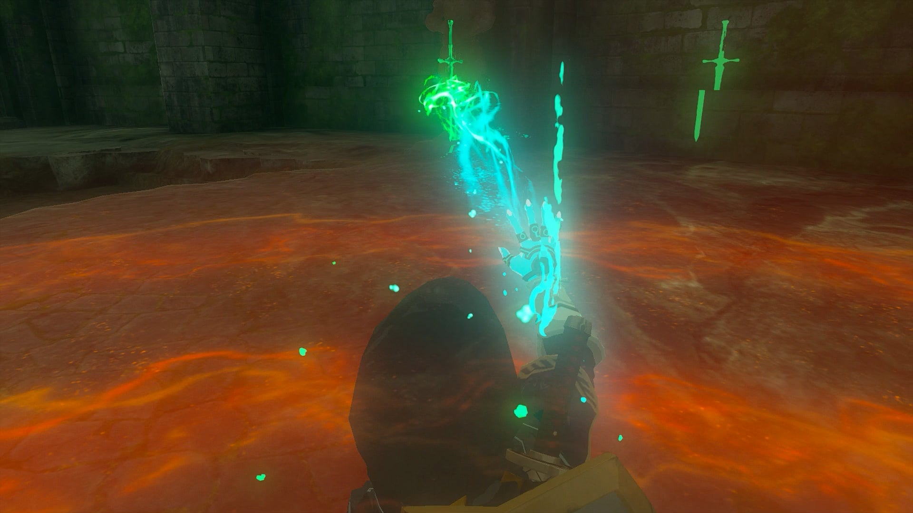
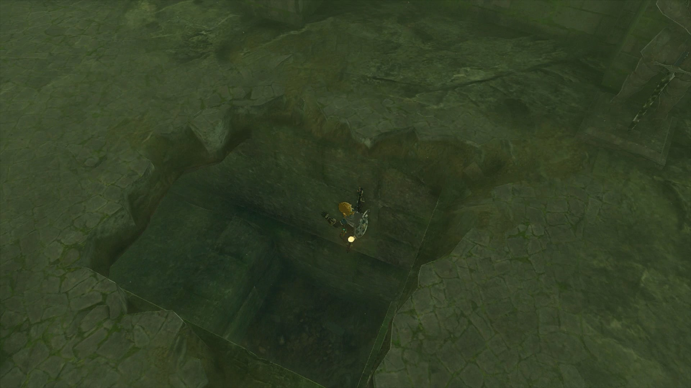
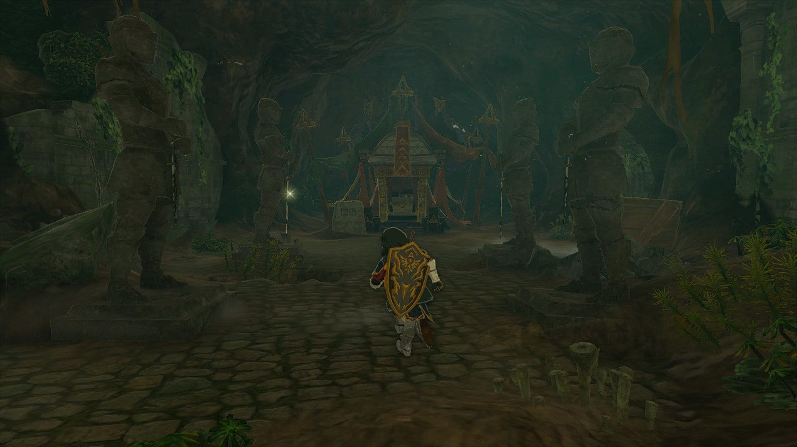

**Misko's Treasure of Awakening II** is one of the Side Quests associated with the Great Bandit Misko and his riddles. This collection of quests will lead you to different pieces of the Armor of Awakening Set. 

  * **Quest Giver:** Misko's Letter
  * **Prerequisites:** Misko's Treasure of Awakening I
  * **Reward:** Trousers of Awakening

The second part of Misko's Treasure of Awakening questline, this quest is unlocked from finding the first piece of Awakening Armor underneath the Ancient Columns in the Tabantha Region, which is guarded by a Flame Gleeok. Next to the chest is another one of Misko's riddles on a stone slab 

The riddle Misko gives you on the second leg of the Armor of Awakening treasure hunt reads as follows: 

"In the ruins of Hyrule Field, where warriors once tested themselves in battle, offer your soldier’s claymore to the two sculpted soldiers. The sword will point the way to my treasure."

The location Misko is hinting to is the Coliseum Ruins in South Hyrule Field. You can get there by gliding southwest from Hyrule Field Skyview Tower, or by riding northeast from Outskirt Stable. 

**Coliseum Ruins coordinates** : -1173, -1310, 0046. 

The Coliseum Ruins are guarded by a Thunder Gleeok, so you will have to come prepared for a fight with a good stash of strong weapons and eyeballs. 

If you would like a full walkthrough on how to take down a Thunder Gleeok, check out our Thunder Gleeok guide.

As a general tip, be prepared to deal with a lot of electric damage, so wear the Rubber Armor Set or the Lightning Helm to increase your defenses (or the Charged Armor Set to raise your damage) as well as eating appropriate foods. Target each of its heads with a powerful bow and arrows fused with Keese or Aerocuda Eyes to quickly bring the beast down, and use the Coliseum's many pillars to avoid its laser beams. You can also ascend up the floors to jump off to increase you slow-down time to aim with arrows. 

Once low on health, it will take high into the sky, and you'll need to dodge lightning strikes while using air gusts to paraglide up high enough to reach it, and fire another homing salvo at its heads to defeat it for good. 

Once you clear out that nasty enemy, make your way over to the southern wall where you will find two soldier sculptures. Pick up the Soldier’s Claymore lying on the ground beside the soldier on the right and place it back on the statue. 

As soon as you place the sword back in its rightful place, a large hole will open up in the ground leading to the Coliseum Ruins Cave. 

It's technically possible to do this without fighting the Gleeok, but the puzzle won't trigger if you're in combat, which will require you to quickly sneak in before the Gleeok notices you.

Drop down into the cave below to find the treasure chest containing Misko’s treasure: The Trousers of Awakening. Be sure to also read the stone slab next to the chest, as it will start Misko's Treasure of Awakening III! 

Misko's Treasure of Awakening II

See the complete List of Side Quests and Side Adventures

### Up Next: Walkthrough

Previous

About IGN's Zelda TotK Guide Writers

Next

Walkthrough

### Top Guide Sections

  * Walkthrough
  * Zelda: Tears of The Kingdom Switch 2 Edition Guide
  * Zelda Notes Voice Memories
  * List of Side Quests and Side Adventures

### Was this guide helpful?

Leave feedback

### In This Guide

The Legend of Zelda: Tears of the KingdomNintendo EPD

Initial Release: May 12, 2023

Learn more

Go to comments