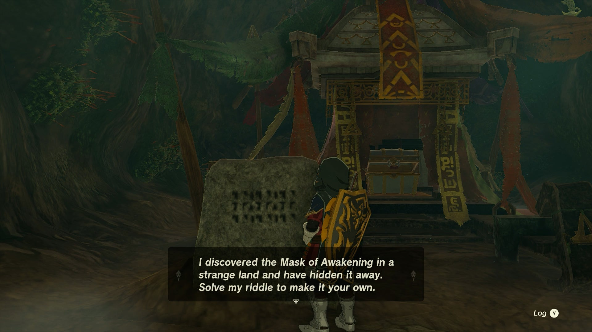
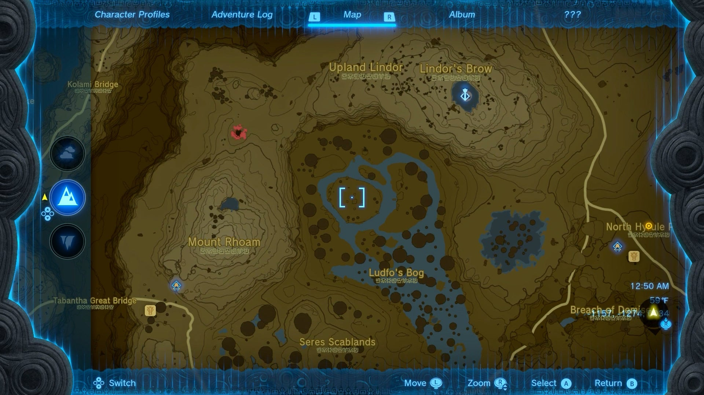
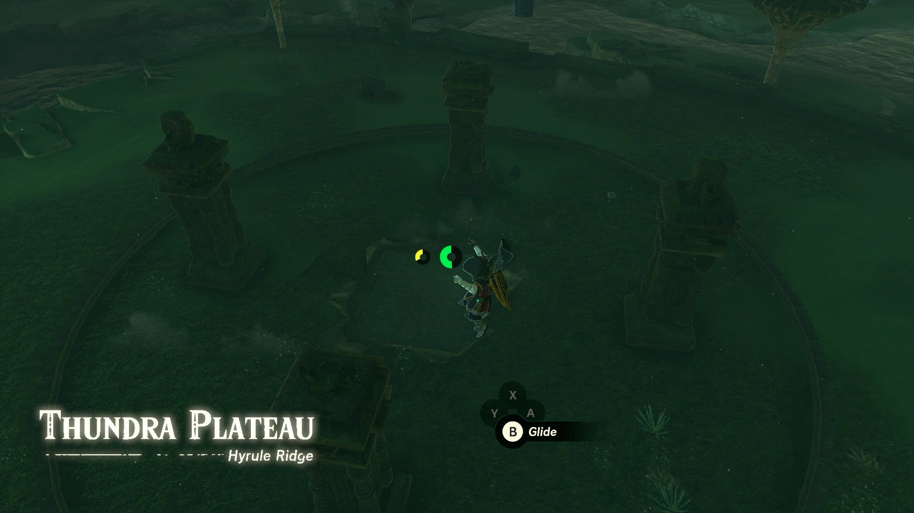
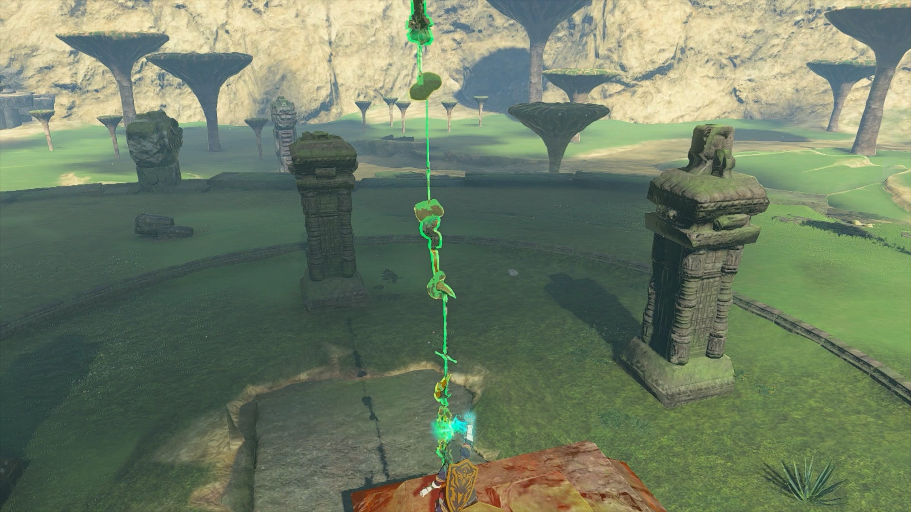
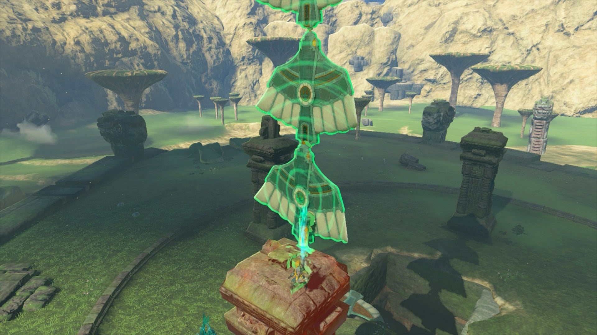
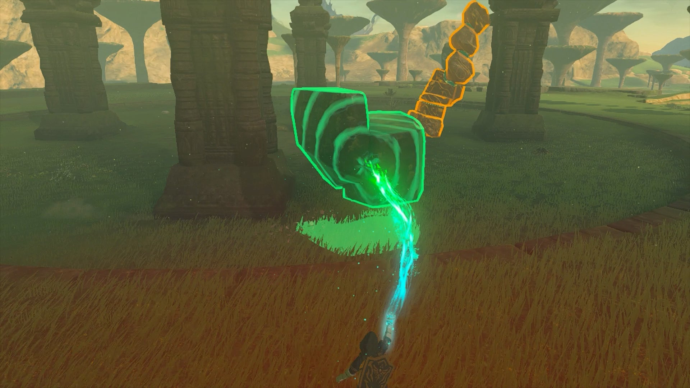
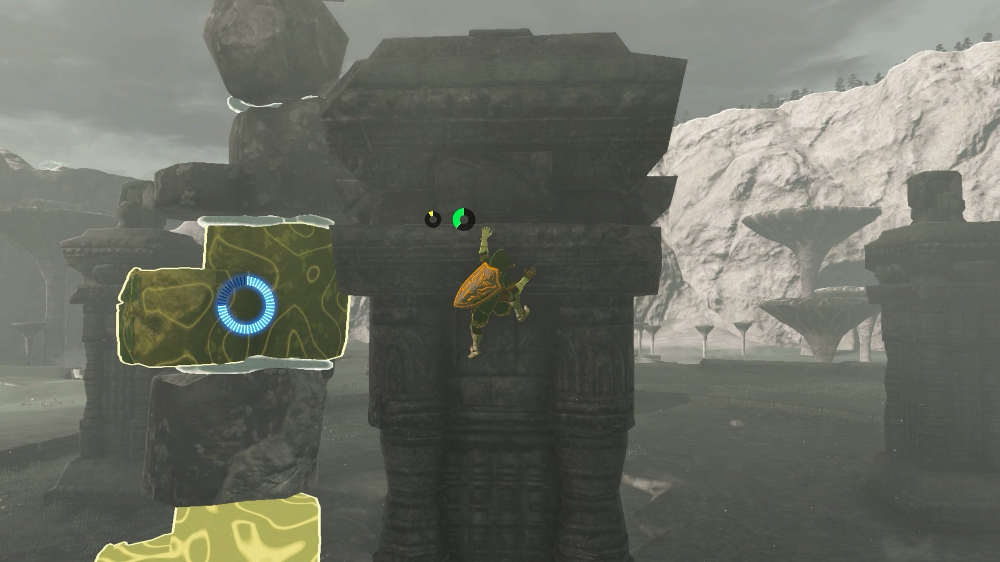
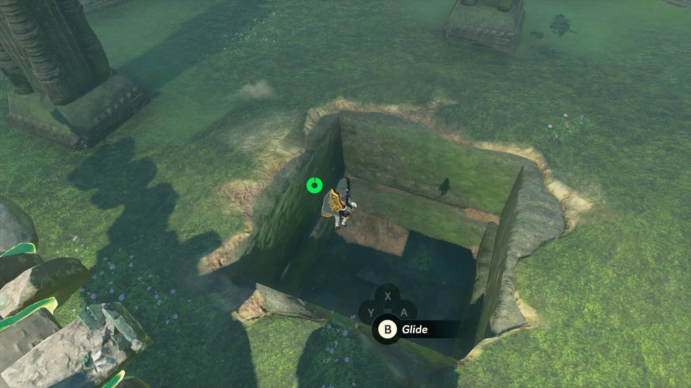
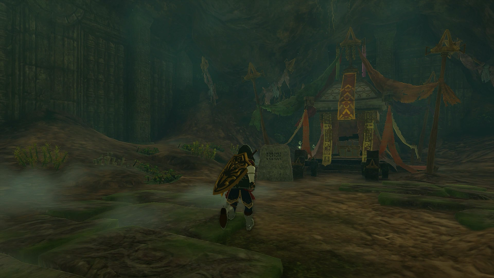

**Misko's Treasure of Awakening III** is one of the Side Quests associated with the Great Bandit Misko and his riddles in The Legend of Zelda: Tears of the Kingdom. This collection of quests will lead you to different pieces of the Armor of Awakening Set. 

## Misko's Treasure of Awakening III Quest Walkthrough

  * **Quest Giver:** Misko's Letter
  * **Prerequisites:** Misko's Treasure of Awakening II
  * **Reward:** Mask of Awakening

The final part of Misko's Treasure of Awakening questline, this quest is unlocked from finding the second piece of Awakening Armor underneath the Coliseum Ruins in southwestern Hyrule Field, which is guarded by a Lightning Gleeok. 

Once you obtain the armor, a stone slab next to the chest contains the clue for the final piece: 

"On Hyrule Ridge, in Ludfo's land, ruins sleep beneath the towering mushroom trees. Connect the southern column's midday shadow to the northern. At the shadow's center, the way to may treasure will open."

This is easily the most craftiest of Misko's riddles, but the good news is that no fighting will be required. You can find the spot the riddle references at the Thundra Plateau at the northern end of Ludfo's Bog in Hyrule Ridge, which you can easily glide down to from the Lindor's Brow Skyview Tower to the northeast. 

When you arrive at the plateau, you'll find four large columns surrounding a square patch in the middle. Be sure to double check which column is the southern one, as you'll need to work around it to solve the riddle. 

In essence, you need to create something with a long enough shadow to link the southern column's shadow to the northern column around noon, but how you do so is entirely up to you. There are multiple ways to solve this puzzle, but you'll likely need to combine a lot of items to create something with a very tall shadow, and then stand atop the pillar while holding it up to try and connect its shadow to the northern pillar. 

Here are a few different ways you can do this: 

  * With enough weapons in your inventory, you can try using Ultrahand to create one very long spear. However, you'll probably need Hestu to give you a ton of inventory space, and you'll need long spear weapons to make this work. They may also be prone to falling apart, so handle with care!

  * An easy way to solve this riddle is to pull out 5 or so Zonai Wing Devices, and Ultrahand them from front to back to create a pillar of wing gliders. You can also use a single Zonai Stake to embed into the top of the pillar, and attach the devices to it so that it can stand on its own.

  * If you lack tools, you can still look around your surroundings to get what you need, though it may take time to assemble. The Sky Ruins above should be periodically dropping chunks of ruins down that you can glue together, and combine with with the various large boulders found around the plateau.

Remember that if you need help holding the pillar of connected items up properly, you can lift it into the air, then swap to Recall to hold it in place while you climb to the top of the pillar, repeat the process, and then use Ultrahand to grab it from the bottom so it can easily be raised higher. Be sure to give yourself enough time to construct your device before noon, and create a campfire if needed by tossing some wood on the ground and lighting it on fire. 

The shadows don't need to touch at Noon on the dot, so you'll have some wiggle room as long as the southern pillar's shadow is easily connected through your creation to reach the nothern pillar. It may take a bit of wiggling for the puzzle to solve, so if nothing happens, confirm the shadows are connected, and move it around the edges of the pillar you are on until it clicks and a cutscene begins. 

Done correctly, an opening will appear in the middle of the Thundra Plateau, revealing the Thundra Plateau Cave. Drop down, and you'll find the final chest holding the Mask of Awakening, and one last congratulatory message from Misko himself! 

Misko's Treasure of Awakening III

Looking for even more The Legend of Zelda: Tears of the Kingdom Guides? Why not check out... 

  * List of Side Quests and Side Adventures
  * All Shrine Locations and Solutions
  * Walkthrough

### Up Next: Walkthrough

Previous

About IGN's Zelda TotK Guide Writers

Next

Walkthrough

### Top Guide Sections

  * Walkthrough
  * Zelda: Tears of The Kingdom Switch 2 Edition Guide
  * Zelda Notes Voice Memories
  * List of Side Quests and Side Adventures

### Was this guide helpful?

Leave feedback

### In This Guide

The Legend of Zelda: Tears of the KingdomNintendo EPD

Initial Release: May 12, 2023

Learn more

Go to comments