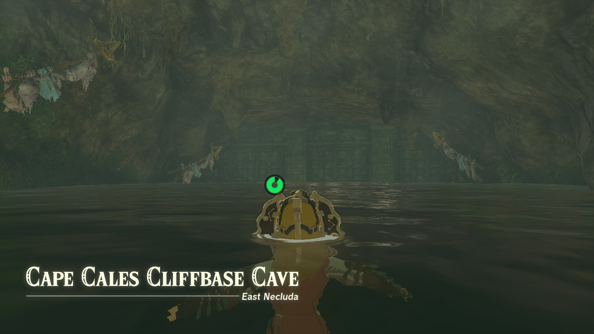

The bandit Misko has hidden valuable treasures all over Hyrule, and the Pirate Manuscript will help you find one of them. As you may find the riddle on the manuscript a bit difficult to decipher, here's how to complete **Misko's Treasure: Pirate Manuscript** in The Legend of Zelda: Tears of the Kingdom. 

## Misko's Treasure: Pirate Manuscript Walkthrough

To unlock this side quest, speak to Domidak in front of the **Cephla Lake Cave** after completing the Misko's Cave of Chests side quest. You'll have to pay him 100 rupees in return for the pirate manuscript. Beware that Domidak offers three different manuscripts, but you need to pick **the pirate cavern** to start this quest, as the others will either start the Misko's Treasure: Twins Manuscript quest or the Misko's Treasure: Heroines Manuscript quest. 

You can find the pirate treasure inside the **Cape Cales Cliffbase Cave** in East Necluda, at coordinates 3645, -3217, -0001. The entrance is blocked, but it will open up if you **whistle** (same as calling your horse). 

Defeat the enemies inside and open the treasure chest to receive Misko's treasure: Tingle's Tights. 

Misko's Treasure: Pirate Manuscript

See the complete List of Side Quests and Side Adventures

### Up Next: Walkthrough

Previous

About IGN's Zelda TotK Guide Writers

Next

Walkthrough

### Top Guide Sections

  * Walkthrough
  * Zelda: Tears of The Kingdom Switch 2 Edition Guide
  * Zelda Notes Voice Memories
  * List of Side Quests and Side Adventures

### Was this guide helpful?

Leave feedback

### In This Guide

The Legend of Zelda: Tears of the KingdomNintendo EPD

Initial Release: May 12, 2023

Learn more

Go to comments