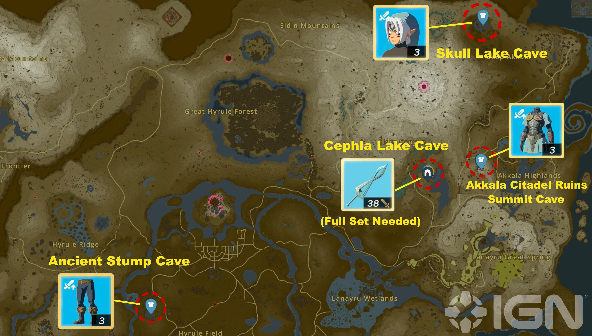

This Tears of the Kingdom side quest is unlocked after completing the Misko's Cave of Chests quest. You'll have to complete a difficult treasure hunt across Hyrule, but once you manage to find all of Misko's treasure locations, your efforts are rewarded with a powerful new armor set. 

Here's how to find every treasure location during **Misko's Treasure: The Fierce Deity**. 

## Misko's Treasure: The Fierce Deity Walkthrough

To start Misko's Treasure: The Fierce Deity, **pick up the bottle inside Cephna Lake Cave** , which was left behind during the final cutscene in Misko's Cave of Chests. Inside the bottle, you'll find a message from Misko, inviting you to go on a treasure hunt. The treasure is hidden in three different locations, as indicated by the following hints: 

  * Beneath the bedchamber of Akkala's red-crowned citadel.
  * In the skull's left eye.
  * In an old stump in Hyrule Field.

In short, you'll find the Fierce Deity Mask inside Skull Lake Cave, northern Akkala. The Fierce Deity Armor is inside the Akkala Citadel Ruins Summit Cave, in the Akkala Highlands, and the Fierce Deity Boots are in the Ancient Tree Stump Cave, in North Hyrule Field. 

**Note:** You can get the Fierce Deity Armor by scanning the Majora's Mask Link amiibo -- and you can even use the three pieces to complete Cephia Lake Cave. However, the Misko's Treasure: The Fierce Deity quest will not be marked complete. In order to "properly" complete the quest, you have to have found all three necessary armor pieces the old-fashioned way by finding them in cave chests. Amiibo scans won't satisfy the conditions of the quest. 

Once you've collected all three armor pieces, equip them and **return to Cephla Lake Cave** , where the stone wall on the right side will open. You will find the Fierce Deity Sword in the treasure chest behind it. 

For a more detailed description of How to Get the Fierce Deity Armor Set, take a look at our separate guide. 

Misko's Treasure: The Fierce Deity

See the complete List of Side Quests and Side Adventures

### Up Next: Walkthrough

Previous

About IGN's Zelda TotK Guide Writers

Next

Walkthrough

### Top Guide Sections

  * Walkthrough
  * Zelda: Tears of The Kingdom Switch 2 Edition Guide
  * Zelda Notes Voice Memories
  * List of Side Quests and Side Adventures

### Was this guide helpful?

Leave feedback

### In This Guide

The Legend of Zelda: Tears of the KingdomNintendo EPD

Initial Release: May 12, 2023

Learn more

Go to comments