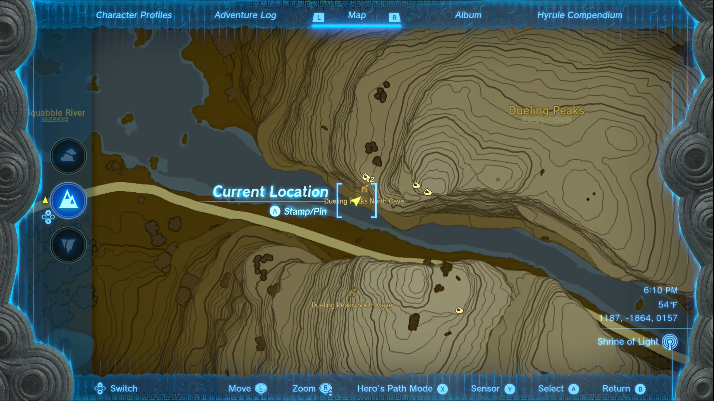
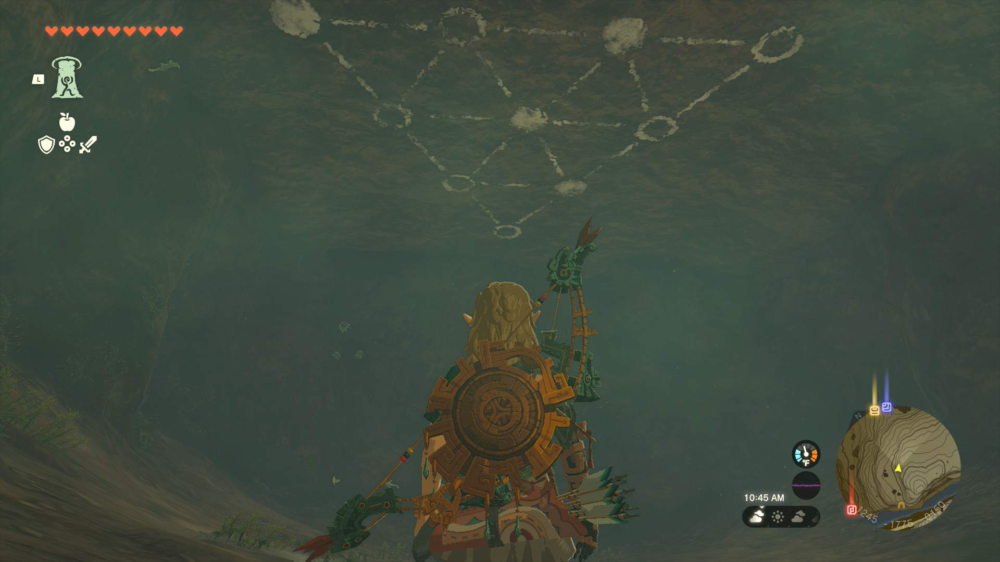
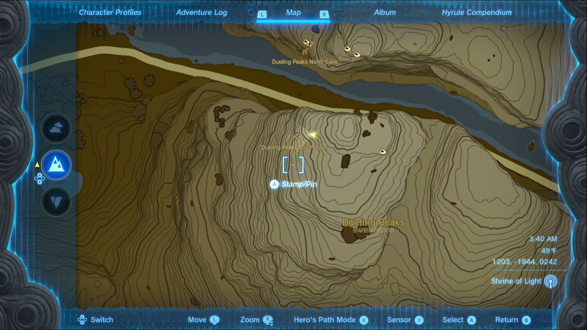

Looking for Misko's old garments? Misko has hidden valuable treasures all over Hyrule, and this Eldin side quest will lead you to one of them. Here's how to complete **Misko's Treasure: Twins Manuscript** in The Legend of Zelda: Tears of the Kingdom. 

## Misko's Treasure: Twins Manuscript Walkthrough

To unlock this side quest, speak to Domidak at the **Cephla Lake Cave** after completing the Misko's Cave of Chests side quest. He'll offer to sell you a manuscript in return for 100 rupees, which you need to accept. 

While you may choose from three different manuscripts, pick **the twins** to start this quest (the others will either start the Misko's Treasure: Pirate Manuscript quest or the Misko's Treasure: Heroines Manuscript quest). 

Misko's Treasure is inside the **Dueling Peaks South Cave** , but it's hidden behind a puzzle. As the solution to the puzzle is found in the nearby **Dueling Peaks North Cave** , it will save you some time if you go there first! 

You'll find the entrance to the Dueling Peaks North Cave in the West Necluda region. It's about halfway up the cliffs, on the north side of the gorge. The coordinates are 1193, -1857, 0159. 

The puzzle solution is **painted on the ceiling**. Take a picture with your camera or use the picture above as a reference. Once you've done that, travel to the southern Dueling Peak and enter the Dueling Peaks South Cave. It's quite high up the mountain at coordinates 1183, -1945, 0246. 

Enter the large cave room with the pressure plates and loose rocks. Use Ultrahand to lift the rocks and place them on the pressure plates, copying the pattern you found earlier. Each pressure plate at the location of a **white dot** needs to be held down with a rock (so place four rocks in total). 

This will open the stone wall and reveal the treasure chest with your reward: Tingle's Shirt. 

Misko's Treasure: Twins Manuscript

See the complete List of Side Quests and Side Adventures

### Up Next: Walkthrough

Previous

About IGN's Zelda TotK Guide Writers

Next

Walkthrough

### Top Guide Sections

  * Walkthrough
  * Zelda: Tears of The Kingdom Switch 2 Edition Guide
  * Zelda Notes Voice Memories
  * List of Side Quests and Side Adventures

### Was this guide helpful?

Leave feedback

Go to comments