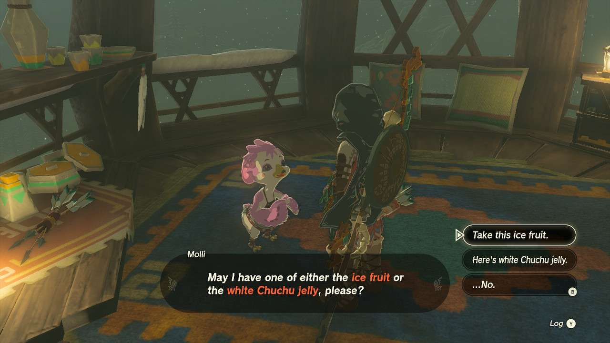

**Molli the Fletcher’s Quest** is one of the many Side Quests to complete in The Legend of Zelda: Tears of the Kingdom. In this guide, we will teach you everything you need to know to complete Molli the Fletcher’s Quest, including where to find it and what you will get as a reward. 

  * **Side Adventure Location** : Rito Village
  * **Prerequisites** : Hearing the Rito children’s song
  * **Rewards** : 10x arrows

After you find the children of Rito Village and listen to their song (tied to the Regional Phenomena), they go off in different directions. Molli, the pink Rito child, will head towards the weapons stall. 

Speaking to Molli will activate the quest, where she simply asks for one **Ice Fruit** or **White Chuchu Jelly**. If you need some, there are Ice Fruit bushes near the Hebra Trailend Lodge, which is directly north of Rito Village and near two bonfires to see it in the snow. If you have some from the trek to Rito Village, that works just as well. White Chuchu Jelly also works if you have some on you. 

This little gesture of goodwill will net you 10x arrows, which is nice, because every single one counts. 

Molli the Fletcher's Quest

See the complete List of Side Quests and Side Adventures

### Up Next: Walkthrough

Previous

About IGN's Zelda TotK Guide Writers

Next

Walkthrough

### Top Guide Sections

  * Walkthrough
  * Zelda: Tears of The Kingdom Switch 2 Edition Guide
  * Zelda Notes Voice Memories
  * List of Side Quests and Side Adventures

### Was this guide helpful?

Leave feedback

### In This Guide

The Legend of Zelda: Tears of the KingdomNintendo EPD

Initial Release: May 12, 2023

Learn more

Go to comments