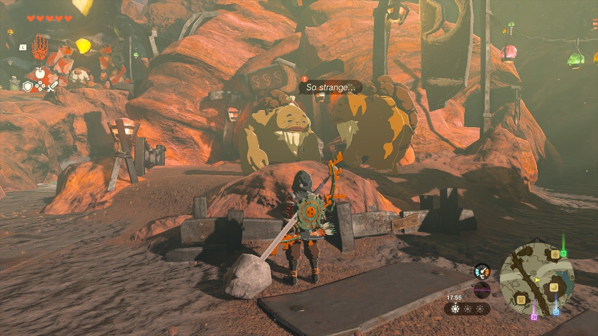
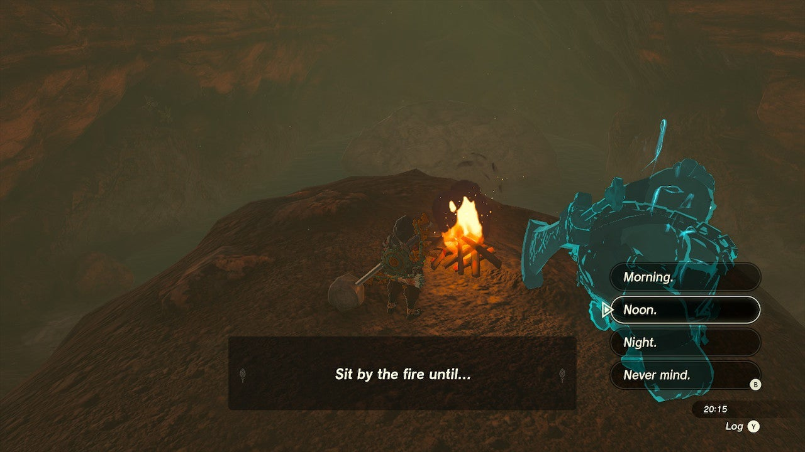
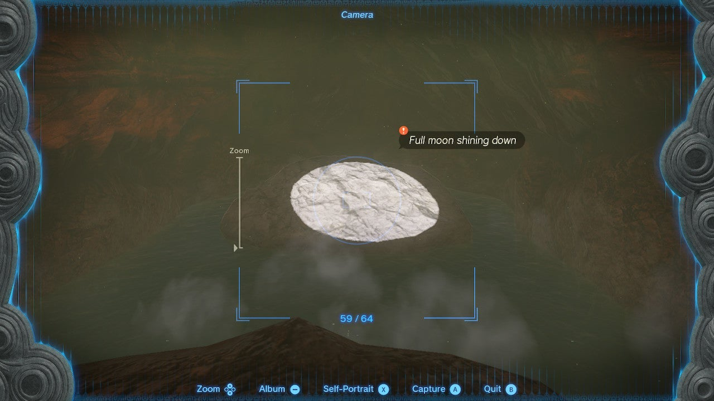

Let's help out some elderly Gorons with our photography skills, shall we? The Legend of Zelda: Tears of the Kingdom's Moon-Gazing Gorons side quest takes you to Ferona Lake, where you have to picture the scenery at the right time. 

Here's how to complete the **Moon-Gazing Gorons** quest. 

## Moon-Gazing Gorons Walkthrough

To start Moon-Gazing Gorons, make sure you've completed the Yunobo of Goron City quest. To start this side quest, go to the center of Goron City and speak to the two Gorons in front of the Inn. They want to see a **picture of a full moon** that's visible during the day, which should be somewhere near Lake Ferona. 

The right location is inside **Lake Ferona Cave** , at coordinates 1930, 1320, 0163. The picture needs to be taken at noon, so either make sure you arrive at the right time, or bring wood and flint to make a campfire (place them next to each other on the ground, hit them, and choose the "wait" option to pass the time). 

When it's noon, you'll see a ray of sunlight shining on the flat rock in the middle of the cave, surrounded by water. Take a picture of this "full moon" using your camera, and return it to the Gorons. 

They'll give you a **silver rupee** (worth 100 gree rupees) as a reward. For more info on Lake Ferona Cave, including the bubbulfrog location, take a look at our Eldin region guide. 

Moon-Gazing Gorons

See the complete List of Side Quests and Side Adventures

### Up Next: Walkthrough

Previous

About IGN's Zelda TotK Guide Writers

Next

Walkthrough

### Top Guide Sections

  * Walkthrough
  * Zelda: Tears of The Kingdom Switch 2 Edition Guide
  * Zelda Notes Voice Memories
  * List of Side Quests and Side Adventures

### Was this guide helpful?

Leave feedback

### In This Guide

The Legend of Zelda: Tears of the KingdomNintendo EPD

Initial Release: May 12, 2023

Learn more

Go to comments