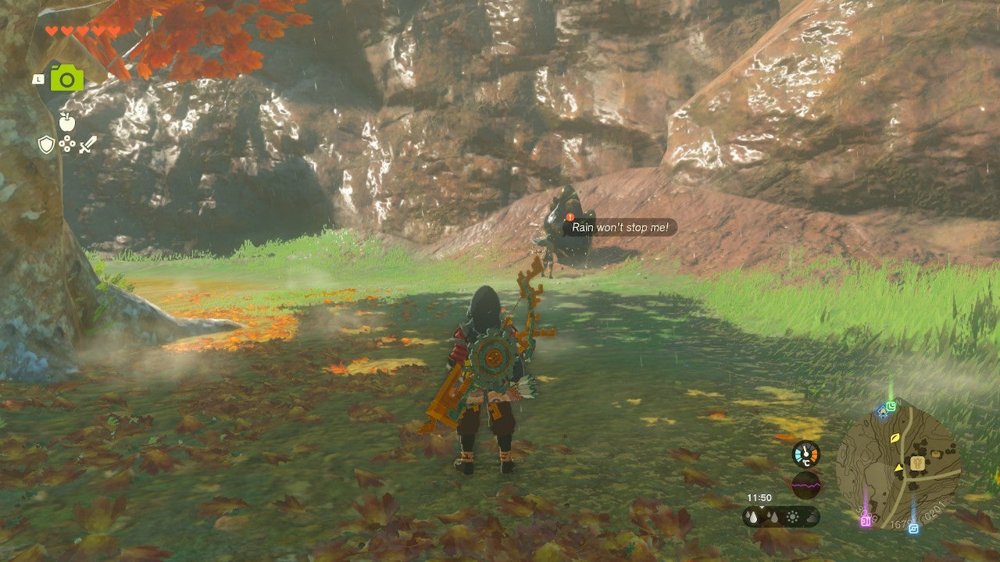
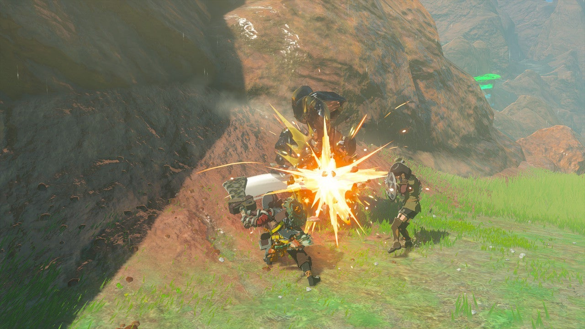

If you want to complete the One-Hit Wonder side quest in Akkala, you'll need to find a good weapon to smash ore deposits. If you find or craft the right weapon to break the stone in just a single hit, you'll receive a nice stack of ore. 

Here's how to solve the **One-Hit Wonder** side quest in The Legend of Zelda: Tears of the Kingdom. 

## One-Hit Wonder Walkthrough

To start One-Hit Wonder, speak to **Parcy** near the South Akkala Stable (southwest side). Furiously hacking away at a shiny ore deposit, she's quite easy to spot. 

Parcy challenges you to **smash the boulder with just one hit** , so you'll need to use a proper ore-smashing weapon. Normal swords and spears won't do, but a Cobble Crusher would be perfect. Alternatively, Fuse a strong two-handed weapon with a nearby rock or powerful monster part. 

As soon as you've smashed the ore deposit, the One-Hit Wonder side quest is completed. You can pick up the **rare ores** as a quest reward. 

One-Hit Wonder!

See the complete List of Side Quests and Side Adventures

### Up Next: Walkthrough

Previous

About IGN's Zelda TotK Guide Writers

Next

Walkthrough

### Top Guide Sections

  * Walkthrough
  * Zelda: Tears of The Kingdom Switch 2 Edition Guide
  * Zelda Notes Voice Memories
  * List of Side Quests and Side Adventures

### Was this guide helpful?

Leave feedback

Go to comments