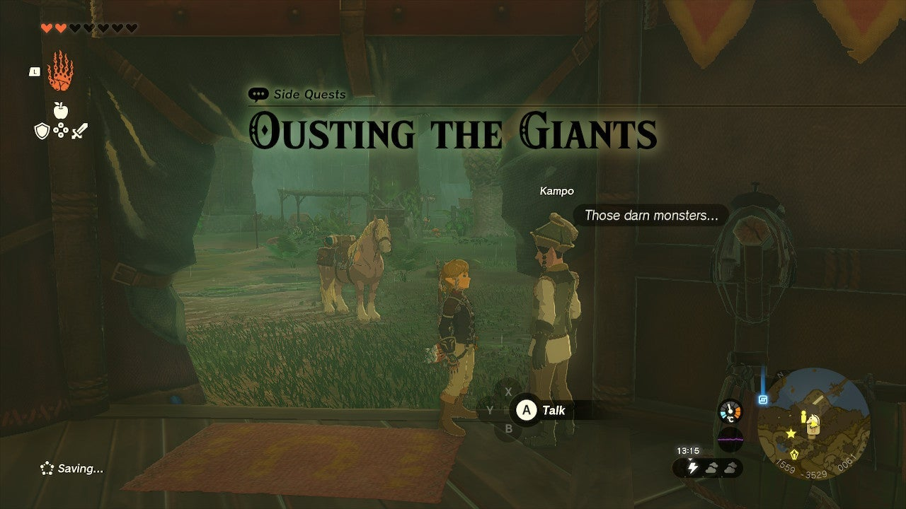
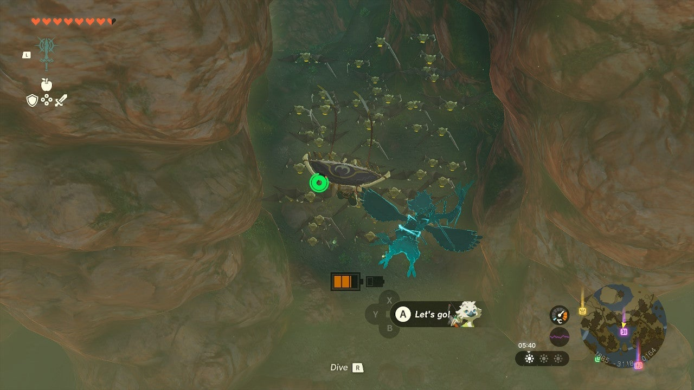
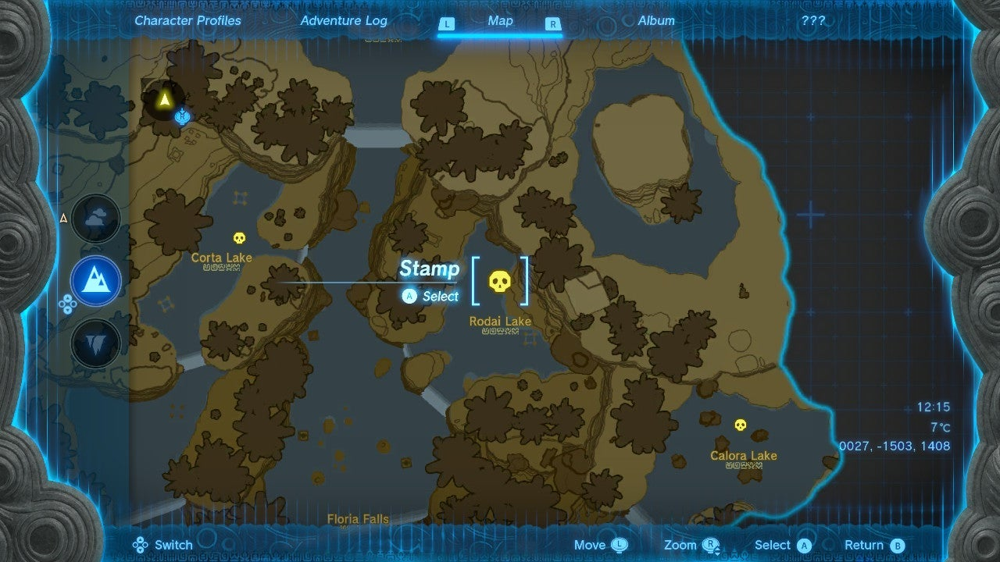
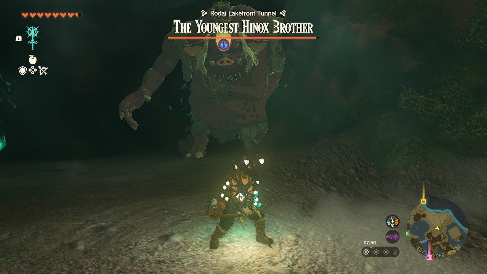
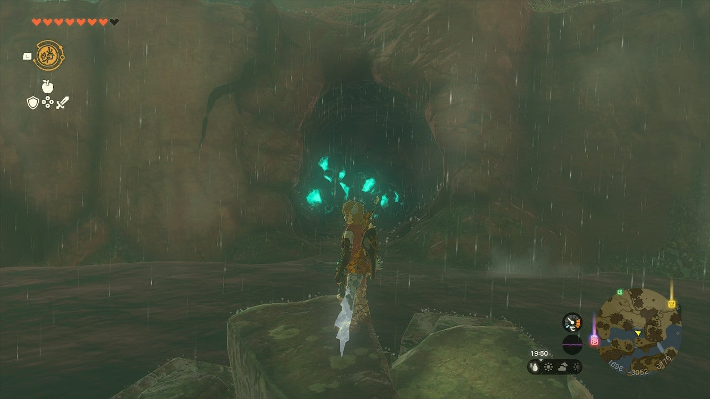
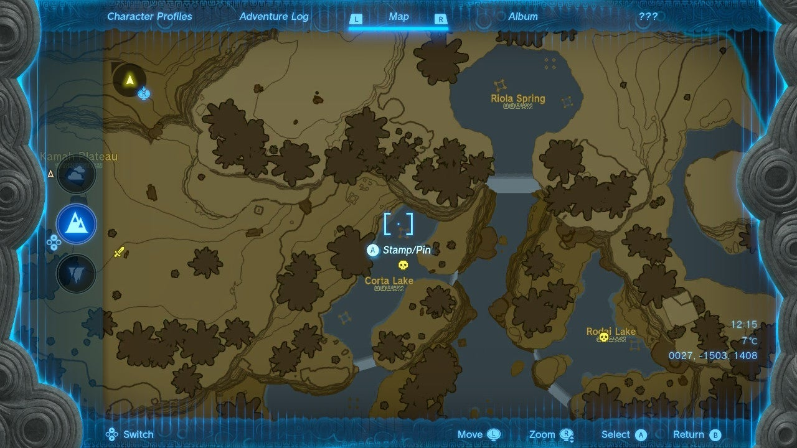
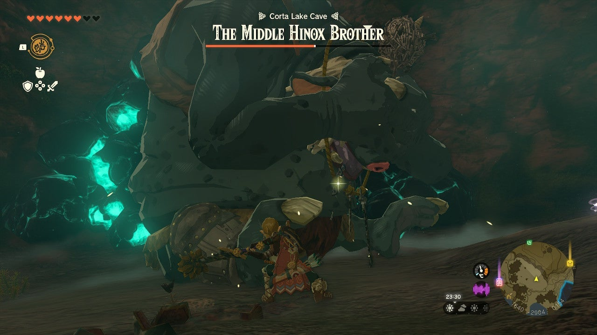
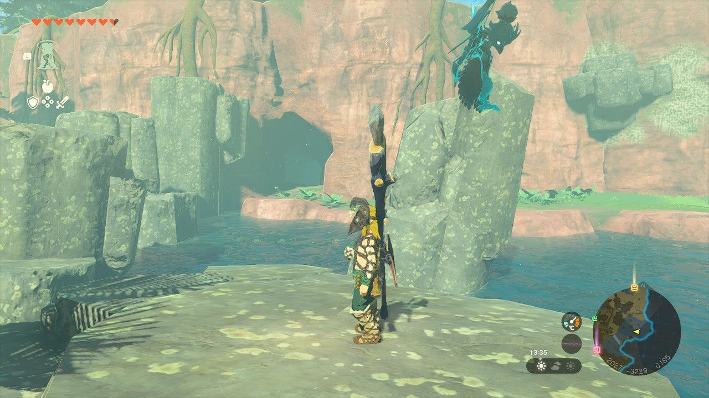
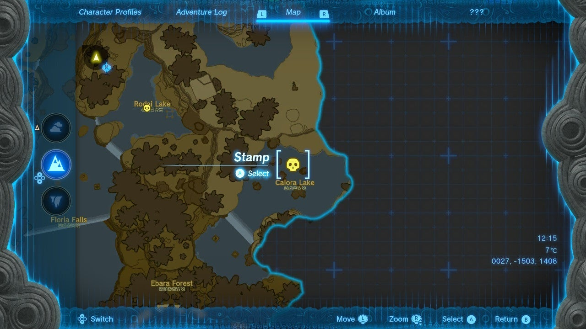
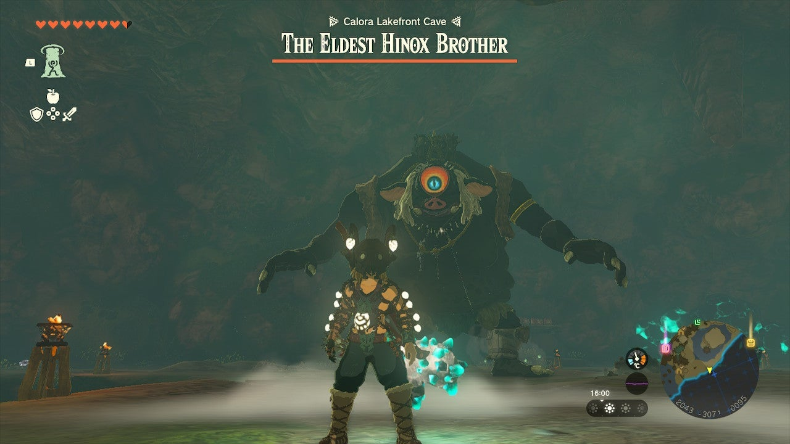

**Ousting the Giants** is a Side Quest found at Lakeside Stable in the Faron region. To trigger it, speak to an NPC named **Kampo** , who will tell you about three giant Hinox brothers that have taken up residence in some nearby caves. Kampo is worried that the Hinox brothers presence will drive away any potential customers, so, of course, he needs a hero like Link to clear them out. 

The caves themselves are situated around the lakes to the Northeast. The**Rodia Lakefront Cave** , **Corta Lake Cave** , and the **Calora Lake Cave**. The three Hinox brothers increase in both size and difficulty, with the Hinox in the Calora Lake Cave being the strongest. 

## Finding the Hinox Brothers

Kampo shows you the general direction that the caves are in, but you still have to do some exploring yourself to find them. Below you can find the exact locations of the caves, as well as a summary of the resources you can collect there. 

### Rodai Lakefront Cave

This cave is part of the Outsting the Giants Side Quest and is home to the Youngest Hinox Brother. 

It’s exact coordinates are 1890, -3121, 0134. 

**Bubbulfrog Location**

The Bubbulfrog is hiding inside a large reddish hollow rock in the centre of the main room of the cave. 

**Resources**

  * Luminous Stone
  * Ore Deposits
  * Rare Ore Deposits
  * Brightcaps
  * Brightbloom Seeds
  * Giant Brightbloom Seeds
  * Hearty Lizard
  * Gnarled Long Stick
  * Knights Bow
  * Bubbul Gem

**Enemies**

  * The Youngest Hinox Brother

### Defeating the Youngest Hinox Brother 

The Youngest Hinox Brother is a Red Hinox, and is the weakest of the three brothers. He doesn’t apply many defensive tactics like covering his eye, so the best way to take him down is to keep moving backwards while aiming your bow towards his eyeball. 

Once you hit him in the eye, he will fall to the ground, allowing you to run over and wail on him with your strongest weapon. Repeat this process until you have defeated the Youngest Hinox Brother. 

### Corta Lake Cave

Corta Lake Cave is also part of the Outsting the Giants Side Quest and is home to the Middle Hinox Brother. 

Its exact coordinates are 1679, -3042, 0166. 

**Bubbul Gem Location**

There are a number of wind tunnels in this cave. The Bubbul Gem is in a small alcove accessible from the third wind tunnel. 

**Resources**

  * Luminous Stone
  * Brightbloom Seeds
  * Giant Brightbloom Seeds
  * Ore Deposits
  * Hearty Lizards
  * Brightcaps
  * Bomb Flowers
  * Strong Long Stick
  * Bubbul Gem

**Enemies**

  * Electric Chu-Chu
  * The Middle Hinox Brother

### Defeating the Middle Hinox Brother

The Middle Hinox Brother is a Blue Hinox, meaning he is a little stronger and faster than the regular variety. This Hinox is smart enough to cover his eye with his hand so you can’t hit it with an arrow as easily. It still brings its hand down every now and then, however, giving you a small window to make your shot. 

If you are struggling to meet the window of opportunity to hit his eye with an arrow, you can still slash at his legs with a strong weapon. Just be careful that he doesn't sit on you. 

### Calora Lake Cave

Calora Lake Cave is the home of the Eldest Hinox Brother, and is the last cave in the Outsting the Giants Side Quest. 

Its exact location is at 2008, -3160, 0181. 

**Bubbulfrog Location**

Behind a huge breakable wall on the left side of the cave. 

**Resources**

  * Brightcaps
  * Brightbloom Seed
  * Ore Deposits
  * Bomb Flowers
  * Giant Brightbloom Seeds
  * Luminous Stone
  * Knights Bow
  * Knights Broadsword
  * Glowing Cave Fish
  * Hearty Lizard

**Enemies**

  * The Eldest Hinox Brother

### Defeating the Eldest Hinox Brother

The Eldest Hinox Brother is a Black Hinox, which is the strongest and biggest of the bunch. Thankfully, there is a relatively quick way to take this Hinox down. 

There are bomb barrels strategically bordering the room, which you can use to your advantage to take this Hinox down quickly. Keep running around the perimeter of the room, making sure to keep a safe distance between yourself and the bomb barrels. 

When the Hinox passes by the barrels, hit them with an arrow fused with a Fire Fruit to ignite them and take a massive amount of health from his health gauge. If the Eldest Hinox Brother is still kicking and you have run out of barrels, you can still beat him the old-fashioned way by slashing at his legs and hitting his eye with your bow. 

## Completing Your Quest

Once you have successfully cleared the Hinox Brothers from the cave, head back to Lakeside Stable to tell Kampo the good news. Kampo will give you a **Mighty Fried Banana** dish as a reward for taking down the three Hinox Brothers and securing the future of his business. 

Ousting The Giants

See the complete List of Side Quests and Side Adventures

### Up Next: Walkthrough

Previous

About IGN's Zelda TotK Guide Writers

Next

Walkthrough

### Top Guide Sections

  * Walkthrough
  * Zelda: Tears of The Kingdom Switch 2 Edition Guide
  * Zelda Notes Voice Memories
  * List of Side Quests and Side Adventures

### Was this guide helpful?

Leave feedback

Go to comments