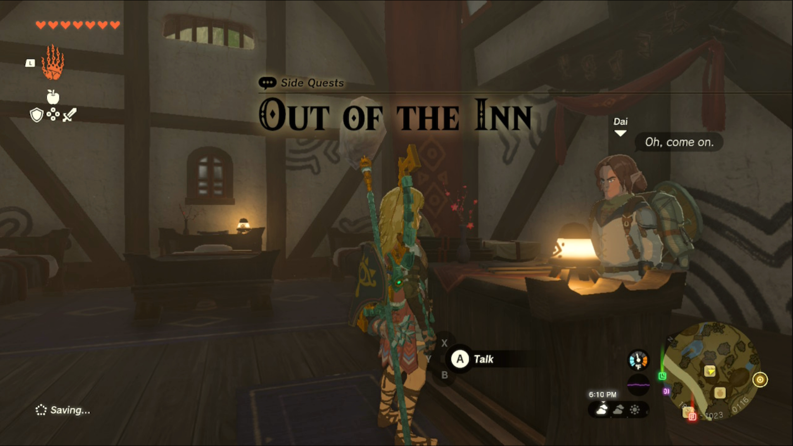
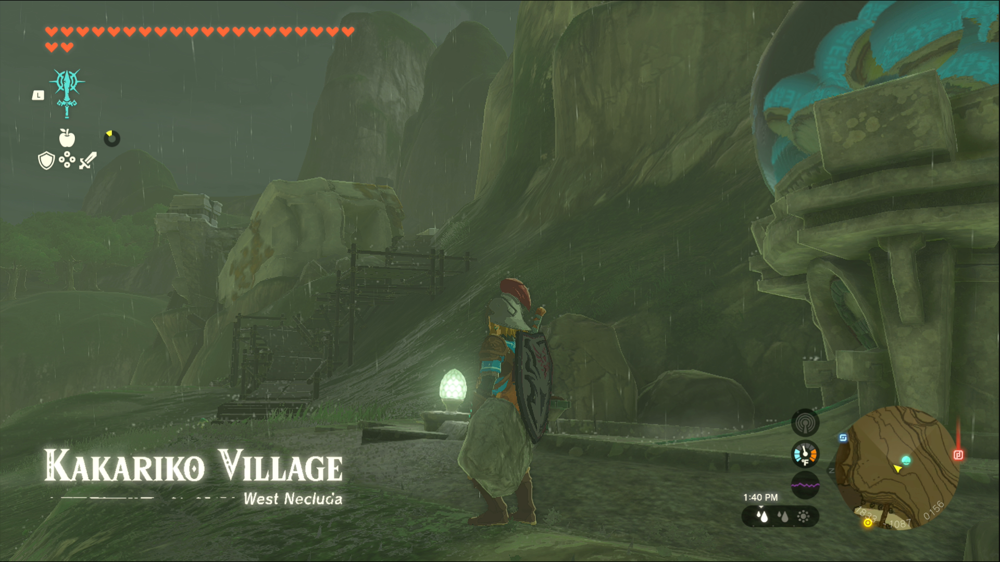
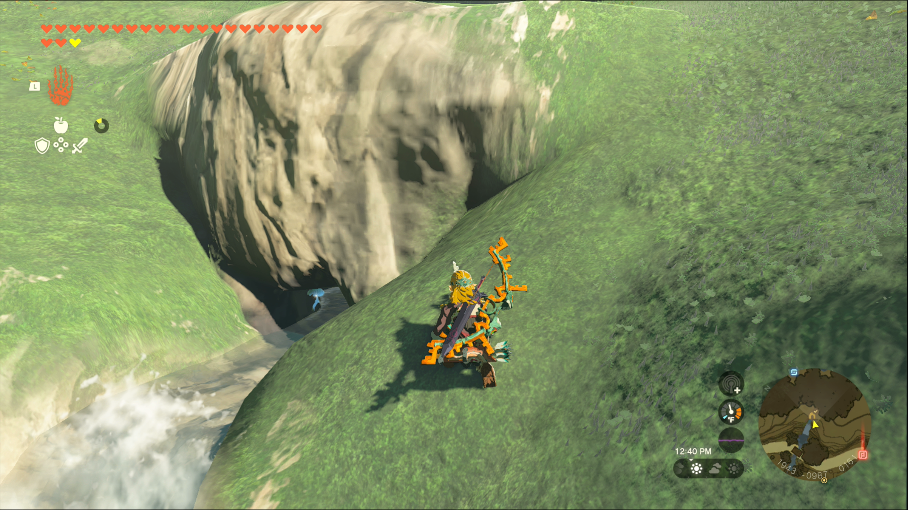

Out of the Inn is one of the Side Quests you’ll discover in Kakariko Village. Side Quests are quests in The Legend of Zelda: Tears of the Kingdom that are relatively short or simple chores that can earn you small rewards or services. 

## Out of the Inn

To start the Side Quest “Out of the Inn” you need to head into the Shuteye Inn in Kakariko Village. Speak to the man behind the counter, Dai, who will tell you he’s just watching the Inn while the owner changes the Ring Ruins Survey Team’s bedsheets. You’ll need to find him and tell him to come back to the inn if you want to stay for the night. 

It’s not so simple to find the owner, however, because the tents are scattered across 4 different locations. You’ll need to check them all until you find the owner, so it’s time to start looking. 

### Important note

You should accept the side quest “A Trip through History” from Bugut, and “Codgers’ Quarrel” from Trissa, before embarking on this quest. These quests all have to do with the Ring Ruins in one way or another so it’s most efficient to accept them all at once. Bugut can be found wandering through Kakariko Village, while Trissa operates High Spirits Produce, the general store in the southwest corner of the village. 

Each of the 4 Ring Ruin sites has a camp established nearby, so you’ll have to check each site, potentially clearing other quests in the meantime. The first we suggest checking is southwest of Makasura Shrine, across the road into the village and up a large hill. 

Next, head east, toward the Device Dispenser south of the village. It looks like a giant gumball or gachapon machine, and the tents will be nearby. If you find Cori at this camp, she may suggest searching at the Ring Ruins above the village elder’s home, so you can head straight there if you want, but if you’ve accepted the quest A Trip through History, you should visit them all anyway. 

Now it’s time to search the ruins on the north side of the village. You can take the sloping path on the northeast side out of the village toward East Hill, where the third ruin is located. As you head up to East Hill, you’ll see a large scaffolding with a ladder, which you’ll want to climb. 

Asking the researchers here about the innkeeper will point you toward the southeast ruins, but if you’re following this guide, you’ve already checked there. The last spot left to search is the northwest ring ruin, but be sure to check the stone slab here first. 

Next, you need to head west, jumping down to the scaffolding on the other side of the path leading north out of Kakariko Village. Climb the ladders and follow the wooden ramps to the final set of beds, where you’ll find the innkeeper dozing away. Speaking to him won’t wake him up, but as the man nearby says, the innkeeper keeps mumbling about Hearty Truffles, so bringing him one might wake him up. 

He suggests searching the waterfall pouring into Kakariko Village, but if you already have a Hearty Truffle, you can drop it on the sleeping innkeeper. Once he’s awake you can head back to the inn, but be sure to speak with Gordi, the man by the stone slab, to wrap up the quest “A Trip through History” as well. 

Return to the inn and speak to Dai again, for your trouble he’ll give you a Sticky Elixir, which increases your resistance to slipping on wet surfaces. You can also stay at the Shuteye Inn now! 

Out of the Inn

See the complete List of Side Quests and Side Adventures

### Up Next: Walkthrough

Previous

About IGN's Zelda TotK Guide Writers

Next

Walkthrough

### Top Guide Sections

  * Walkthrough
  * Zelda: Tears of The Kingdom Switch 2 Edition Guide
  * Zelda Notes Voice Memories
  * List of Side Quests and Side Adventures

### Was this guide helpful?

Leave feedback

### In This Guide

The Legend of Zelda: Tears of the KingdomNintendo EPD

Initial Release: May 12, 2023

Learn more

Go to comments