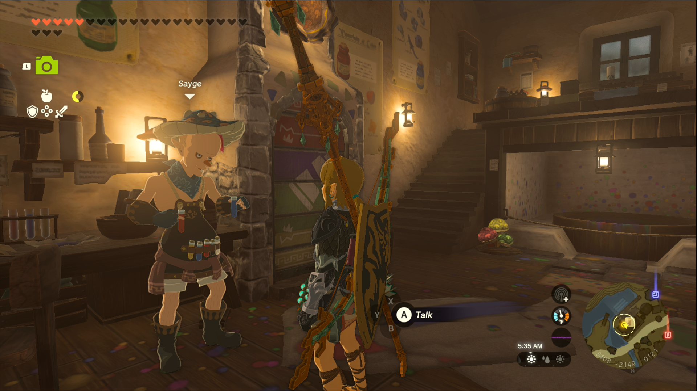
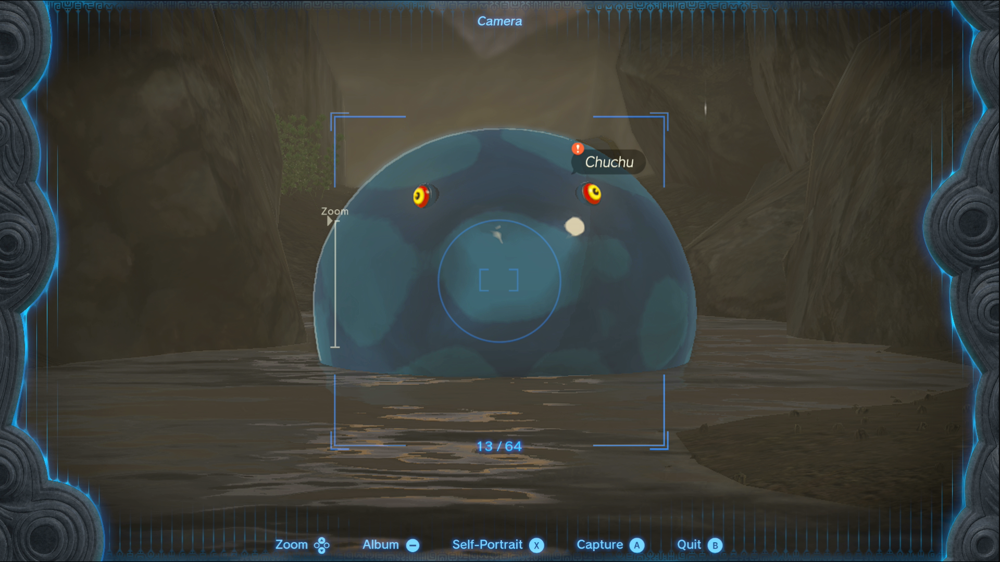
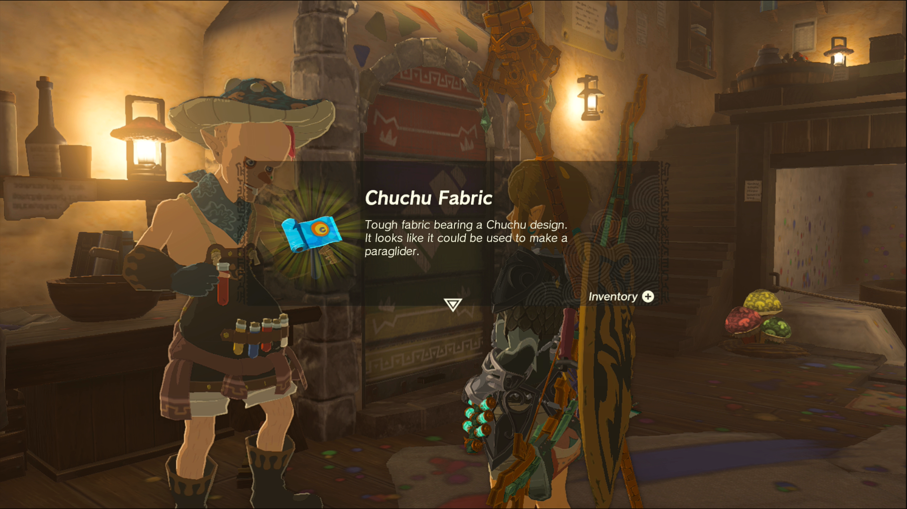

Photographing a Chuchu is one of the Side Quests you’ll discover in the Mount Lanayru region. Side Quests are quests in The Legend of Zelda: Tears of the Kingdom that are relatively short or simple chores that can earn you small rewards or services. 

## Photographing a Chuchu

To start the Side Quest “Photographing a Chuchu” you need to head to Hateno Village and speak to Sayge, the owner of the Dye Shop. Sayge will tell you he wants to create a new glider fabric based on Chuchus, but he wants a photo to reference. 

That’s where you come in, you need to take a picture of a normal blue Chuchu and show it to Sayge. Chuchus can be found in Hyrule Field and East Necluda, so head to those regions to search for a chuchu. We were able to find a pair of them northwest of the Rabella Wetlands Skyview Tower, in the canyon between Rabella Wetlands and Breman Peak. As always, make sure the quest marker appears over the Chuchu, like in the image below. 

Once you have the photo, head back to Sayge and show it to him. You’ll receive the promised glider fabric, but now you can also take pictures of other monsters and animals for reference to get other glider patterns. 

Asking Sayge to rework your glider will show you the possible fabrics you can earn. 

Photographing a Chuchu

See the complete List of Side Quests and Side Adventures

### Up Next: Walkthrough

Previous

About IGN's Zelda TotK Guide Writers

Next

Walkthrough

### Top Guide Sections

  * Walkthrough
  * Zelda: Tears of The Kingdom Switch 2 Edition Guide
  * Zelda Notes Voice Memories
  * List of Side Quests and Side Adventures

### Was this guide helpful?

Leave feedback

### In This Guide

The Legend of Zelda: Tears of the KingdomNintendo EPD

Initial Release: May 12, 2023

Learn more

Go to comments