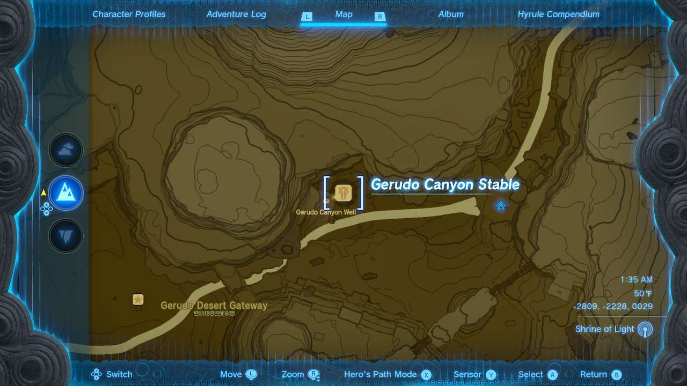
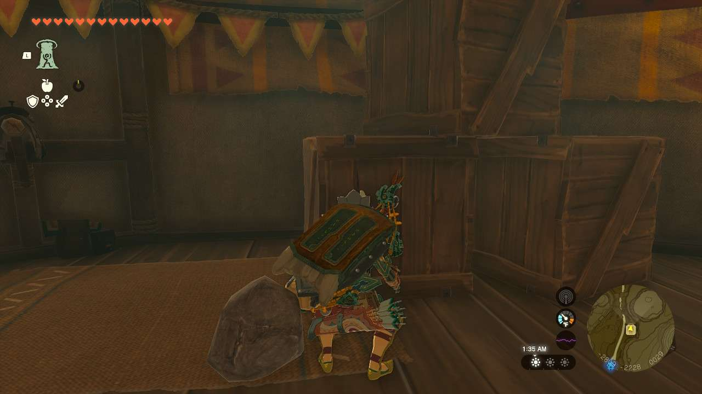

**Piaffe, Packed Away** is one of the many Side Quests to complete in The Legend of Zelda: Tears of the Kingdom. In this guide, we will teach you everything you need to know to complete Piaffe, Packed Away, including where to find it and what you will get as a reward. 

  * **Side Quest Location** : Gerudo Canyon Stable, Gerudo Canyon
  * **Prerequisites** : n/a
  * **Rewards** : 1 Pony Point

This quest is more or less automatically started upon finding the **Gerudo Canyon Stable**. There are boxes and crates everywhere, blocking your entrance and blocking in poor **Piaffe**. 

However you wish, destroy or move enough crates to make your way to Piaffe. Once you’ve cleared away enough and spoken to them, they reveal that the stable is actually closed and all the packing was why they were stuck inside. They’ll give you 1 Pony Point for your troubles. 

Piaffe, Packed Away

See the complete List of Side Quests and Side Adventures

### Up Next: Walkthrough

Previous

About IGN's Zelda TotK Guide Writers

Next

Walkthrough

### Top Guide Sections

  * Walkthrough
  * Zelda: Tears of The Kingdom Switch 2 Edition Guide
  * Zelda Notes Voice Memories
  * List of Side Quests and Side Adventures

### Was this guide helpful?

Leave feedback

### In This Guide

The Legend of Zelda: Tears of the KingdomNintendo EPD

Initial Release: May 12, 2023

Learn more

Go to comments