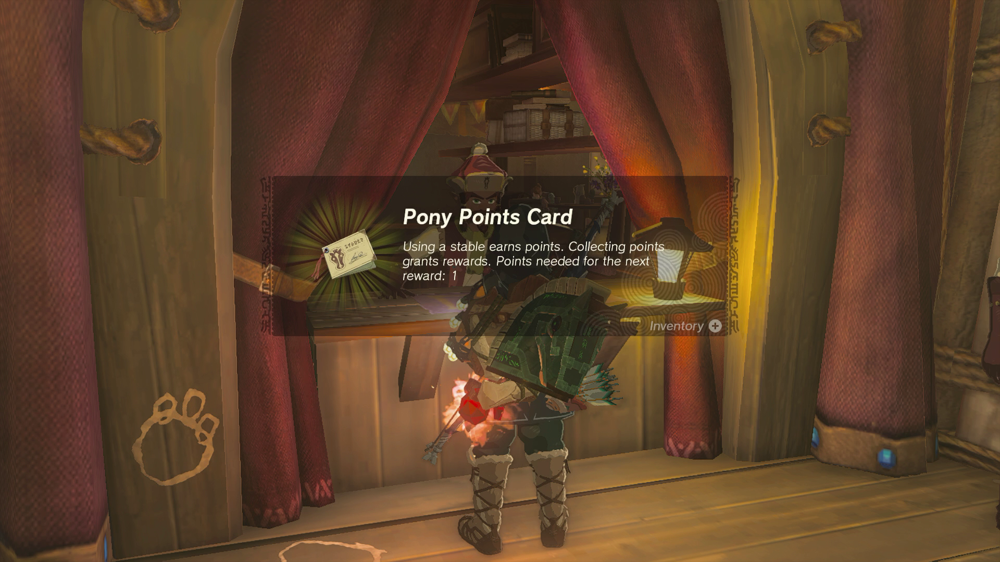
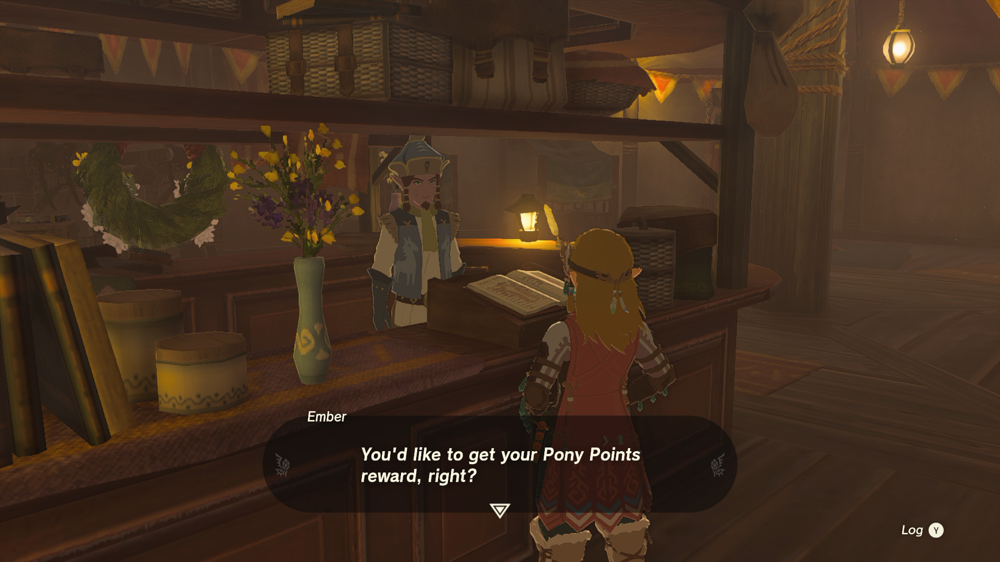

The **Pony Points Card** is a **Key Item** used to get helpful horse-themed rewards and other benefits in The Legend of Zelda: Tears of the Kingdom. To earn these rewards, you'll need to register with the Stable Association's membership system at one of their many locations and use their services. Learn about how to get the Pony Points Card, its uses, and what Pony Points rewards you can get with this TotK key items guide. 

**Official Description** : "Using a stable earns points. Collecting points grants rewards. Points needed for the next reward:" 

Jump to... 

  * How to Get the Pony Points Card
  * How to get Pony Points
    * Pony Points Rewards List

## How to Get the Pony Points Card in The Legend of Zelda: Tears of the Kingdom

You can get the **Pony Points Card** by finding one of the many stables across Hyrule and registering yourself with the Stable Keeper at the front booth window, who will reward you two Pony Points just for signing up. From then on, you can earn more Pony Points at any Stable whenever you use one of their helpful services, eventually unlocking fantastic Pony rewards. 

To find a Stable nearest your location, check out our guide link below. 

Towns and Stables Locations in TotK

## How to Get Pony Points in The Legend of Zelda: Tears of the Kingdom

There are a few methods to get **Pony Points** in TotK, the fastest being renting a bed at the Stable's Inn over and over. However, it can get expensive during early game as it will cost at least twenty Rupees each time you lodge with them. Other ways of getting Pony Points include visiting new Stables and Boarding new horses for the first time. 

### Pony Points Rewards List

Once you have earned enough **Pony Points** , you can visit the Stables **Pony Points Ledger** to redeem your rewards and learn how many points you need for the following item or benefit. 

Pony Points  
Reward

3 Pony Points  
Towing Harness

5 Pony Points  
Horse-God Fabric

7 Pony Points  
Melanya Bed

10 Pony Points  
Register an additional horse

13 Pony Points  
Traveler's SaddleandTraveler's Bridle

16 Pony Points  
Mane-restyling service

20 Pony Points  
Register an additional horse

23 Pony Points  
Knight's SaddleandKnight's Bridle

26 Pony Points  
Extravagant SaddleandExtravagant Bridle

30 Pony Points  
Register an additional horse

35 Pony Points  
Register an additional horse

40 Pony Points  
Permanant 50% Discount for All Stable Fees

45 Pony Points  
Five Sleepover Tickets

50 Pony Points  
Three Endura Carrots

**Related and Other Helpful Guide Pages to Check Out Next** : 

  * How to Tame a Horse
  * Towns and Stables Guide
  * How to Find and Unlock Great Fairy Fountains
  * Amiibo Unlockables, Rewards, and Functionality
  * Cheats and Secrets

### Up Next: Towing Harness

Previous

Light of Blessing

Next

Towing Harness

### Top Guide Sections

  * Walkthrough
  * Zelda: Tears of The Kingdom Switch 2 Edition Guide
  * Zelda Notes Voice Memories
  * List of Side Quests and Side Adventures

### Was this guide helpful?

Leave feedback

### In This Guide

The Legend of Zelda: Tears of the KingdomNintendo EPD

Initial Release: May 12, 2023

Learn more

Go to comments