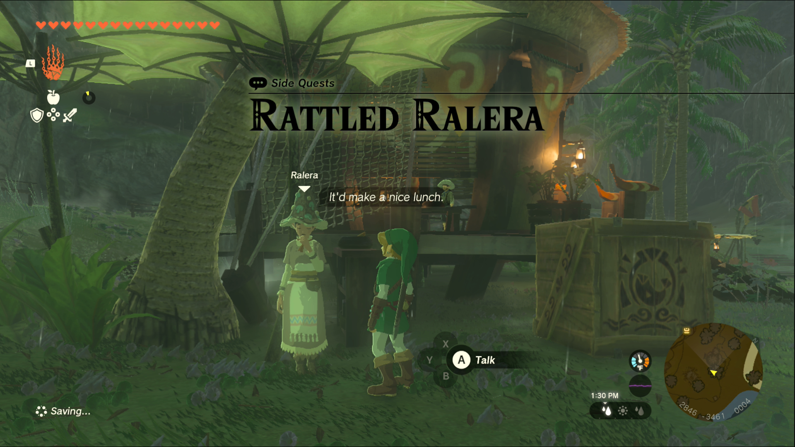
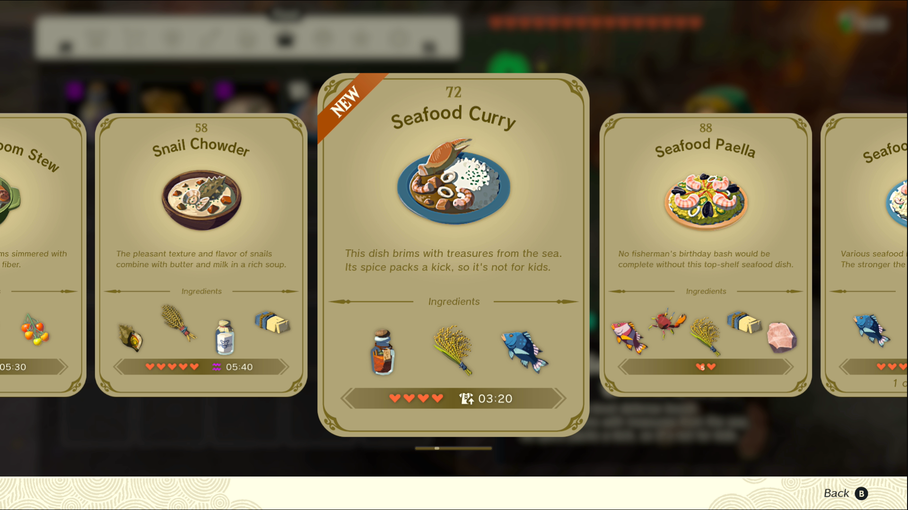
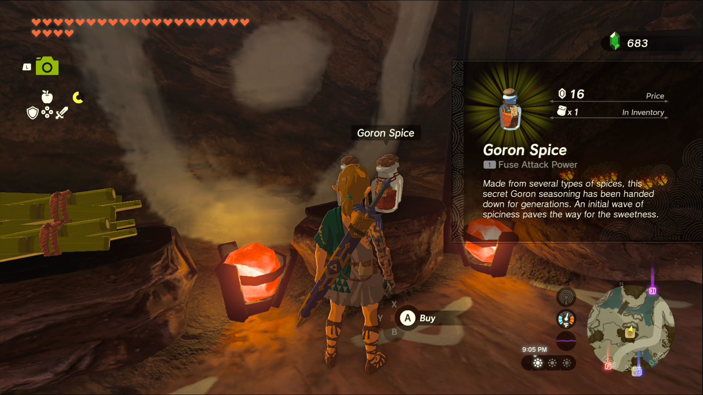
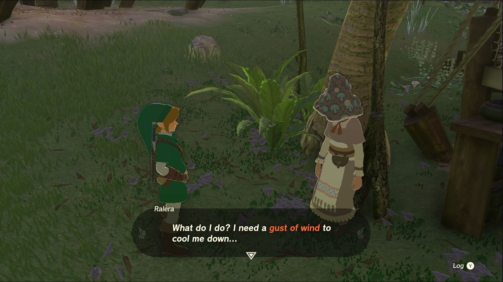

Rattled Ralera is a Side Quest in Lurelin Village. Side Quests are quests in _The Legend of Zelda: Tears of the Kingdom_ that are relatively short or simple chores that can earn you small rewards or services. 

## Rattled Ralera

To start the Side Quest “Rattled Ralera” you first need to complete “Ruffian-Infested Village” and “Lurelin Village Restoration Project.” Once you’ve fixed up the village, you can speak to Ralera, the former inhabitant of Hateno Village who has moved back home. 

She’ll be at the houses on the west side of the village. She would like to think of some ideas to draw in visitors to the newly rebuilt village, but she’s too hungry to focus, and she’d like to eat a dish made with Porgy, Goron Spice, and Hylian Rice. 

Porgy are a fish and can naturally be found in the ocean (any variety of Porgy, like Armored Porgy, works with this recipe), and Hylian Rice can be purchased at many general stores, including the ones in Hateno Village, Gerudo Town and Zora’s Domain. Goron Spice can be acquired in Goron City, on the northside of Hyrule. If you’ve never been, it’ll be quite the trek, but unlocking the towers and shrines in the area will be well worth it eventually. 

Once you have all your ingredients, throw them together in a pot to make Seafood Curry, and bring the resulting meal back to Ralera. She’ll eat it right up but the spice will be too effective, and now she needs wind to cool her down. A weapon with a flat wooden board or a Korok frond fused to it will cool her right off. If you need a Korok frond, you can sometimes find one after cutting down trees in forested areas, but there should be a wooden board somewhere near the pier in the village. 

Once you have your guster weapon, swing at Ralera to cool her off. With that, she’ll finally have a burst of inspiration and create a flag to represent the village. As a reward, she’ll give you some fabric for a new glider design. 

Rattled Ralera

See the complete List of Side Quests and Side Adventures

### Up Next: Walkthrough

Previous

About IGN's Zelda TotK Guide Writers

Next

Walkthrough

### Top Guide Sections

  * Walkthrough
  * Zelda: Tears of The Kingdom Switch 2 Edition Guide
  * Zelda Notes Voice Memories
  * List of Side Quests and Side Adventures

### Was this guide helpful?

Leave feedback

### In This Guide

The Legend of Zelda: Tears of the KingdomNintendo EPD

Initial Release: May 12, 2023

Learn more

Go to comments