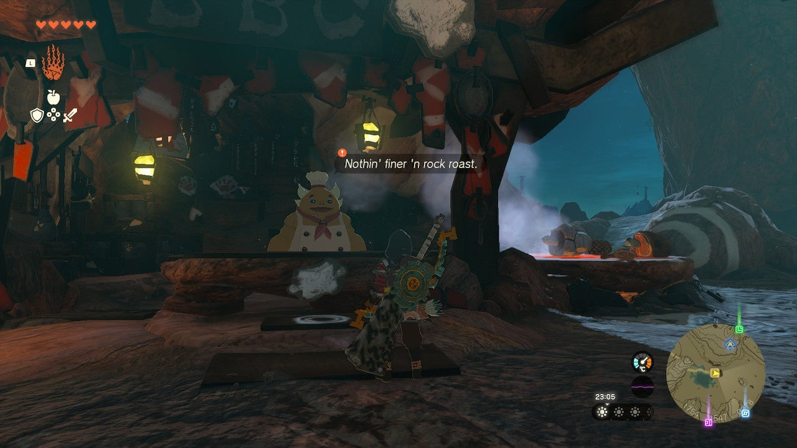
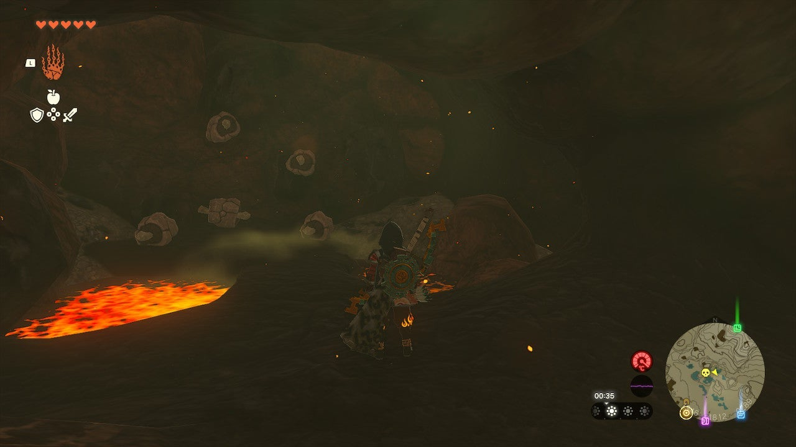
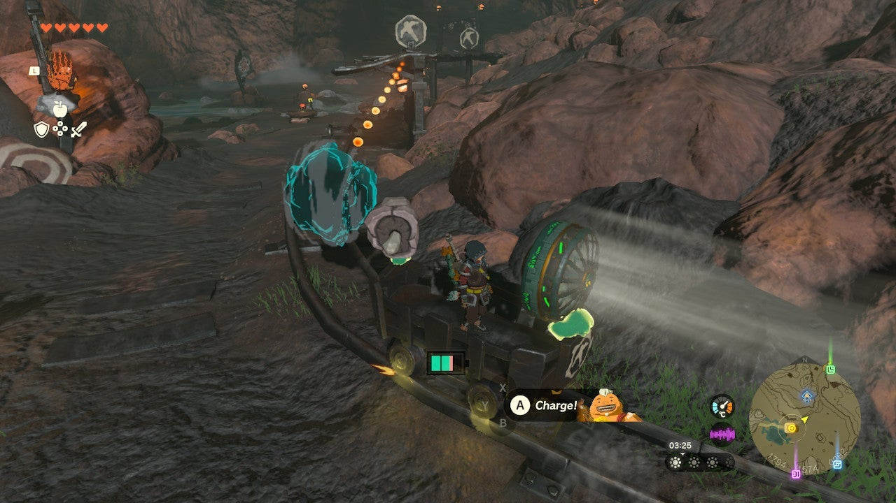
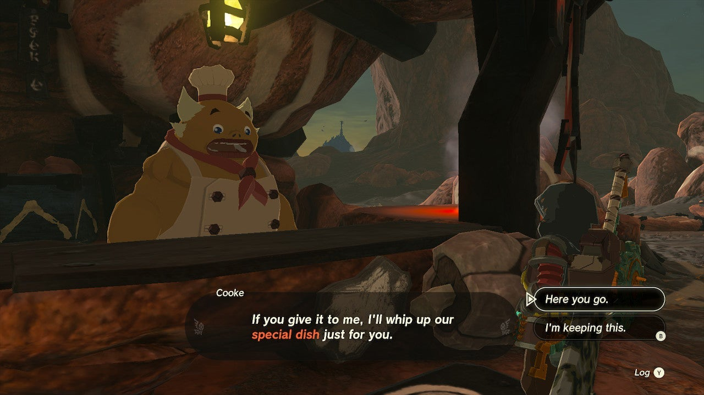

After completing the main quest Yunobo of Goron City, you can start the Rock Roast or Dust side quest at the Bedrock Bistro in Eldin. All you need to do is deliver some Rock Roast... But you need to know where to find it, of course. 

Here's how to find rock roast and complete **Rock Roast or Dust** in The Legend of Zelda: Tears of the Kingdom. 

## Rock Roast or Dust Walkthrough

Visit the Bedrock Bistro in the southwestern part of Eldin, close to the Timawak Shrine, and speak to Cooke. He'll inform you that he's short on **Rock Roast**. To find some, head to the **East Restaurant Cave** a bit further north. 

The best way to reach this cave is by following the minecart tracks leading east from Bedrock Bistro. At the end of the cave, you'll find a large supply of Rock Roasts. 

The easiest way to deliver the Rock Roast is by **attaching it to the nearby minecart** using Ultrahand. There's a tiny opening in the wall behind the minecart, where you'll find a Fan (for more detailed info on this cave, including the Bubbulfrog location, see our Eldin region guide). 

Ride the minecart with the Rock Roast attached back to Bedrock Bistro, then use Ultrahand to place the Rock Roast on the counter. 

Cooke will reward you with a **Seared Gourmet Steak**. 

Rock Roast or Dust

See the complete List of Side Quests and Side Adventures

### Up Next: Walkthrough

Previous

About IGN's Zelda TotK Guide Writers

Next

Walkthrough

### Top Guide Sections

  * Walkthrough
  * Zelda: Tears of The Kingdom Switch 2 Edition Guide
  * Zelda Notes Voice Memories
  * List of Side Quests and Side Adventures

### Was this guide helpful?

Leave feedback

Go to comments