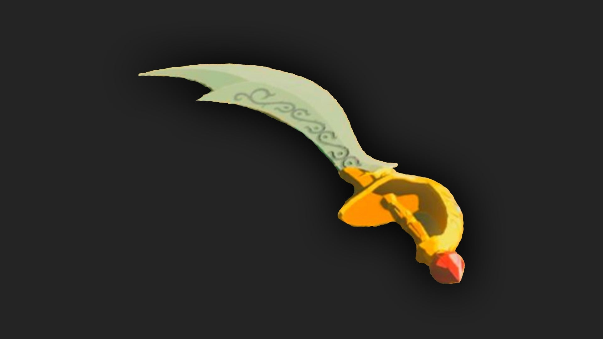

The Scimitar of the Seven is a one-handed weapon in The Legend of Zelda: Tears of the Kingdom. This item used to belong to the Gerudo Champion Urbosa, but now you can obtain it by completing a side quest in the Gerudo Desert. 

## Scimitar of the Seven Stats

A famous sword once beloved by the Gerudo Champion Urbosa. It is said that when Urbosa swung this sword in battle, her movements resembled a beautiful dance. 

  * **Hyrule Compendium number:** 352
  * **Base Damage:** 28
  * **Passive Ability:** Strong Fusion

352 Scimitar of the Seven

Players will get this weapon by completing the side quest "The Missing Owner." 

Learn more about The Legend of Zelda: Tears of the Kingdom with our helpful guide: 

  * Complete Walkthrough
  * Tips, Tricks, and Things to Know
  * Things to Do First in TotK

Or Jump back to our Weapons Hub

### Up Next: Walkthrough

Previous

About IGN's Zelda TotK Guide Writers

Next

Walkthrough

### Top Guide Sections

  * Walkthrough
  * Zelda: Tears of The Kingdom Switch 2 Edition Guide
  * Zelda Notes Voice Memories
  * List of Side Quests and Side Adventures

### Was this guide helpful?

Leave feedback

### In This Guide

The Legend of Zelda: Tears of the KingdomNintendo EPD

Initial Release: May 12, 2023

Learn more

Go to comments