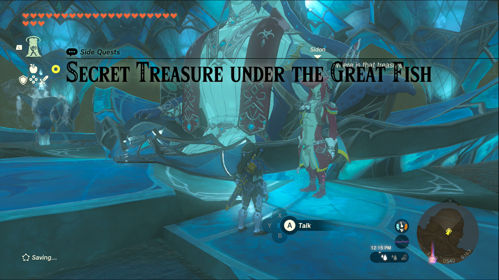
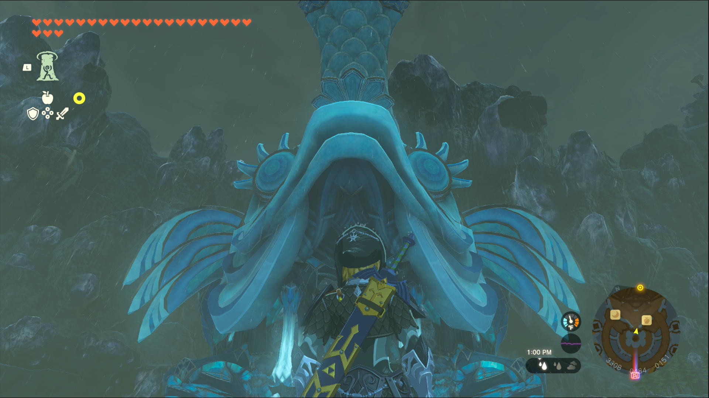
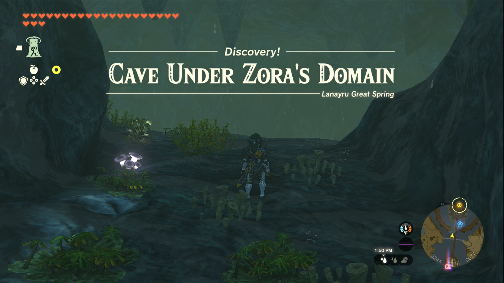
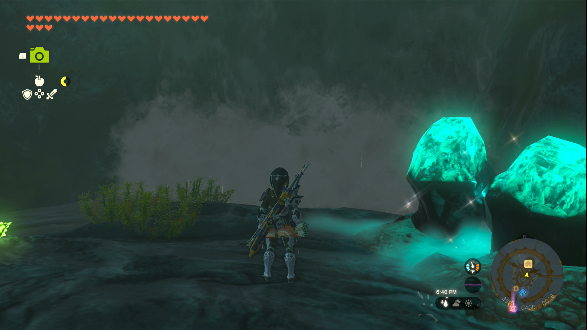

Secret Treasure under the Great Fish is one of the Side Quests you’ll discover in the Lanayru Great Spring region. Side Quests are quests in The Legend of Zelda: Tears of the Kingdom that are relatively short or simple chores that can earn you small rewards or services. 

## Secret Treasure under the Great Fish

To start the Side Quest “Secret Treasure under the Great Fish” you first need to complete the Main Quest “Sidon of the Zora.” Then head to the Throne Room in Zora’s Domain and speak to Sidon. 

He’s discovered ancient texts referring to a secret treasure, with a few cryptic words about bridges and waterfalls. If you’re having trouble deciphering the message, we can help. The great fish seems to be referring to the large fish statue that towers over Zora’s Domain, so naturally that would make Great Zora Bridge the ‘long bridge’ in the passage. 

Head to the massive waterfall under the bridge and swim through it to discover a cave appropriately named ‘Cave Under Zora’s Domain.’ 

The passage also directs treasure seekers to ‘Pass beneath two waterfalls to find your prize,’ so that means you need to swim beneath one more waterfall. As luck would have it, there’s a waterfall across from you as you enter, so glide across (taking care not to fall into the chasm in the middle of the room) and swim through the waterfall. 

This small chamber contains a chest, so open it up to find the treasure: the Vah Ruta Divine Helm. This special helmet strengthens your Vow of Sidon, Sage of Water while you're wearing it. 

Secret Treasure Under the Great Fish

See the complete List of Side Quests and Side Adventures

### Up Next: Walkthrough

Previous

About IGN's Zelda TotK Guide Writers

Next

Walkthrough

### Top Guide Sections

  * Walkthrough
  * Zelda: Tears of The Kingdom Switch 2 Edition Guide
  * Zelda Notes Voice Memories
  * List of Side Quests and Side Adventures

### Was this guide helpful?

Leave feedback

### In This Guide

The Legend of Zelda: Tears of the KingdomNintendo EPD

Initial Release: May 12, 2023

Learn more

Go to comments