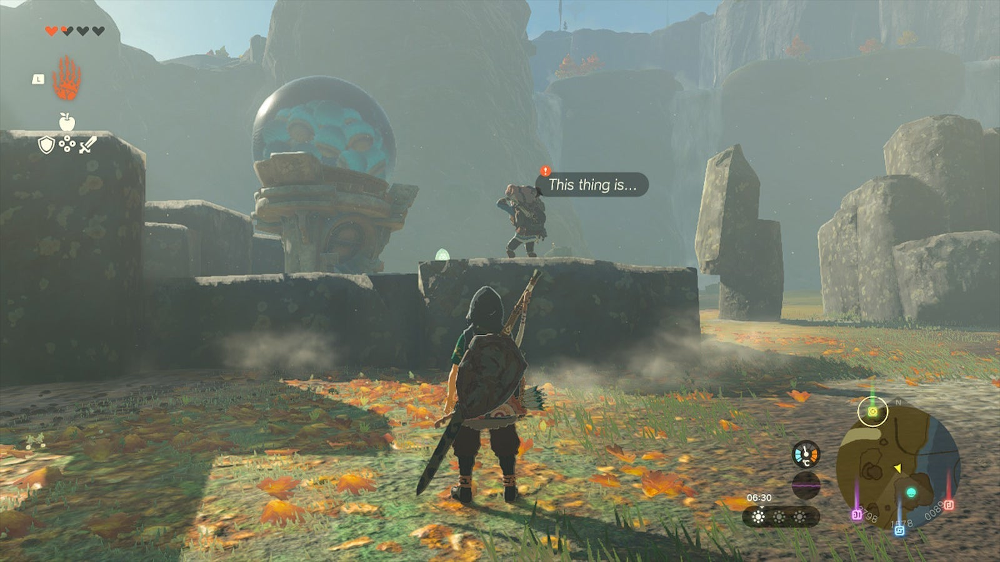

The **Secrets Within** side quest in Tears of the Kingdom's Akkala region provides a short and simple way to uncover device dispenser locations. Here's how to find it, how to use the device dispenser, and how to impress Pulcho. 

## Secrets Within Walkthrough

Secrets Within takes place near **Tarrey Town** in the Akkala Highlands. To start the quest, visit the device dispenser on the coastline west of Lake Akkala. It's next to Hudson's construction site (coordinates 3800, 1571, 0091). 

  
Next, speak to the NPC called Pulcho and **use the device dispenser** \- just put some zonai charges in the tube and wait for the zonai capsules to roll out. This will automatically trigger a dialogue scene with Pulcho, after which the Secrets Within quest is completed. 

The reward for this Tears of the Kingdom side quest is one **sundelion** flower. In addition to that, Pulcho discloses the locations of other device dispensers: one in **Kakariko Village** and one near **Diggdog Bridge**. 

Secrets Within

See the complete List of Side Quests and Side Adventures

### Up Next: Walkthrough

Previous

About IGN's Zelda TotK Guide Writers

Next

Walkthrough

### Top Guide Sections

  * Walkthrough
  * Zelda: Tears of The Kingdom Switch 2 Edition Guide
  * Zelda Notes Voice Memories
  * List of Side Quests and Side Adventures

### Was this guide helpful?

Leave feedback

### In This Guide

The Legend of Zelda: Tears of the KingdomNintendo EPD

Initial Release: May 12, 2023

Learn more

Go to comments