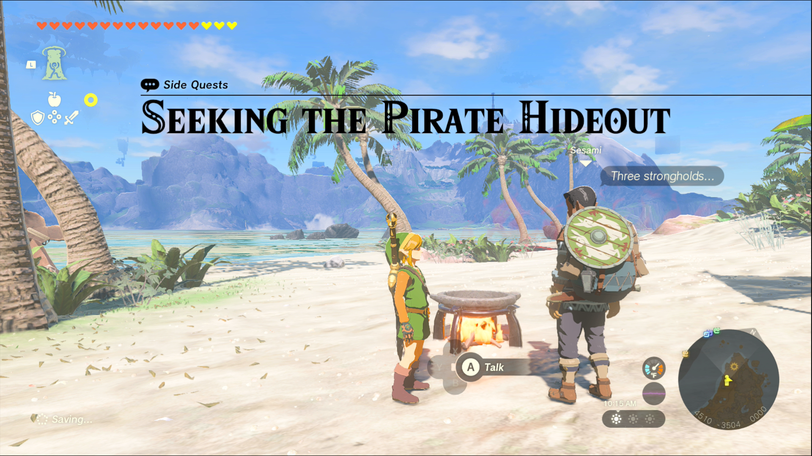
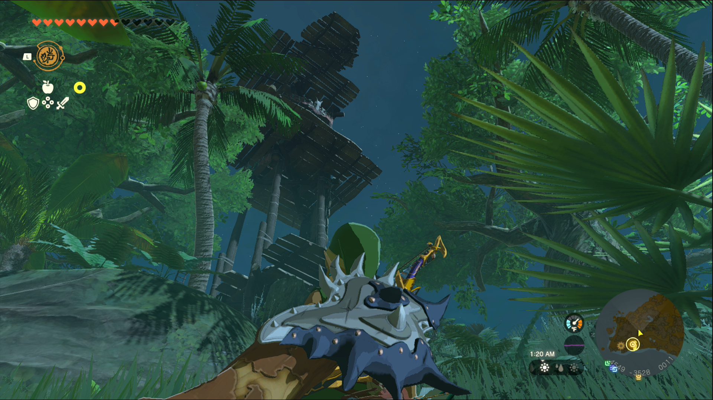
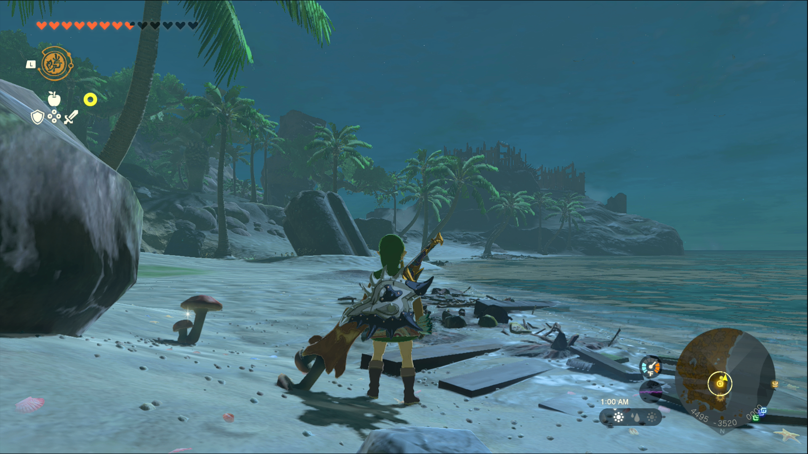
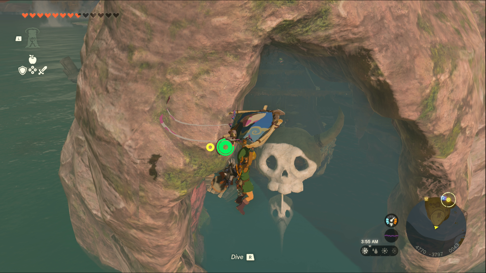

Seeking the Pirate Hideout is a Side Quest you’ll find on Eventide Island. Side Quests are quests in The Legend of Zelda: Tears of the Kingdom that are relatively short or simple chores that can earn you small rewards or services. 

## Seeking the Pirate Hideout

To start the Side Quest “Seeking the Pirate Hideout” you need to reach Eventide Island, the island in the southeast corner of the world map. If you have enough stamina you can glide from Cape Cales to the west, or you can sail across the Necluda Sea using a raft with sails or fans. However you decide to come to the island, you’ll need to speak to Sesami, a man on the northwest shore of Eventide Island. He needs to locate the pirates’ hideout, but there are three enemy strongholds preventing him from getting a good look around the island. 

The three strongholds are located roughly at the three corners of the island. If you need a shortcut to the top of the island, a chasm in the northmost corner gives you a spot to ascend that takes you to the peak of Koholit Rock. This also places you just above the east most stronghold, so take the opportunity to rain arrows down on the monsters from relative safety. Your progress in each stronghold will be marked with a large health bar at the top of the screen, so you can tell if you’re missing a monster in the area. 

The northmost stronghold can be handled with Ascend, allowing you to climb to the top immediately and take out the rest of the monsters below, especially using the 10 bomb flowers you can find in the chest at the top of the central tower. 

The western stronghold is surrounded by walls and spikes, but if you take off from Koholit Rock you may be able to fly right over them, whether by glider or flying device. Otherwise you’ll need to enter from the front gate, where an iron spike ball will be waiting to crush you. The moblin is the biggest threat in the camp, but with numerous archers along the wall, you should stay cautious until the entire stronghold falls. 

When you’ve destroyed the third stronghold, return to Sesami on the beach. He’ll mention seeing a pirate ship sail around the back of the island, so you’ll need to swim or glide around to find a cave. This is easier from the air, so use the chasm shortcut to reach the peak of Koholit Rock and glide in. It’s best if you land on the front of the ship, because there are several monsters on the docks. Use your best weapons to deal with the monsters; if you’re unable to quickly defeat the Boss Bokoblin, turn your attention to his weaker allies. They have much less health so defeating them will make it easier to focus on the Boss Bokoblin at the end. 

When the cave is cleared of enemies, return to Sesami once again. In return for all your help, you’ll receive a Blue-Maned Lynel Saber Horn which can be fused to a weapon or used in an elixir. You also gain access to a flying mini-game located at the peak of Koholit Rock. 

Seeking the Pirate Hideout

See the complete List of Side Quests and Side Adventures

### Up Next: Walkthrough

Previous

About IGN's Zelda TotK Guide Writers

Next

Walkthrough

### Top Guide Sections

  * Walkthrough
  * Zelda: Tears of The Kingdom Switch 2 Edition Guide
  * Zelda Notes Voice Memories
  * List of Side Quests and Side Adventures

### Was this guide helpful?

Leave feedback

Go to comments