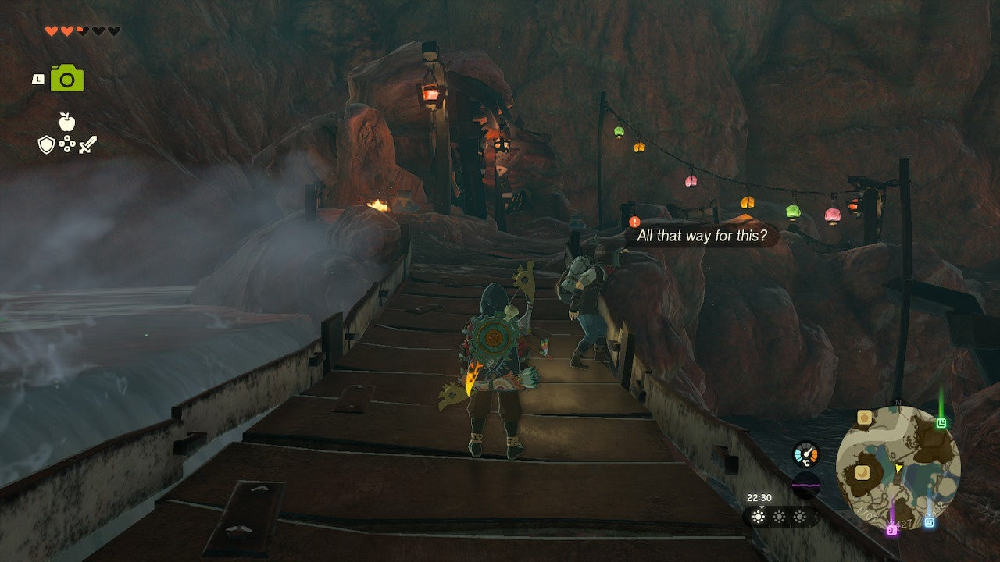
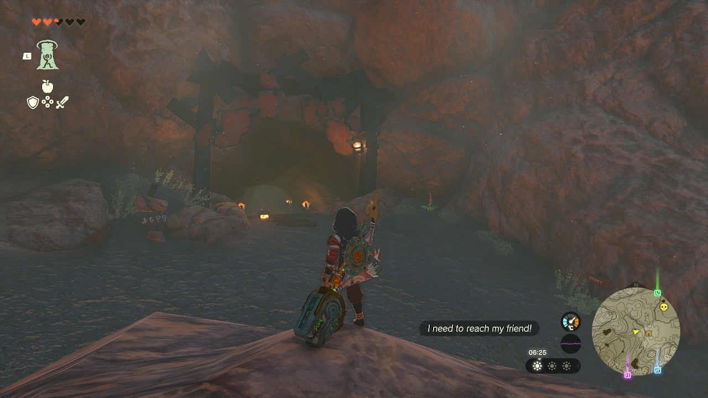
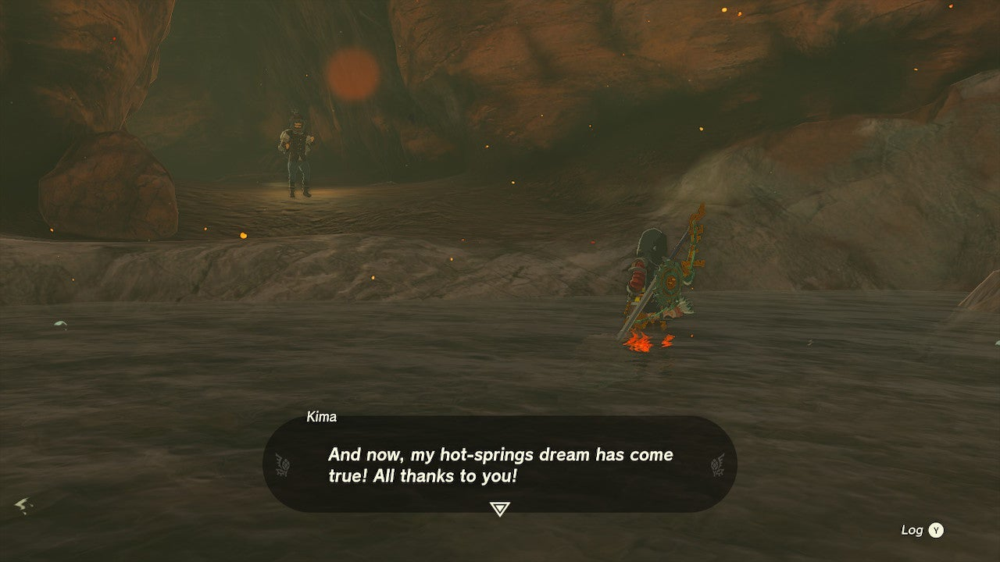

Have you heard about Hyrule's hidden hot springs? Naturally, we need to find them! The hunt for the mysterious Simmerstone Springs starts in Goron City, the Eldin region, where you can pick up this Legend of Zelda: Tears of the Kingdom side quest. 

Here's how to complete the **Simmerstone Springs** side quest. 

## Simmerstone Springs Walkthrough

To start Simmerstone Springs, go to the wooden bridge in the eastern part of Goron City, and speak to the NPC named **Kima**. He will tell you about the hidden hot springs, but he doesn't know their location. He'll advise you to visit the non-secret hot springs south of Goron City and ask around. 

To find the **Goron Hot Springs** , follow the path southeast of Goron City, towards coordinates 1750, 2270, 0479. Look for a Goron named **Grapp**. He's relaxing in one of the hot springs. 

He'll tell you that the Simmerstone Springs are inside **Gorko Tunnel** , but the entrance is blocked. Run further southeast to find the Gorko Tunnel caves. The coordinates are 1970, 2045, 0430. 

Inside the tunnel, **keep breaking the walls of loose rock** (the easiest way to do so is by using Yunobo's power - unlocked after Yunobo of Goron City) until you see a small lava lake, then go left. Break a few more walls until you see the hot spring. You have to walk into the water to complete Simmerstone Springs. 

As soon as you're in the water, Kima will show up to thank you and reward you with a **silver rupee** (100 rupees). He will then sit down and start boiling some eggs. If you want, you can pick up these **Hard-Boiled Eggs** as an extra quest reward - don't worry, Kima won't mind too much. 

Simmerstone Springs

See the complete List of Side Quests and Side Adventures

### Up Next: Walkthrough

Previous

About IGN's Zelda TotK Guide Writers

Next

Walkthrough

### Top Guide Sections

  * Walkthrough
  * Zelda: Tears of The Kingdom Switch 2 Edition Guide
  * Zelda Notes Voice Memories
  * List of Side Quests and Side Adventures

### Was this guide helpful?

Leave feedback

### In This Guide

The Legend of Zelda: Tears of the KingdomNintendo EPD

Initial Release: May 12, 2023

Learn more

Go to comments