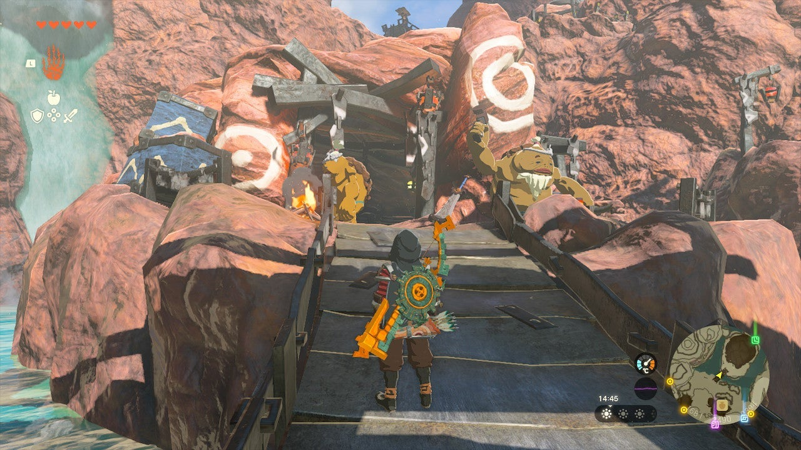
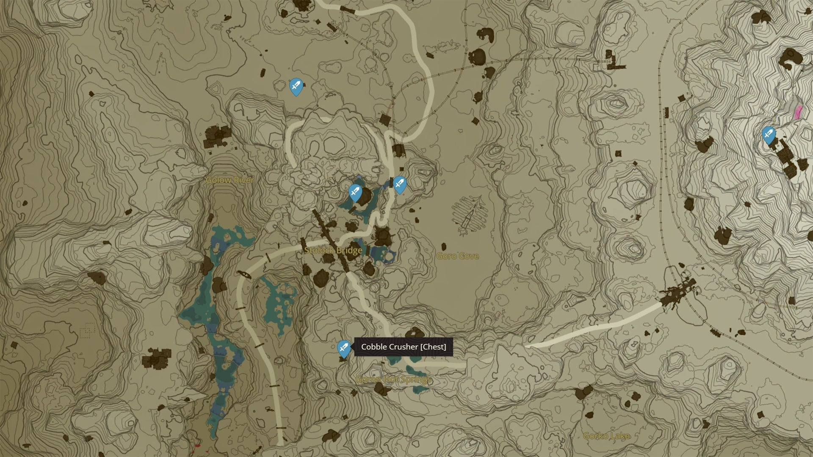

A young blacksmith apprentice in Goron City, the Eldin region, is missing the required materials to complete his Boulder Breaker weapon. It's up to you to help him find the **Boulder Breaker** materials and gain the approval of his master. 

Here's how to help the young Goron and complete the **Soul of the Gorons** side quest in The Legend of Zelda: Tears of the Kingdom. 

## Soul of the Gorons Walkthrough

The Soul of the Gorons side quest becomes available after you've completed the main quest Yunobo of Goron City. Travel to the **northeastern part of Goron City** , where you'll see an old blacksmith and a younger Goron in front of a house. Talk to them or try to pick up the large weapon behind them to start the quest. 

The younger Goron, Fugo, will ask for the following materials: 

  * Cobble Crusher x1
  * Flint x5
  * Diamond x3

There's a chest containing a **Cobble Crusher** south of Goron City (see picture below). If you need more Cobble Crusher locations, take a look at our Tears of the Kingdom interactive map. 

**Flint** is a very common ore type - just crush a few ore deposits if you don't have enough yet. **Diamonds** , on the other hand, are hard to come by. There's one beneath Hyrule Castle and another given as a reward for completing the Jochi-ihiga Shrine, but for more specific instructions, take a look at our full Tears of the Kingdom diamonds guide. 

And that's it! Return to Fugo and give him the materials to complete Soul of the Gorons. You will receive a **Boulder Breaker** (attack power 38) as a reward. 

Soul of the Gorons

See the complete List of Side Quests and Side Adventures

### Up Next: Walkthrough

Previous

About IGN's Zelda TotK Guide Writers

Next

Walkthrough

### Top Guide Sections

  * Walkthrough
  * Zelda: Tears of The Kingdom Switch 2 Edition Guide
  * Zelda Notes Voice Memories
  * List of Side Quests and Side Adventures

### Was this guide helpful?

Leave feedback

### In This Guide

The Legend of Zelda: Tears of the KingdomNintendo EPD

Initial Release: May 12, 2023

Learn more

Go to comments