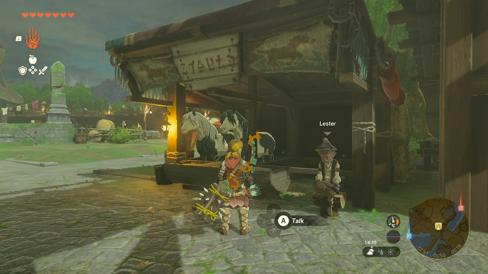

Spotting Spot is a side quest found in Lookout Landing in Zelda: Tears of the Kingdom. In order to get it, you first need to reconstruct the Lookout Landing Stable. 

  * **Side Quest Location:** Lookout Landing
  * **Prerequisites:** Complete Regional Phenomena and The Incomplete Stable
  * **Rewards:** Purple Rupee (50), Swift Carrot, ability to keep Spot and get a Pony Point

After you've reconstructed the Lookout Landing Stable via the The Incomplete Stable side quest, look for Lester, the old stable master who will be mumbling something about "rotten luck". Talk to him to hear about his beloved horse and best friend, Spot, who went missing. 

Lester gives a hint to the horse's appearance and his whereabouts: Spot is beige with grey spots, and the stallion is somewhere nearby (not too far) and high up. 

Now, don't go searching the mountains. Spot really didn't run too far off. From the Lookout Landing Stable, exit through the south gate (you might as well take out a horse to speed this up) and keep your eyes peeled to the right as you enter the hills of Hyrule. Spot is frolicking in the higher-up meadows to the southwest of Lookout Landing. You can see the location on the map below: 

Spot is playing with other horses -- and there may be enemies nearby -- so be careful that you don't spook them all, making it harder to catch and ride Spot. 

The easiest way to get Spot is to use the ice arrow trick. You can don some stealth gear or drink a potion and unequip loud armor and weapons to sneak up on the horse, or you can just do it the easy way. Aim an arrow at Spot and fuse an ice power item to it (white Chuchu Jelly or Ice Fruit, for example). Fire the arrow to freeze Spot and walk up to the frozen horse and wait next to it. 

The moment it unfreezes, jump on, and hit the L button rapidly to calm down Spot. As soon as you're in control, ride back to the Lookout Landing Stable and talk to Lester. You can do so from horseback by targeting him. 

The mission is complete. Lester will thank you and reward you with a Purple Rupee and a Swift Carrot. But better yet, you can keep Spot and register and board the horse right there at the stable and receive a Pony Point for it. 

Spotting Spot

See the complete List of Side Quests and Side Adventures

### Up Next: Walkthrough

Previous

About IGN's Zelda TotK Guide Writers

Next

Walkthrough

### Top Guide Sections

  * Walkthrough
  * Zelda: Tears of The Kingdom Switch 2 Edition Guide
  * Zelda Notes Voice Memories
  * List of Side Quests and Side Adventures

### Was this guide helpful?

Leave feedback

Go to comments