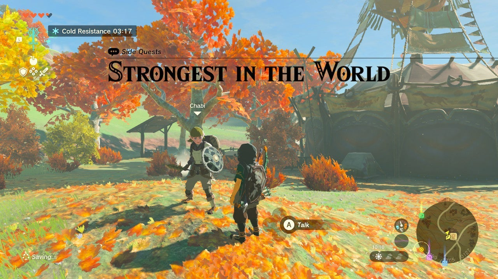
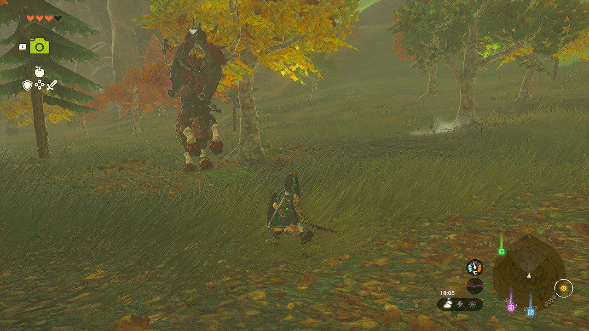

The Strongest in the World side quest provides a great opportunity to test Link's battle prowess. But beware; this Akkala-based quest involves a fight against a rather dangerous Lynel boss, so be sure to bring your strongest weapons. 

If that doesn't scare you off, here's how to complete the **Strongest in the World** quest in The Legend of Zelda: Tears of the Kingdom. 

## Strongest in the World Walkthrough

To start the Strongest in the World, visit the East Akkala Stable and speak to **Chabi** (coordinates 4200, 2765, 0127). 

Chabi will tell you about a **Lynel** located northwest of your current position, on the way to Tempest Gulch. Travel off-road through Deep Akkala to find it (coordinates 3750, 2880, 0038). As Chabi wants to see a weapon made from a Lynel horn, your task is to fight this creature. 

To make this fight successful, try to study the Lynel's attack pattern and dodge at the right moment. This will give you an opportunity to land a flurry of hits. You can also try to keep your distance and hit the Lynel with your arrows. Always aim for the head! 

After defeating the Lynel, **pick up its horn** and use your Fuse ability to combine it with a weapon. **Return to Chabi** and show her the weapon to complete the Strongest in the World quest. She'll give you a **purple rupee** (worth 50 green rupees) as a reward. 

Strongest in the World

See the complete List of Side Quests and Side Adventures

### Up Next: Walkthrough

Previous

About IGN's Zelda TotK Guide Writers

Next

Walkthrough

### Top Guide Sections

  * Walkthrough
  * Zelda: Tears of The Kingdom Switch 2 Edition Guide
  * Zelda Notes Voice Memories
  * List of Side Quests and Side Adventures

### Was this guide helpful?

Leave feedback

### In This Guide

The Legend of Zelda: Tears of the KingdomNintendo EPD

Initial Release: May 12, 2023

Learn more

Go to comments