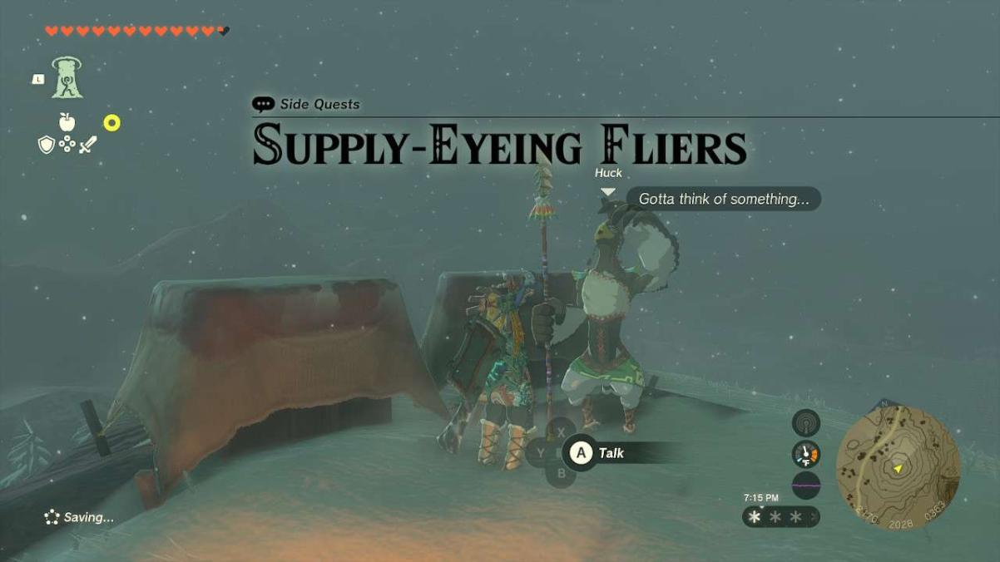
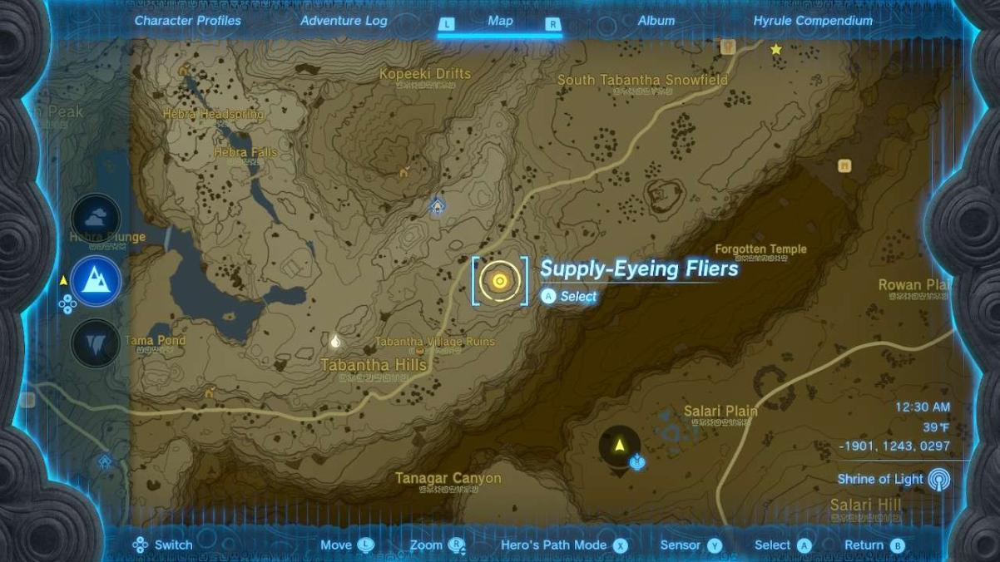
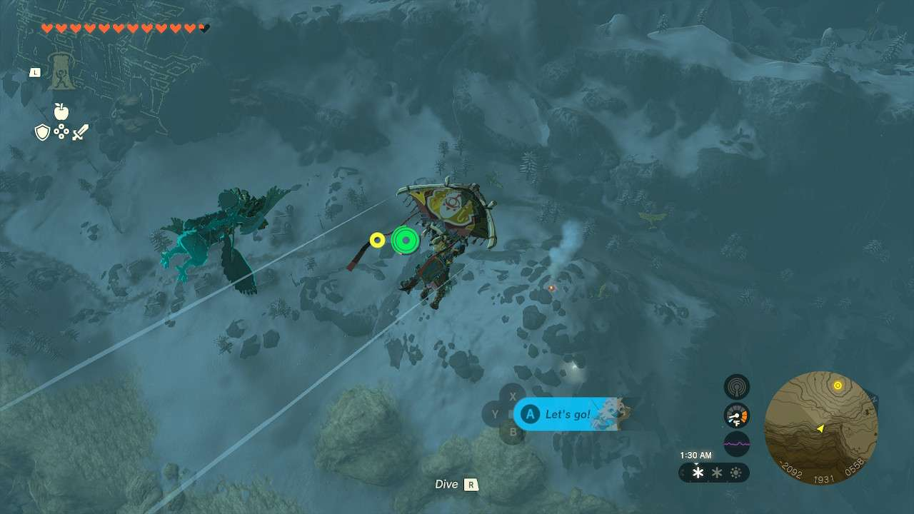

**Supply-Eyeing Fliers** is one of the many Side Quests to complete in The Legend of Zelda: Tears of the Kingdom. In this guide, we will teach you everything you need to know to complete Supply-Eying Fliers, including where to find it and what you will get as a reward. 

  * **Side Quest Location** : Tabantha Hills
  * **Prerequisites** : n/a
  * **Rewards** : 50 Rupees

Not too far away from the **Tabantha Village Ruins** in **Tabantha Hills** , there’s a campfire at the top of a small mountain. Up here is a Rito named **Huck** , who is protecting some supplies from a trio of **Aerocudas** that are circling above. 

Thing is, the Aerocudas are just out of reach of most conventional means of combat, including bows. We need to get high enough to hit them all. You could get to a higher vantage point from the nearby Lindor’s Brow Skyview Tower or the nearby mountain range, but the quickest way is to have a **Hylian Pine Cone** and drop it on the fire, creating an upward draft. 

Open the paraglider over this draft to get high enough to target the Aerocudas and snipe’em. Don’t forget you can lock onto targets with the ZL trigger. Once you eliminate the three of them, Huck will thank you with **50 Rupees** and pack up. 

Supply-Eyeing Fliers

See the complete List of Side Quests and Side Adventures

### Up Next: Walkthrough

Previous

About IGN's Zelda TotK Guide Writers

Next

Walkthrough

### Top Guide Sections

  * Walkthrough
  * Zelda: Tears of The Kingdom Switch 2 Edition Guide
  * Zelda Notes Voice Memories
  * List of Side Quests and Side Adventures

### Was this guide helpful?

Leave feedback

### In This Guide

The Legend of Zelda: Tears of the KingdomNintendo EPD

Initial Release: May 12, 2023

Learn more

Go to comments