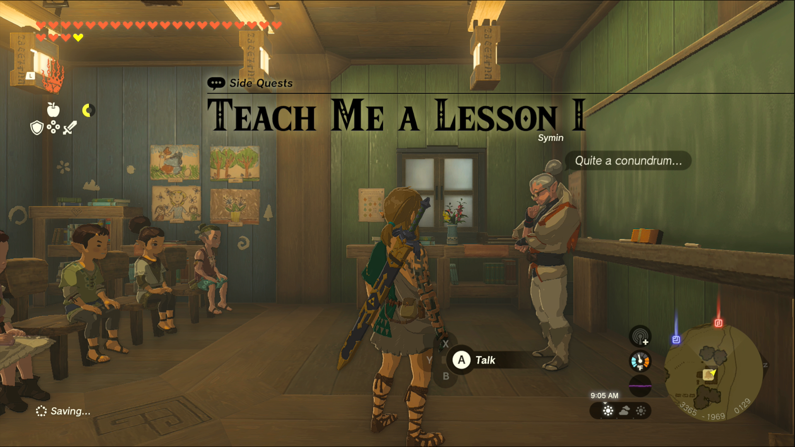
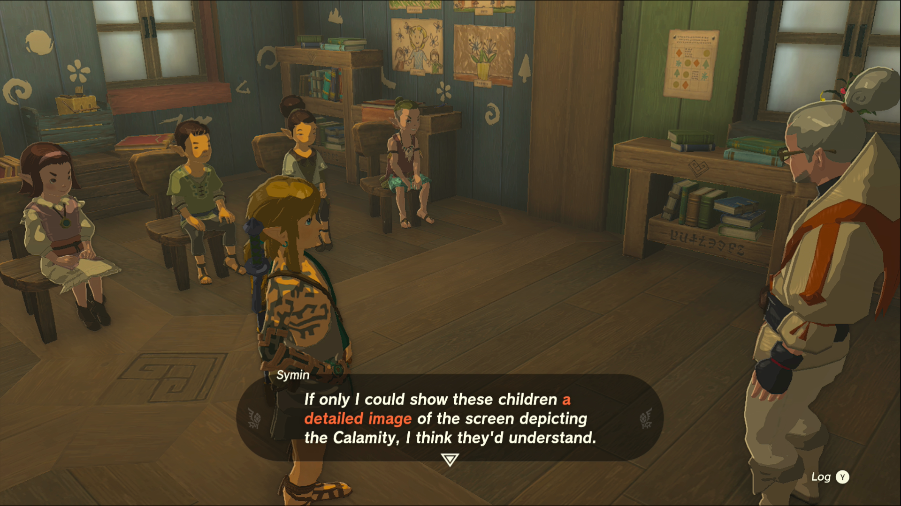
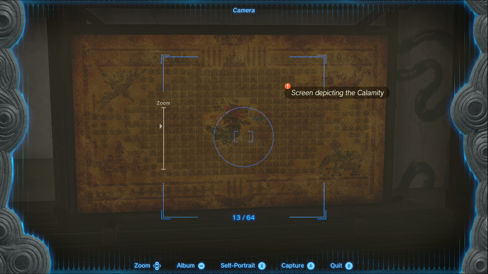

Teach Me a Lesson I is one of the Side Quests you’ll discover in the Mount Lanayru region. Side Quests are quests in The Legend of Zelda: Tears of the Kingdom that are relatively short or simple chores that can earn you small rewards or services. 

## Teach Me a Lesson I

To start the Side Quest “Teach Me a Lesson I” you need to go to the Hateno School and speak to Symin while class is in session. This is at 9:00, when Symin starts his lesson for the day. 

He wants to teach the children about the calamity, but they’re skeptical of the veracity of the history lesson. Symin needs you to get him a picture depicting the calamity, which can be found at the Elder’s Hall in Kakariko Village. 

Once you get to Kakariko Village, head upstairs and the screen will be on the left side. Make sure the quest marker appears on the screen before you take the picture, but once you have it, return to Symin at the school in Hateno. 

If school’s out, you’ll need to wait until the next day to show the photo to Symin and his class. You’ll receive 10 bunches of Hylian Rice as a reward. Speak to Symin again for his next lesson and quest, Teach Me a Lesson II. 

Teach Me a Lesson I

See the complete List of Side Quests and Side Adventures

### Up Next: Walkthrough

Previous

About IGN's Zelda TotK Guide Writers

Next

Walkthrough

### Top Guide Sections

  * Walkthrough
  * Zelda: Tears of The Kingdom Switch 2 Edition Guide
  * Zelda Notes Voice Memories
  * List of Side Quests and Side Adventures

### Was this guide helpful?

Leave feedback

Go to comments