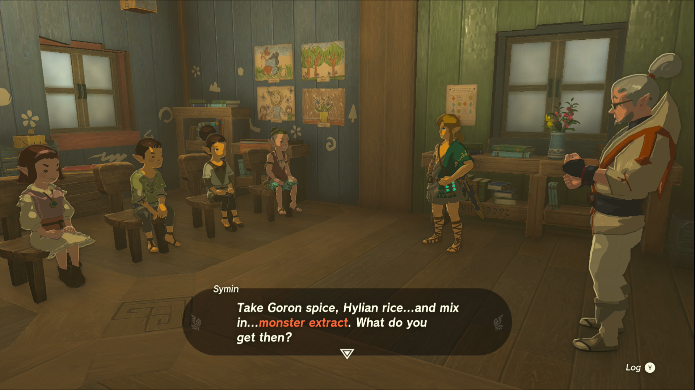
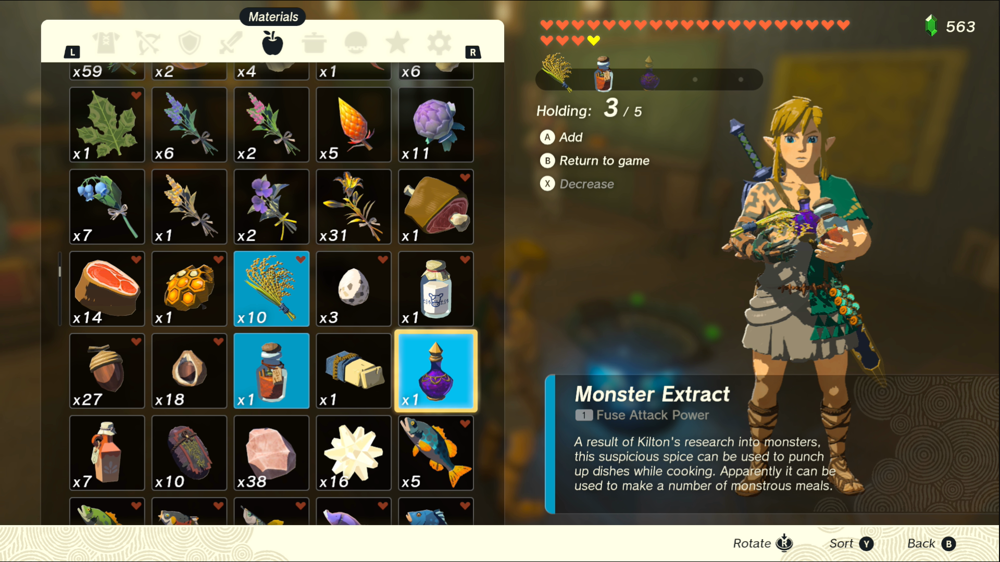
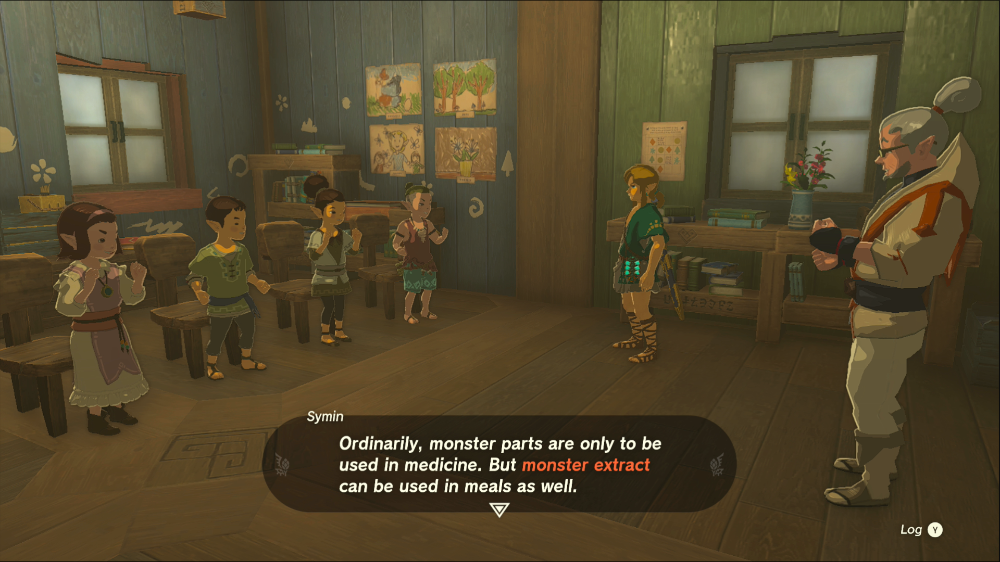

Teach Me a Lesson II is one of the Side Quests you’ll discover in the Mount Lanayru region. Side Quests are quests in The Legend of Zelda: Tears of the Kingdom that are relatively short or simple chores that can earn you small rewards or services. 

## Teach Me a Lesson II

To start the Side Quest “Teach Me a Lesson II” you need to complete “Teach Me a Lesson I” but while the first class was a history lesson, this time the students are learning home economics! 

Symin wants to teach the children about cooking with Monster Extract, but once again they’re skeptical of his lessons. If Symin had monster curry to show the children, he could complete the lesson, so he’s counting on you to make the recipe. You’ll need Goron Spice, Hylian Rice and Monster Extract to make this food. 

Goron Spice can be found at the general store in Goron City next to Death Mountain, and Hylian Rice was given as a reward for completing the previous lesson. As Symin said, you can find Monster Extract at Tarrey Town, in the Akkala Region. Once you have the ingredients, cook them together and give the result to Symin. Just like with the last quest, if the class is out of session you’ll have to wait until the next day to turn in the meal. 

As a reward, Symin has given you permission to use the school’s field to grow your own crops, like pumpkins, carrots, tomatoes, wildberries, wheat, rice or melons. You’ll need to speak to Uma to complete the side quest “Uma’s Garden” to learn about planting crops. 

Teach Me a Lesson II

See the complete List of Side Quests and Side Adventures

### Up Next: Walkthrough

Previous

About IGN's Zelda TotK Guide Writers

Next

Walkthrough

### Top Guide Sections

  * Walkthrough
  * Zelda: Tears of The Kingdom Switch 2 Edition Guide
  * Zelda Notes Voice Memories
  * List of Side Quests and Side Adventures

### Was this guide helpful?

Leave feedback

Go to comments