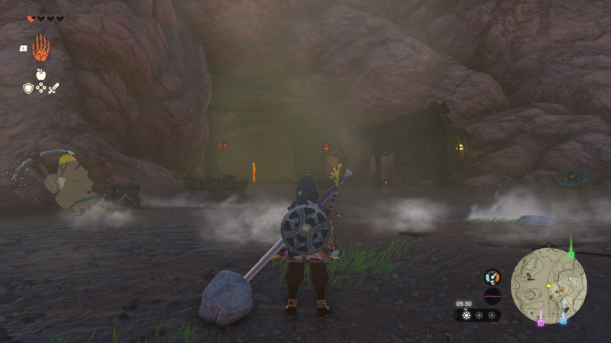
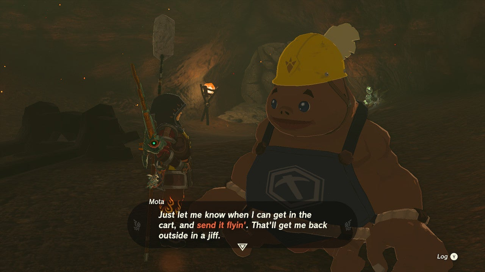
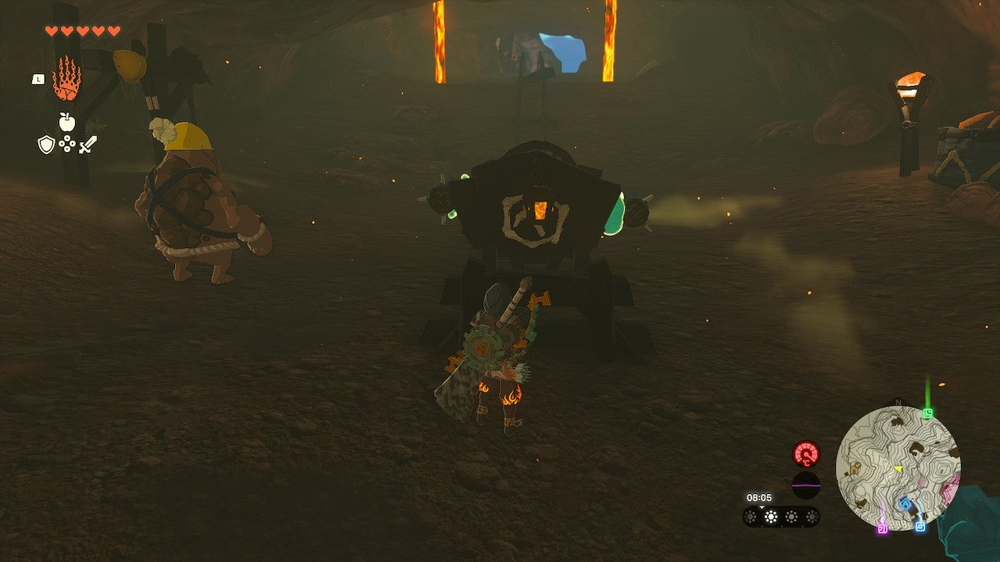

Can you help out an abandoned laborer? One of the Goron miners in Death Mountain West Tunnel is stuck behind a broken minecart track, and the only way to save him is by enhancing a minecart with Zonai devices. 

If you want to know how to help this unfortunate Goron, here’s a full walkthrough for **The Abandoned Laborer** in The Legend of Zelda: Tears of the Kingdom. 

## The Abandoned Laborer Walkthrough

The Abandoned Laborer side quest starts in the **Death Mountain West Tunnel** , which is found at coordinates 2250, 2680, 0523. As the name suggests, the tunnel is located on the west side of Death Mountain, quite easy to spot - look for the large tunnel with a bunch of mineworkers in front of it. 

Make sure you're protected against **intense heat** (either through a Fireproof Elixir or armor) before heading inside and crossing the lava. Speak to **Mota** to start The Abandoned Laborer side quest. 

Destroy the wall behind Mota, but **do not use Bomb Flowers** as they will immediately explode due to the intense heat. Behind the wall, you'll find a supply of Rockets and Fans. Use Ultrahand to take **two Rockets** back to Mota. See the minecart next to him? Attach one Rocket to each side of the minecart as shown in the picture below, and place the minecart on the broken tracks. 

Time to ask Mota to hop on the minecart! You probably know the drill by now: hit the cart, and the Rockets will send him flying across the lava. Meet up with Mota outside the Death Mountain West Tunnel to finish The Abandoned Laborer side quest and receive your reward: a **Large Zonai Charge**. 

For more detailed info on the Death Mountain West Tunnel, such as the Bubbulfrog location, please take a look at our Eldin region guide. 

The Abandoned Laborer

See the complete List of Side Quests and Side Adventures

### Up Next: Walkthrough

Previous

About IGN's Zelda TotK Guide Writers

Next

Walkthrough

### Top Guide Sections

  * Walkthrough
  * Zelda: Tears of The Kingdom Switch 2 Edition Guide
  * Zelda Notes Voice Memories
  * List of Side Quests and Side Adventures

### Was this guide helpful?

Leave feedback

Go to comments