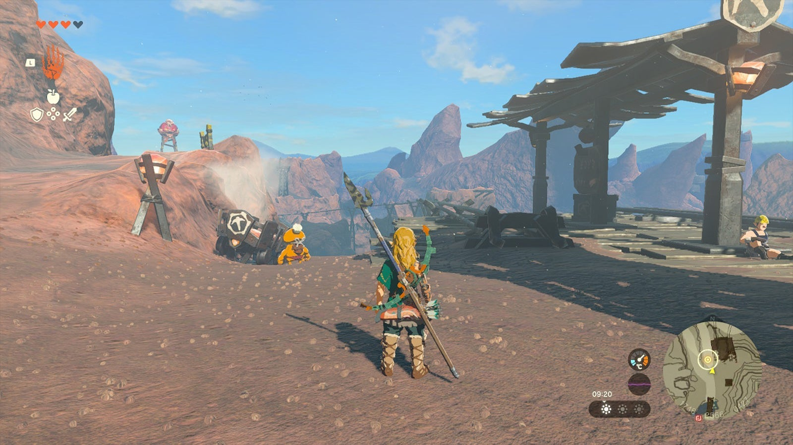
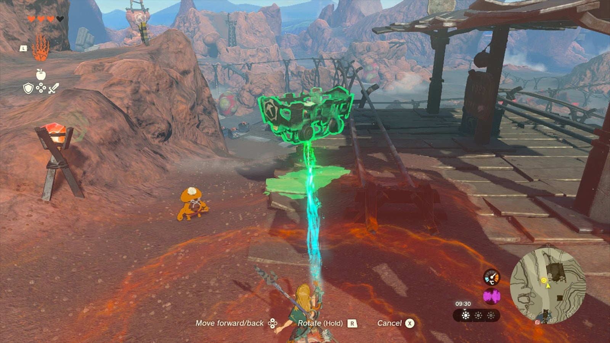

The Ancient City Gorondia is one of the side quests found near Goron City in the Eldin region. It's a relatively short and simple quest that involves mine carts, an old legend, and a new Goron friend. 

Here's how to complete **The Ancient City Gorondia!**

##  The Ancient City Gorondia Walkthrough

Starting from Goron City, follow the road to the north to find an NPC called **Dugby**(coordinates 1744, 2575, 0427). Speaking to this young Goron will start The Ancient City Gorondia side quest. 

Dugby expresses his wish to **use a mine cart** , but the cart is broken. Use your ultrahand ability to attach a nearby fan to one of the mine carts, and place it on the track. Dugby will hop in after you speak to him again. 

Next, join Dugby in the minecart and activate the fan, taking you further north. The Ancient City Gorondia quest will be completed upon arrival, and Dugby will give you a **zonai charge** as a reward. 

The Ancient City Gorondia!

See the complete List of Side Quests and Side Adventures

### Up Next: Walkthrough

Previous

About IGN's Zelda TotK Guide Writers

Next

Walkthrough

### Top Guide Sections

  * Walkthrough
  * Zelda: Tears of The Kingdom Switch 2 Edition Guide
  * Zelda Notes Voice Memories
  * List of Side Quests and Side Adventures

### Was this guide helpful?

Leave feedback

### In This Guide

The Legend of Zelda: Tears of the KingdomNintendo EPD

Initial Release: May 12, 2023

Learn more

Go to comments