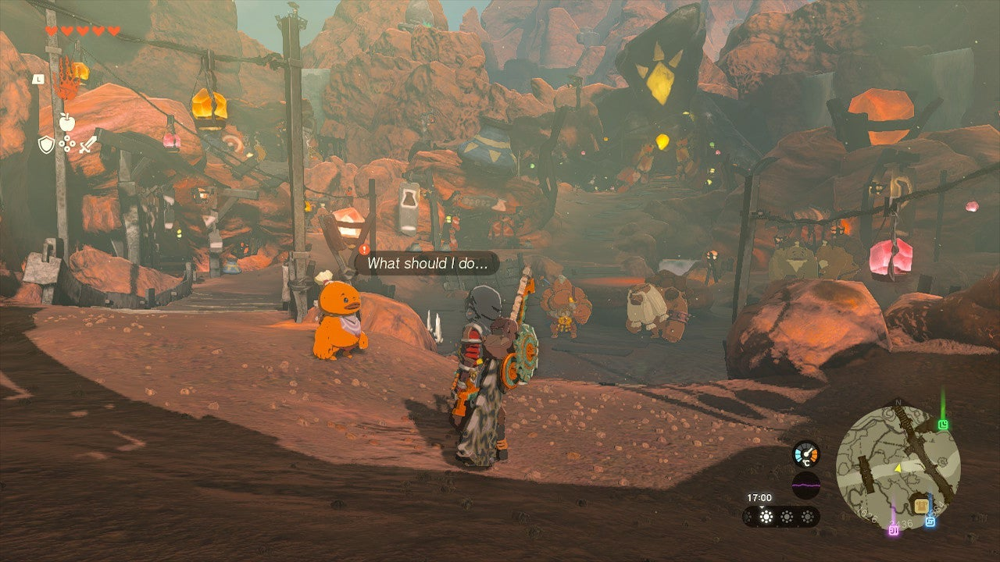
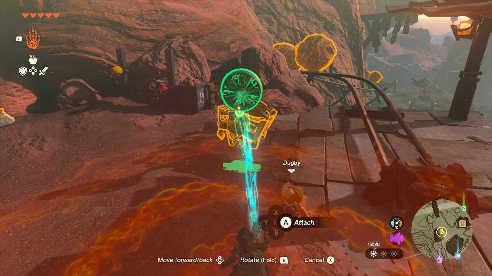
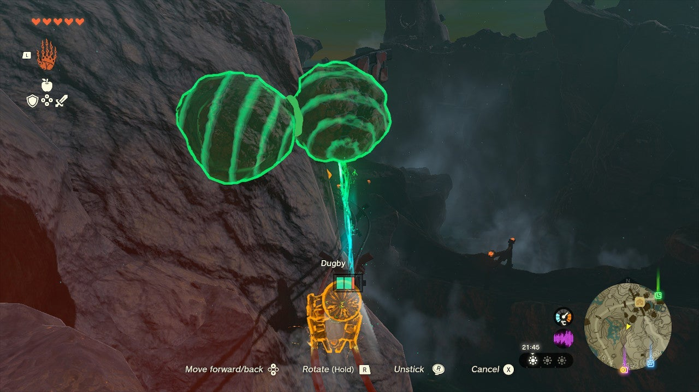

After you've completed the previous quest, The Ancient City Gorondia!, you can meet up with little Dugby again, who's still hoping to discover the ancient city of the Gorons. Time for yet another minecart-building skill test! 

Here's how to solve the second part of the Ancient Gorondia quests: **The Ancient City Gorondia?** side quest. 

## The Ancient City Gorondia Walkthrough

Go to the Eldin region, and visit Goron City, where you'll find **Dugby** on the south side of the town. He'll roll away from you and ask you not to follow him - so naturally, we're following him. 

Dugby will stop at a small minecart station. First, attach the Fan to the nearby minecart and place it on the tracks. 

Next, ask Dugby to get in the cart, and start your journey. The cart will bump against the large stones blocking the tracks, but that's okay; simply use Ultrahand to remove the stones whenever this happens. 

Reach the end of the minecart tracks to complete The Ancient City Gorondia part two. Dugby will reward you with a **Large Zonai Charge**. 

The Ancient City Gorondia?

See the complete List of Side Quests and Side Adventures

### Up Next: Walkthrough

Previous

About IGN's Zelda TotK Guide Writers

Next

Walkthrough

### Top Guide Sections

  * Walkthrough
  * Zelda: Tears of The Kingdom Switch 2 Edition Guide
  * Zelda Notes Voice Memories
  * List of Side Quests and Side Adventures

### Was this guide helpful?

Leave feedback

### In This Guide

The Legend of Zelda: Tears of the KingdomNintendo EPD

Initial Release: May 12, 2023

Learn more

Go to comments