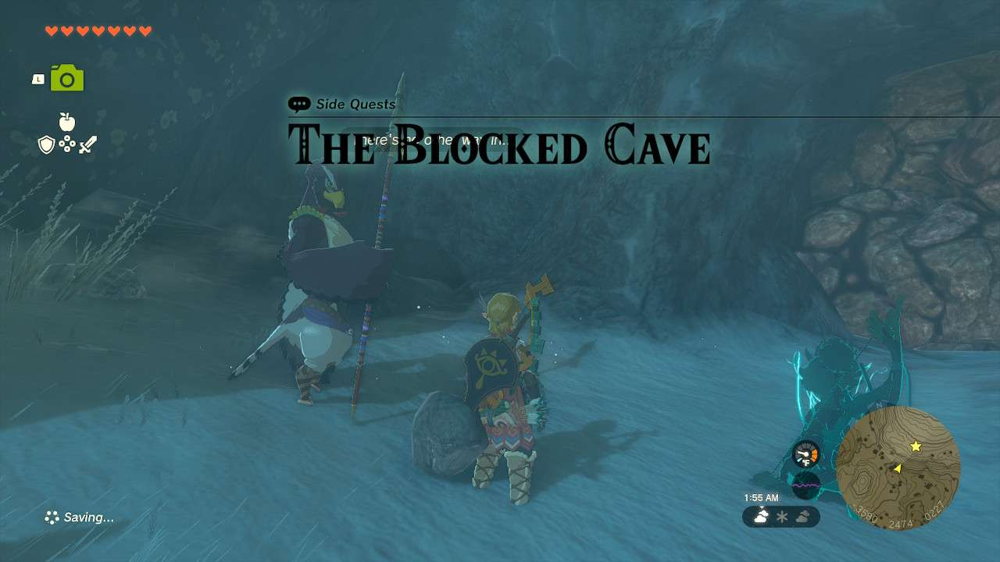
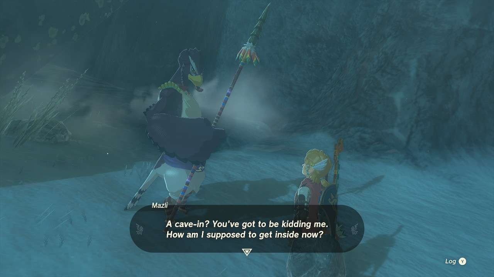
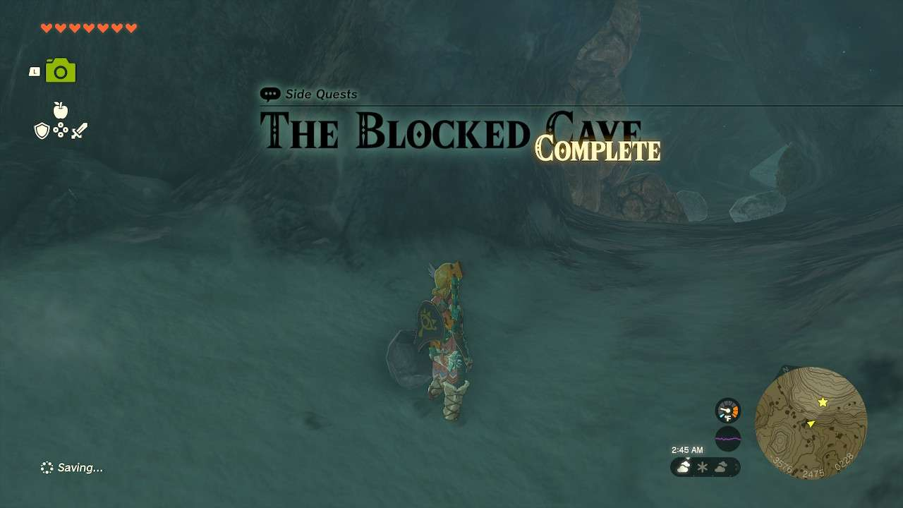

**The Blocked Cave** is one of the many Side Quests to complete in The Legend of Zelda: Tears of the Kingdom. In this guide, we will teach you everything you need to know to complete The Blocked Cave, including where to find it and what you will get as a reward. 

  * **Side Quest Location** : Rospro Pass Cave, (-3580, 2474, 0227)
  * **Prerequisites** : n/a (Possibly need to finish the Rito Village portion of Regional Phenomena)
  * **Rewards** : 20 Rupees

As you’re adventuring in the Hebra Mountains, you may come across **Mazli** in front of a rock-barricaded cave opening. This is **Rospro Pass Cave** , which is slightly northwest of the Rospro Pass Skyview Tower. Speak with him to begin the quest. 

Open up the breakable rocks any way you wish such as bomb plants, a demolition-specific weapon, or any other weapon fused with a boulder. You don’t even have to explore the cave really, just open it up. Once you do, speak again to Mazli to receive your 20 Rupee reward. 

The Blocked Cave

See the complete List of Side Quests and Side Adventures

### Up Next: Walkthrough

Previous

About IGN's Zelda TotK Guide Writers

Next

Walkthrough

### Top Guide Sections

  * Walkthrough
  * Zelda: Tears of The Kingdom Switch 2 Edition Guide
  * Zelda Notes Voice Memories
  * List of Side Quests and Side Adventures

### Was this guide helpful?

Leave feedback

### In This Guide

The Legend of Zelda: Tears of the KingdomNintendo EPD

Initial Release: May 12, 2023

Learn more

Go to comments