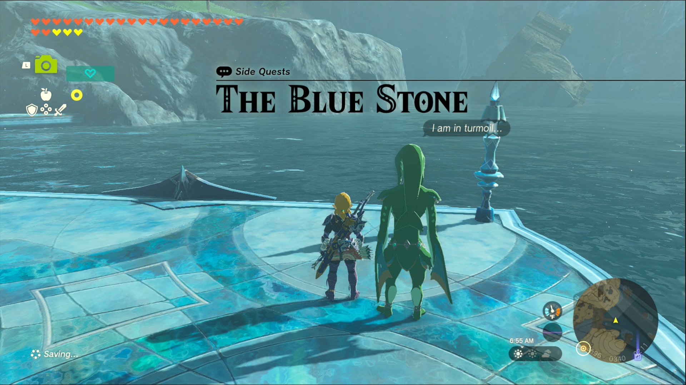
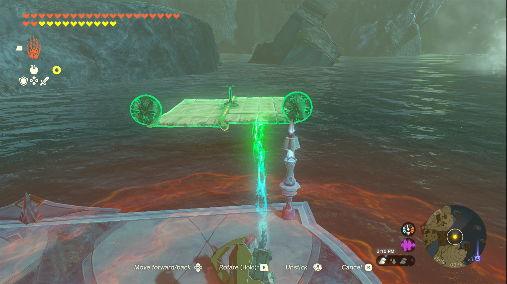
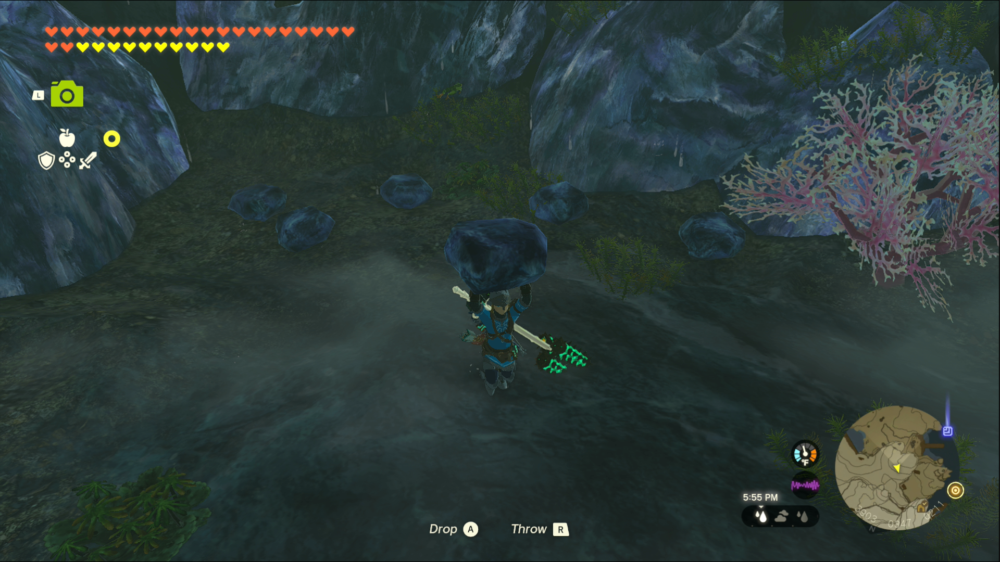
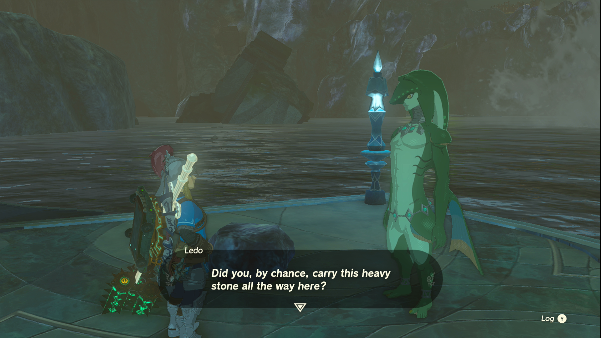
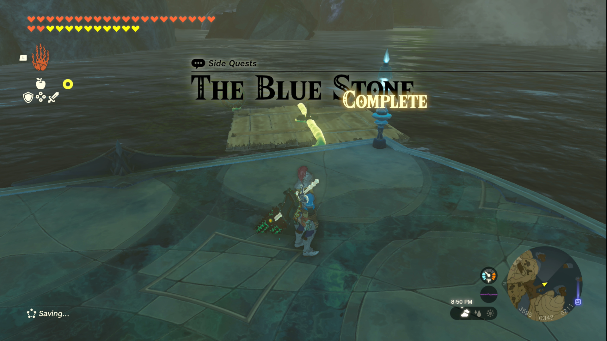

The Blue Stone is one of the Side Quests you’ll discover in the Lanayru Great Spring region. Side Quests are quests in The Legend of Zelda: Tears of the Kingdom that are relatively short or simple chores that can earn you small rewards or services. 

## The Blue Stone

To start the Side Quest “The Blue Stone” you first need to complete the Main Quest “Sidon of the Zora.” Then go to the East Reservoir Lake and speak to Ledo, the Zora standing on the dam leading to Zora’s Domain. 

He’ll point you to a cave and mention it being full of blue stone. They’re too heavy to carry but if you can bring him one he can repair Mipha’s Court. From the sounds of it, you’ll need a raft to bring a stone back to him and, as luck would have it, there are materials to build a raft nearby. 

Use the fans, control stick and the wooden boards to throw one together and head for the cave Ledo pointed you to. 

At the back of the short cave will be a couple of blue stones, pick one up and fuse it to your raft, then turn it around and head back to Ledo. 

Placing the stone next to him will automatically start a conversation where he accepts the stone and gets to work repairing Mipha Court. You’ll receive a new pattern for your glider as a reward. 

The Blue Stone

See the complete List of Side Quests and Side Adventures

### Up Next: Walkthrough

Previous

About IGN's Zelda TotK Guide Writers

Next

Walkthrough

### Top Guide Sections

  * Walkthrough
  * Zelda: Tears of The Kingdom Switch 2 Edition Guide
  * Zelda Notes Voice Memories
  * List of Side Quests and Side Adventures

### Was this guide helpful?

Leave feedback

### In This Guide

The Legend of Zelda: Tears of the KingdomNintendo EPD

Initial Release: May 12, 2023

Learn more

Go to comments