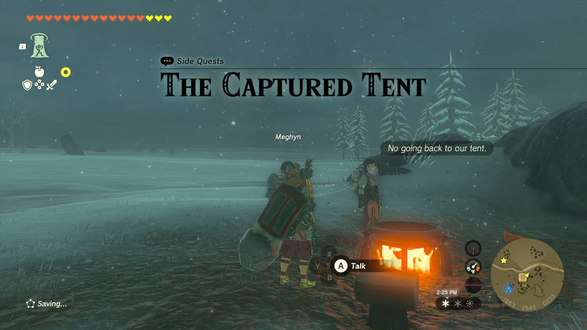
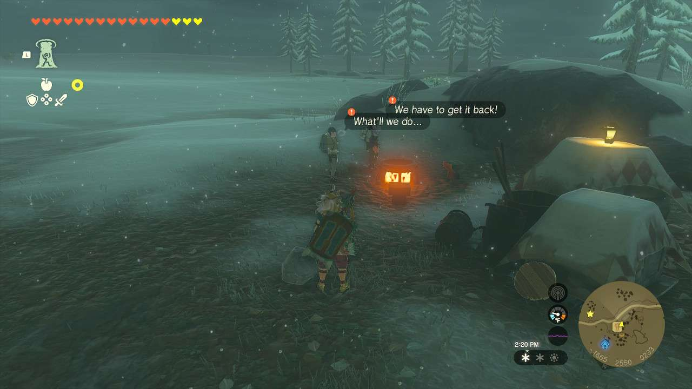
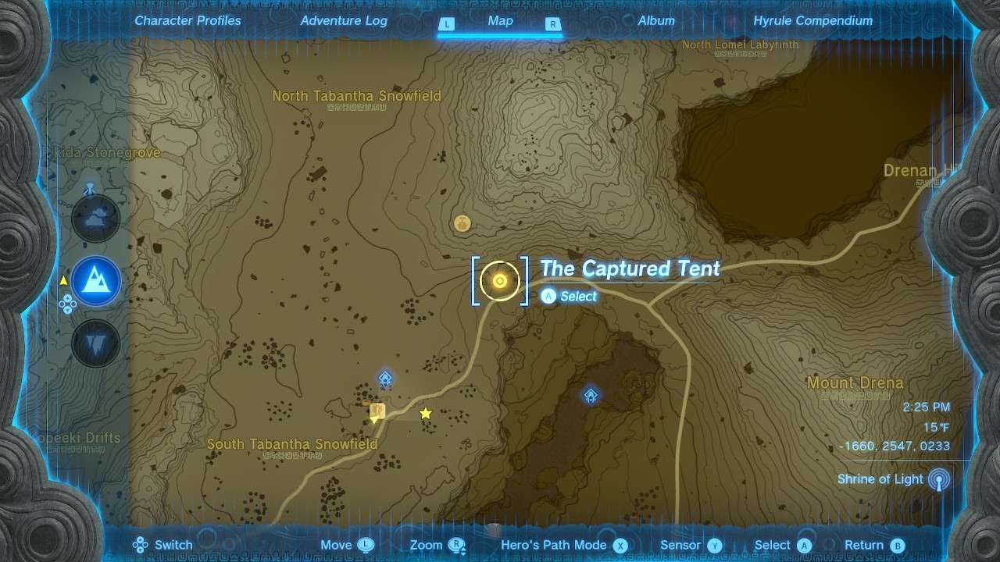
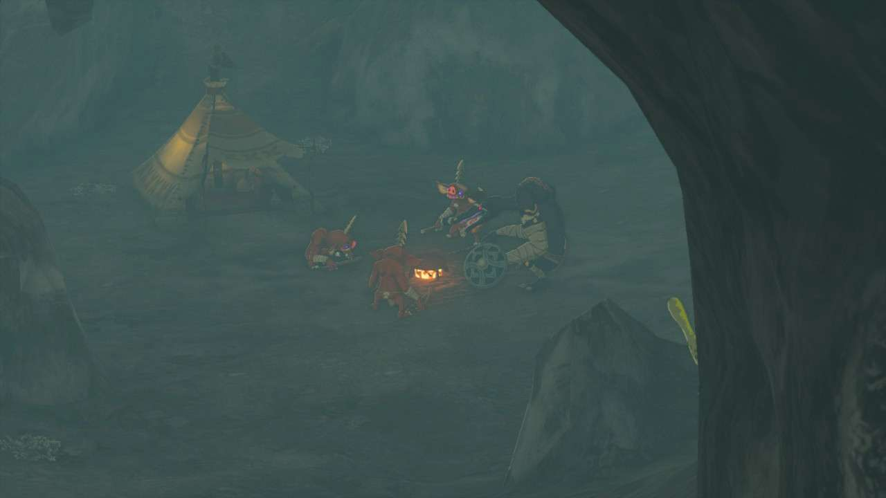

**The Captured Tent** is one of the many Side Quests to complete in The Legend of Zelda: Tears of the Kingdom. In this guide, we will teach you everything you need to know to complete The Captured Tent, including where to find it and what you will get as a reward. 

  * **Side Quest Location** : Snowfield Stable, Tabantha Tundra
  * **Prerequisites** : Complete Cave Mushrooms That Glow
  * **Rewards** : Spicy Steamed Mushrooms

Following the events of Cave Mushrooms That Glow, mushroom hunter sisters **Nat and Meghyn** can be found near the cooking pot at **Snowfield Stable**. Speak to them here and they’ll explain that monsters took over their tent while exploring. You can get it back for them by defeating the monsters. 

The quest marks the location a bit north in the **Mount Drena Foothill Cave** (-1386, 2885, 0189). You can head north and follow the road for the most part, although watch out for a Lizafols ambush that’s not far from the cave entrance. 

Inside the cave, you’ll see the explorers’ tent taken over by a trio of Bokoblins and a Moblin. Defeat this quartet of creatures and head back to the Stable and speak to the girls again to complete the quest. They’ll immediately let you in on their secret and rope you into their final mission, Who Finds the Haven. 

The Captured Tent

See the complete List of Side Quests and Side Adventures

### Up Next: Walkthrough

Previous

About IGN's Zelda TotK Guide Writers

Next

Walkthrough

### Top Guide Sections

  * Walkthrough
  * Zelda: Tears of The Kingdom Switch 2 Edition Guide
  * Zelda Notes Voice Memories
  * List of Side Quests and Side Adventures

### Was this guide helpful?

Leave feedback

### In This Guide

The Legend of Zelda: Tears of the KingdomNintendo EPD

Initial Release: May 12, 2023

Learn more

Go to comments