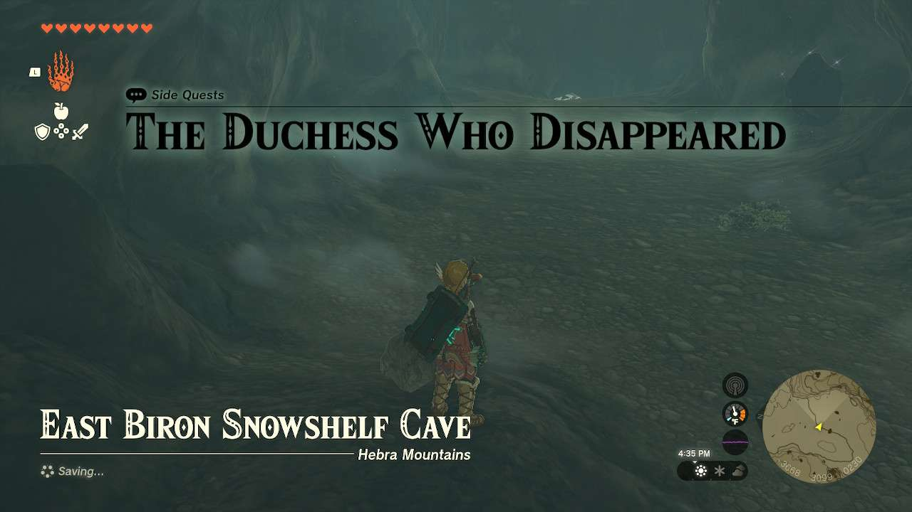
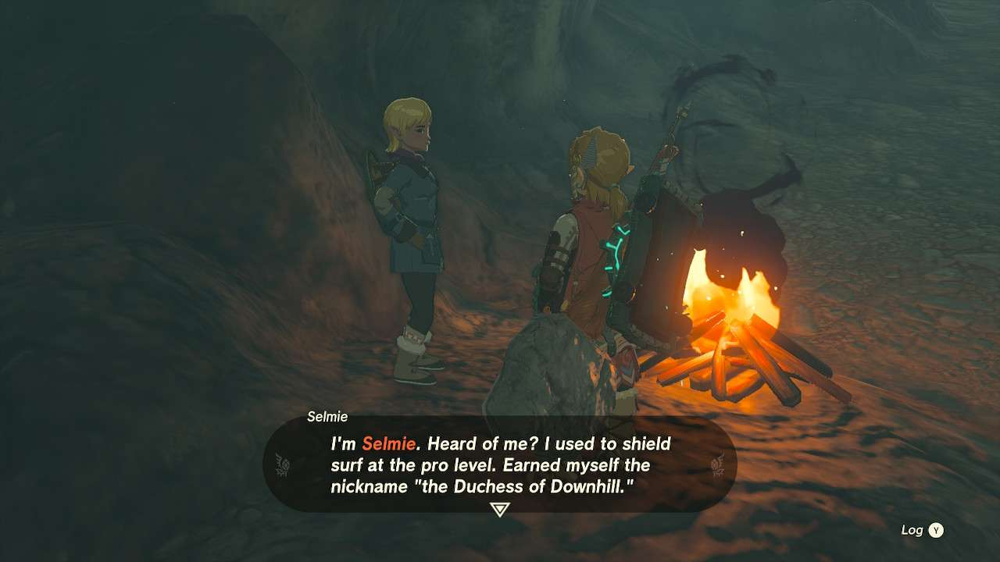
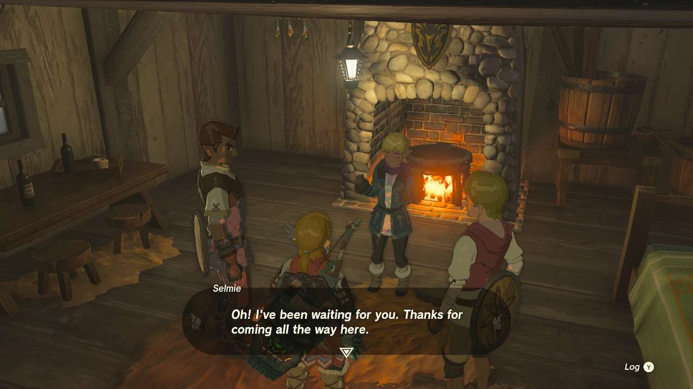

**The Duchess Who Disappeared** is one of the many Side Quests to complete in The Legend of Zelda: Tears of the Kingdom. In this guide, we will teach you everything you need to know to complete The Duchess Who Disappeared, including where to find it and what you will get as a reward. 

  * **Side Quest Location** : Hebra Tundra; Alternately, **East Biron Snowshelf Cave** (West entrance: -3979, 3069, 0143; East entrance: -3555, 3089, 0274)
  * **Prerequisites** : n/a (Possibly need to finish the Rito Village portion of Regional Phenomena)
  * **Rewards** : Strong Zonaite Shield; Shield Surfing time trials

This quest can be started in multiple ways - the first is you can find Russ in the Hebra Tundra not far from East Biron Snowshelf Cave, where he’ll ask you to help find Selmie. _Or_ you can go straight to where Selmie is, which is East Biron Snowshelf Cave. 

Whether you enter from the east or west, Selmie is in a room in the middle past some breakable rocks. If you haven’t started the quest and speak to her, this will start the quest. She’ll ask you to come see her at her cabin (Simile's Spot) near**Hebra East Summit**. 

Head up there where she’ll reward you with the **Strong Zonaite Shield** , accept you as her third student, and let you go on shield surfing timed races down the mountain. 

The Duchess Who Disappeared

See the complete List of Side Quests and Side Adventures

### Up Next: Walkthrough

Previous

About IGN's Zelda TotK Guide Writers

Next

Walkthrough

### Top Guide Sections

  * Walkthrough
  * Zelda: Tears of The Kingdom Switch 2 Edition Guide
  * Zelda Notes Voice Memories
  * List of Side Quests and Side Adventures

### Was this guide helpful?

Leave feedback

Go to comments