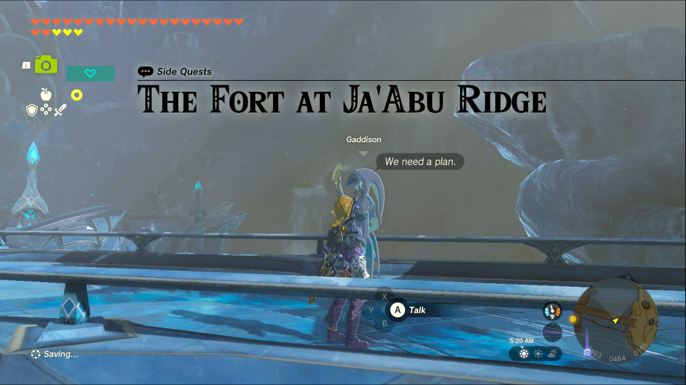
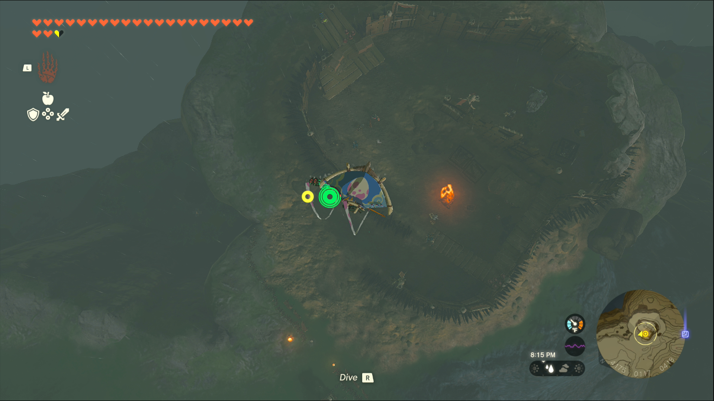
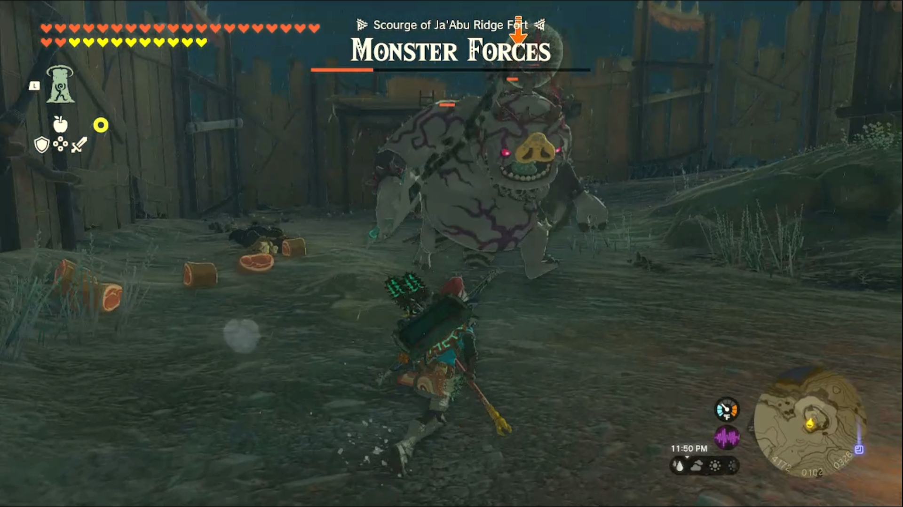
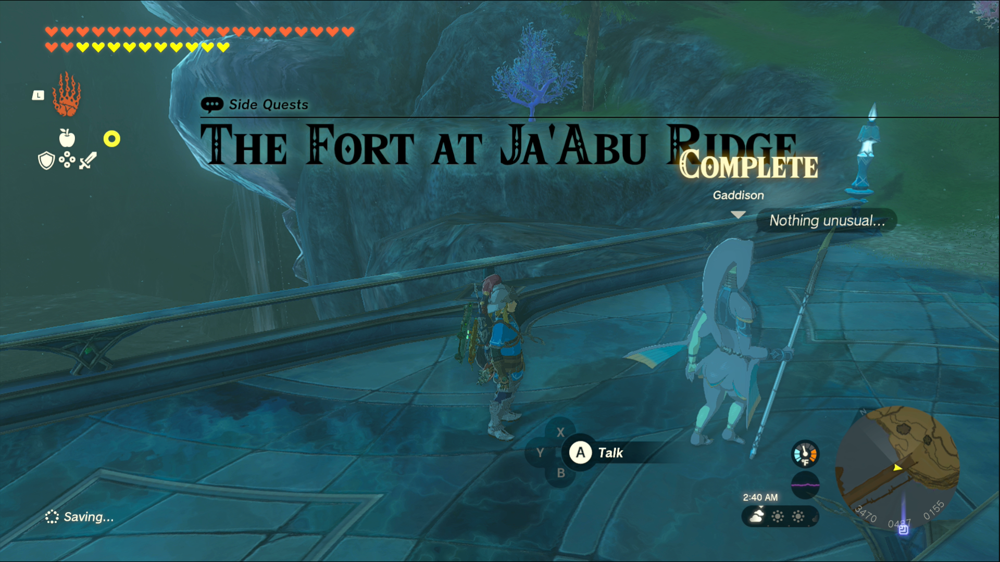

The Fort at Ja’Abu Ridge is one of the Side Quests you’ll discover in the Lanayru Great Spring region. Side Quests are quests in The Legend of Zelda: Tears of the Kingdom that are relatively short or simple chores that can earn you small rewards or services. 

## The Fort at Ja’Abu Ridge

To start the Side Quest “The Fort at Ja’Abu Ridge” you first need to complete the Main Quest “Sidon of the Zora.” Then go to the bridge leading east out of Zora’s Domain, where you’ll spot a patrolling zora named Gaddison. 

He expresses concerns about the monsters that created a fort on the north side of Ja’Abu Ridge. 

While you can certainly climb your way toward the fort, it’s easier to teleport up to Wellspring Island and glide down from there. 

The fort is occupied by several bokoblins as well as a boss bokoblin. Be wary of the Bokoblins on the elevated platforms, they have several explosive barrels they can throw down to you. Take advantage of them by throwing a bomb or fire up to them. 

When all the enemies are defeated, you can free the human from the cage at the back of the fort. Hino will give you a few meals in return for saving him. The mission can’t be completed until you defeat every monster in the fort. If you dropped in from the sky, you might be missing one more enemy; a lonely bokoblin archer at the entrance of the fort. 

Once they’re all defeated, check back with Gaddison to complete the quest. He’ll give you 100 Rupees as a reward. 

The Fort at Ja'Abu Ridge

See the complete List of Side Quests and Side Adventures

### Up Next: Walkthrough

Previous

About IGN's Zelda TotK Guide Writers

Next

Walkthrough

### Top Guide Sections

  * Walkthrough
  * Zelda: Tears of The Kingdom Switch 2 Edition Guide
  * Zelda Notes Voice Memories
  * List of Side Quests and Side Adventures

### Was this guide helpful?

Leave feedback

### In This Guide

The Legend of Zelda: Tears of the KingdomNintendo EPD

Initial Release: May 12, 2023

Learn more

Go to comments