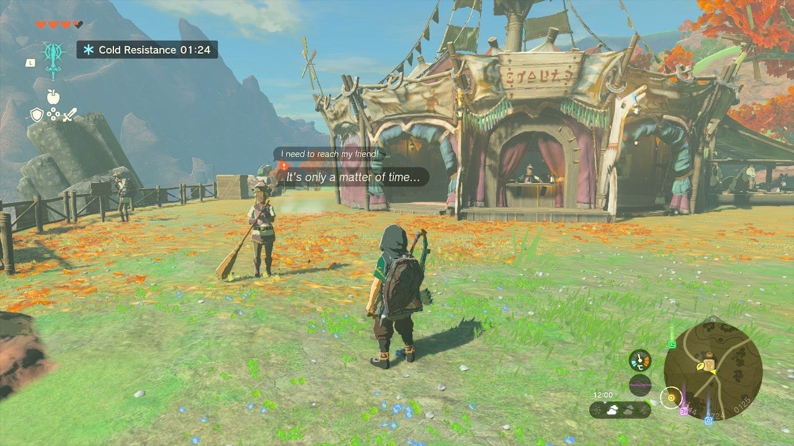
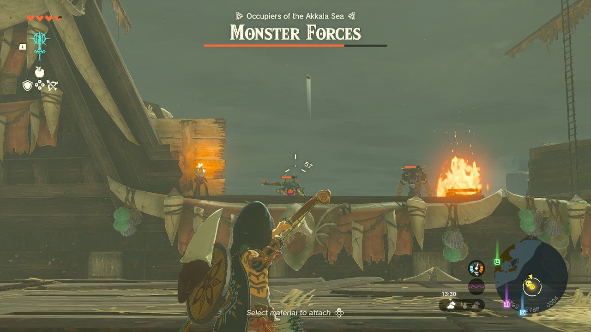
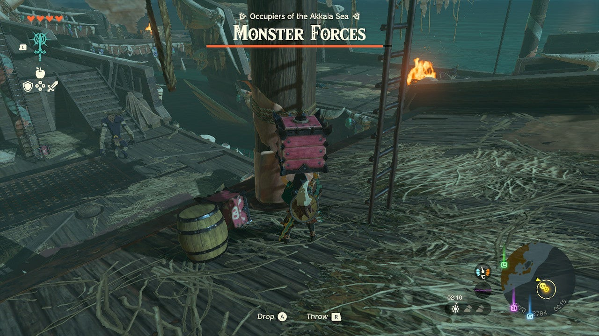

A bunch of Bokoblin pirates are threatening the East Akkala Stable in The Legend of Zelda: Tears of the Kingdom, and it's up to Link to defeat them. As you would expect, this Akkala side quest presents you with a pretty difficult fight. 

Here's how to start **The Gathering Pirates** quest and how to defeat the monsters. 

## The Gathering Pirates Walkthrough

To start The Gathering Pirates, talk to **Aya** at the East Akkala Stable (coordinates 4240, 2740, 0125). She wants you to defeat a group of pirates on **North Akkala Beach**. Travel straight to the east, towards the quest marker, and you should have no trouble finding them - they're on the three pirate ships just offshore. 

  
The pirate gang consists of Bokoblins, Moblins, Aerocudas, and Boss Bokoblins. The best way to fight them is by engaging only a few opponents at the same time - enter the first ship and take out the first Bokoblins in **crouch mode** to avoid getting overwhelmed. It's also wise to **bring a bow** , allowing you to shoot enemies on other ships. 

You can try to antagonize some of the larger enemies before jumping in the water, as this may prompt them to pick up a smaller Bokoblin and throw them after you, effectively **causing the Bokoblin to drown** (but beware of your own stamina!). Finally, keep an eye out for **explosive barrels** , as you may be able to throw them from a high place, such as the ship's mast. 

Once you've defeated all the pirates, don't forget to open the pirates' chest, which contains a **blue hinox hammer**. Return to Aya for an additional quest reward: **two pony points** and an **endura carrot**. 

The Gathering Pirates

See the complete List of Side Quests and Side Adventures

### Up Next: Walkthrough

Previous

About IGN's Zelda TotK Guide Writers

Next

Walkthrough

### Top Guide Sections

  * Walkthrough
  * Zelda: Tears of The Kingdom Switch 2 Edition Guide
  * Zelda Notes Voice Memories
  * List of Side Quests and Side Adventures

### Was this guide helpful?

Leave feedback

Go to comments