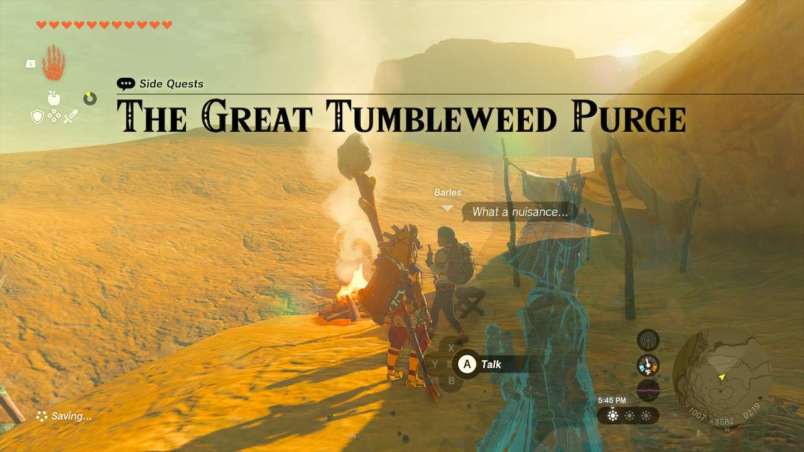
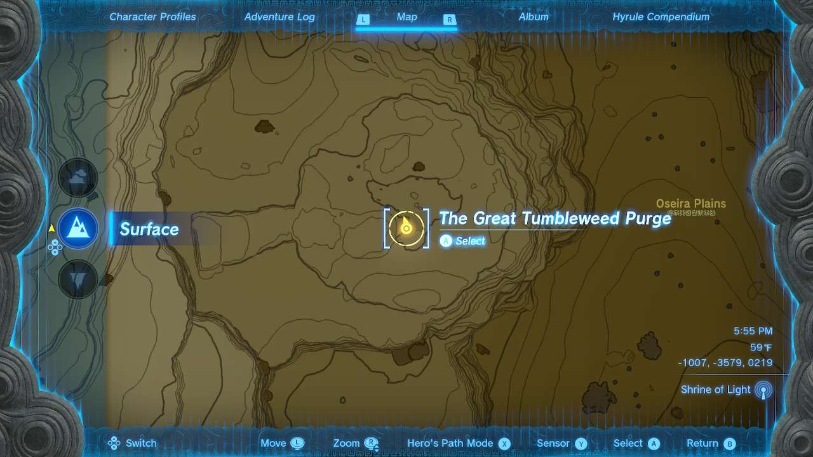
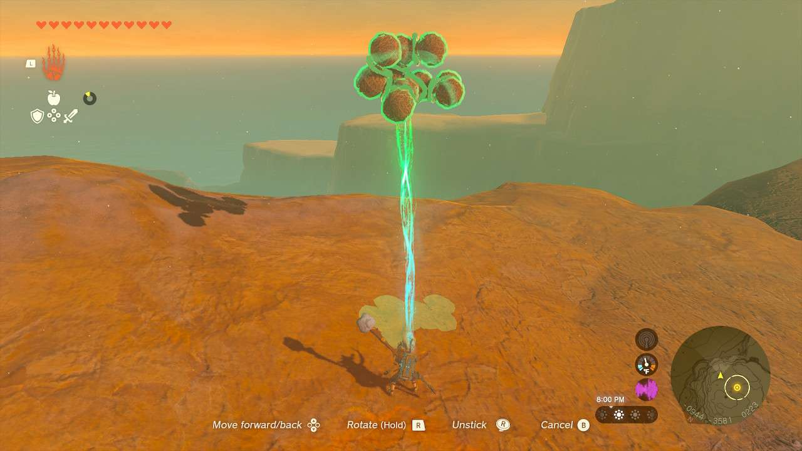
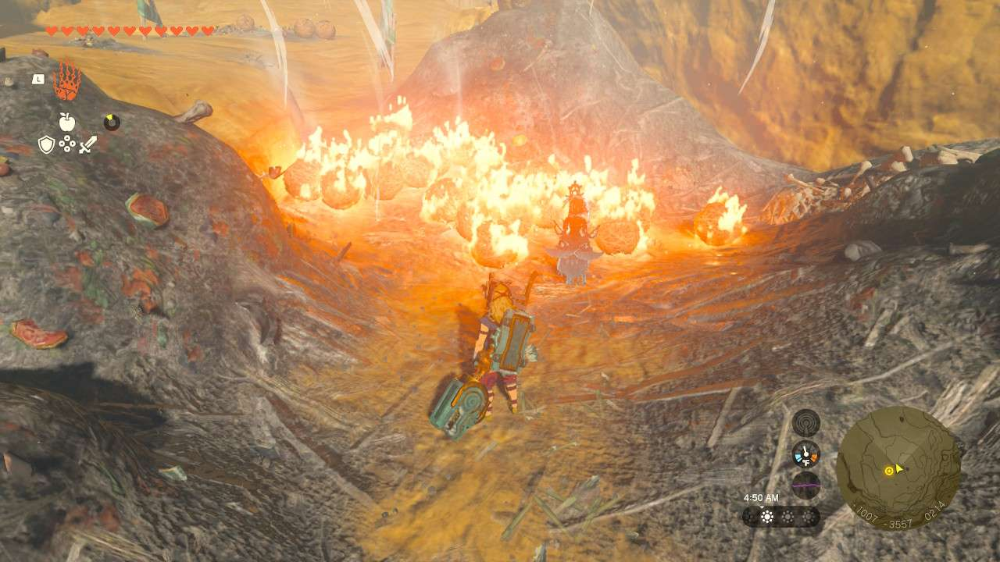

**The Great Tumbleweed Purge** is one of the many Side Quests to complete in The Legend of Zelda: Tears of the Kingdom. In this guide, we will teach you everything you need to know to complete The Great Tumbleweed Purge, including where to find it and what you will get as a reward. 

  * **Side Quest Location** : Gerudo Canyon
  * **Prerequisites** : n/a
  * **Rewards** : Royal Shield

This quest is located on a plateau in the middle of **Daval Peak, Mount Granajh** , and **Osteria Plains**. You can approach **Barles** near her tent, which is also visible from afar by way of a campfire. She wants to clean up the area, but there are tumbleweeds everywhere that have to be eliminated before she can clean anything. 

There isn’t a set way you have to get rid of the tumbleweeds, you just need to **remove them out of the area of all the flags**. There are Zonai Fans all over the place if you wish to blow them away. There is also a Flame Emitter in the rubbish as well, allowing you to burn the stuff (and creating a wind flow for others in the process). You can also Ultrahand and combine many of them and simply throw them off the nearby cliff. 

However you wish to get rid of them will be somewhat tedious, but as soon as they are removed, Barles will reward you with a **Royal Shield**. 

The Great Tumbleweed Purge

See the complete List of Side Quests and Side Adventures

### Up Next: Walkthrough

Previous

About IGN's Zelda TotK Guide Writers

Next

Walkthrough

### Top Guide Sections

  * Walkthrough
  * Zelda: Tears of The Kingdom Switch 2 Edition Guide
  * Zelda Notes Voice Memories
  * List of Side Quests and Side Adventures

### Was this guide helpful?

Leave feedback

### In This Guide

The Legend of Zelda: Tears of the KingdomNintendo EPD

Initial Release: May 12, 2023

Learn more

Go to comments