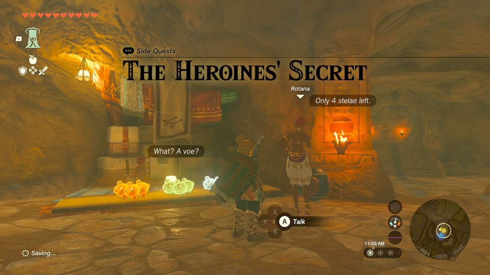
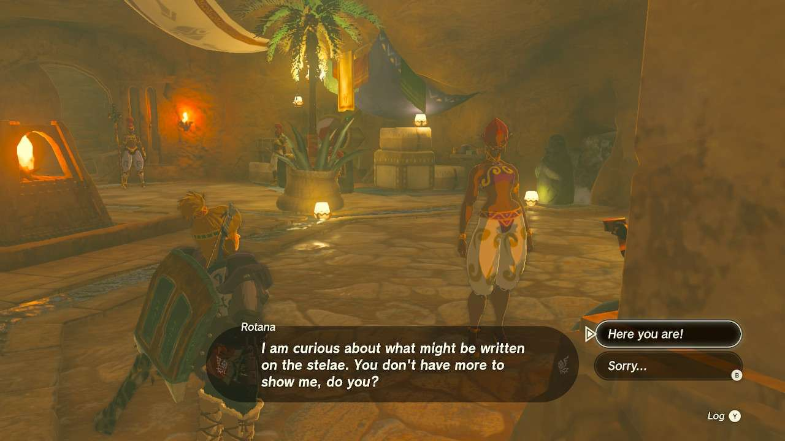
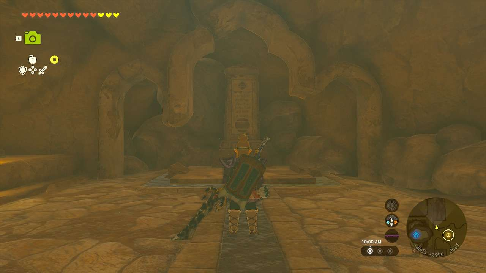
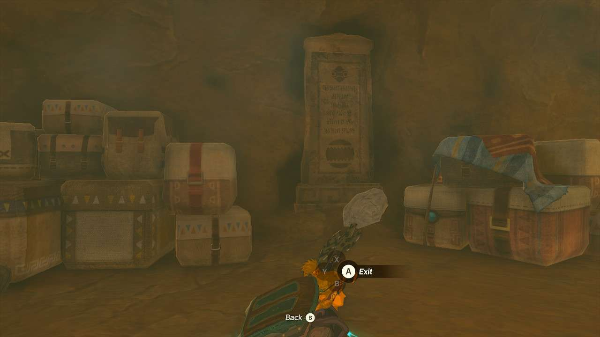
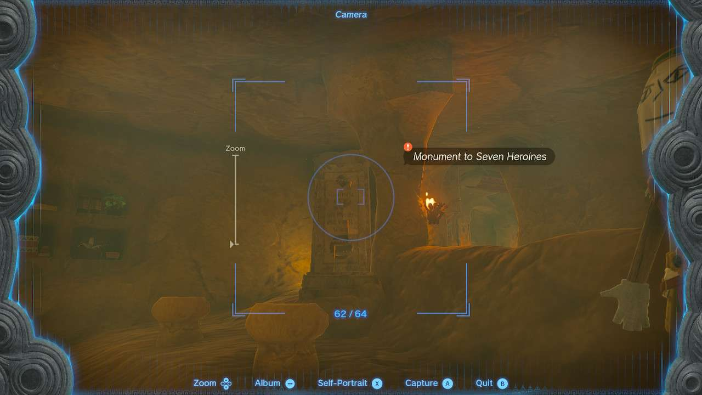
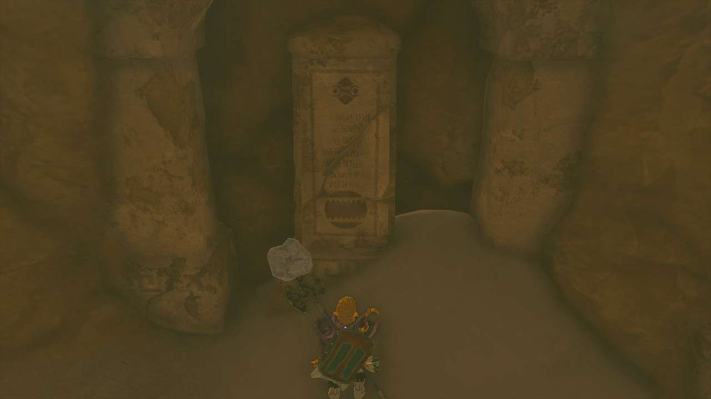

**The Heroines’ Secret** is one of the many Side Quests to complete in The Legend of Zelda: Tears of the Kingdom. In this guide, we will teach you everything you need to know to complete The Heroines’ Secret, including where to find it and what you will get as a reward. 

  * **Side Quest Location** : Gerudo Town
  * **Prerequisites** : n/a
  * **Rewards** : 100 Rupees

The quest is started by speaking to **Rotana** in the **Gerudo Shelter**. She’s looking for several stelae, sort of ancient slab looking things, that reveal secrets about the heroes of Gerudo’s past. She has four of them and needs the remaining four, which you’ll need to take pictures of. **Luckily, all four of the remaining slabs are in the Gerudo Shelter itself.**

Stelae #1 

The first one is a few steps behind Rotana, in the training room. To the left are a pile of destructible rocks you need to clear. 

Stelae #2 

The second one can be found in the jail cell. Go right from Rotana until you see the entryway with the banner of a vase overhead. Inside this room, keep to the right side wall and go all the way back. Move or destroy the vases on the bottom-leftmost shelf and crawl into this space. Ascend in here to pop up in the jail and look behind the guy in there for the stelae. 

Stelae #3 

The third is in the classroom area. You can only enter the classroom area after 4 PM. Once there, stand in the spot where there is a mannequin missing and look towards the entryway for the classroom. You’ll see two pieces of the stelae that fit together perfectly when you stand in this one spot. 

Stelae #4 

The fourth stelae is in the room to the left of the classroom, just before you get to the underground cave down there. The slab is broken, but there’s a pile of sand next to it with the missing chunk. Ultrahand this and put it back into place. 

Return to Rotana to show her all your photos for your reward. **The Mysterious Eighth** Side Quest will become available from Rotana afterwards. 

The Heroines' Secret

See the complete List of Side Quests and Side Adventures

### Up Next: Walkthrough

Previous

About IGN's Zelda TotK Guide Writers

Next

Walkthrough

### Top Guide Sections

  * Walkthrough
  * Zelda: Tears of The Kingdom Switch 2 Edition Guide
  * Zelda Notes Voice Memories
  * List of Side Quests and Side Adventures

### Was this guide helpful?

Leave feedback

### In This Guide

The Legend of Zelda: Tears of the KingdomNintendo EPD

Initial Release: May 12, 2023

Learn more

Go to comments