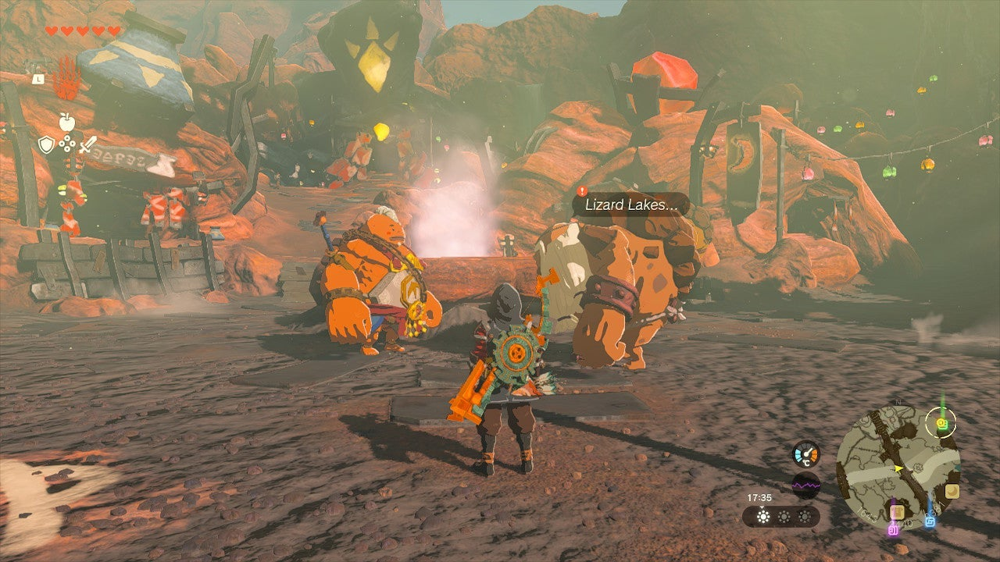
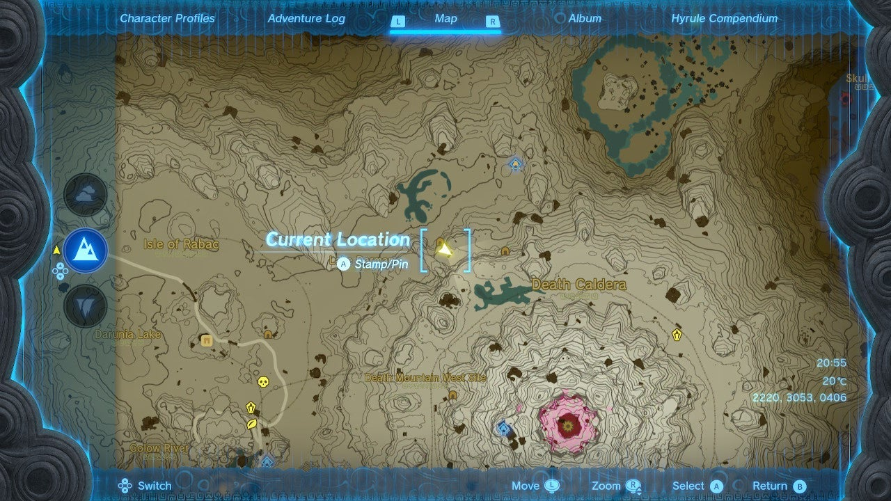
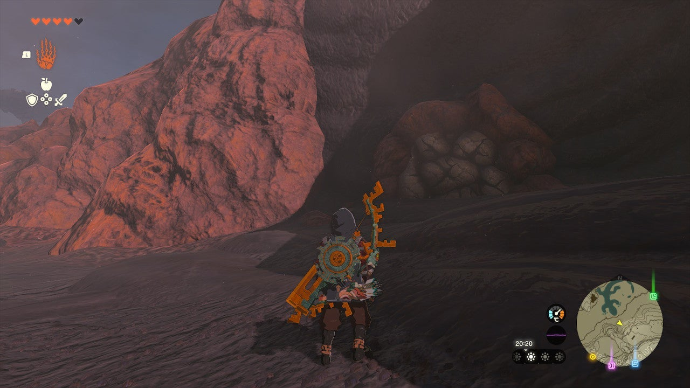

Looks like it's time for your next Tears of the Kingdom treasure hunt. After completing the Yunobo of Goron City main quest, you can start The Hidden Treasure at Lizard Lakes side quest in Goron City. 

Here's how to find the hidden treasure location and complete **The Hidden Treasure at Lizard Lakes**. 

## The Hidden Treasure at Lizard Lakes

This Tears of the Kingdom side quest starts in Goron City, the Eldin region. Listen to Yunobo and Bludo's conversation in the middle of the town, and they'll tell you about a **hidden treasure at Lizard Lakes** , which is in the northern part of Eldin (above Death Mountain). 

If you don't want to search for it yourself, here's how to find the hidden treasure: go to the area between the Lizard Lakes, at coordinates 2200, 3080, 0405. 

Standing near the northernmost Lizard Lake, if you look towards the south, you'll see a cave entrance with a bunch of rocks blocking the entrance (see picture below). 

Break the rocks and follow the path inside until you find a treasure chest. Open it to receive the **Vah Rudania Divine Helm**. This will complete The Hidden Treasure at Lizard Lakes. 

For more details on the cave, Lizard's Burrow, take a look at our Eldin region guide. 

The Hidden Treasure at Lizard Lakes

See the complete List of Side Quests and Side Adventures

### Up Next: Walkthrough

Previous

About IGN's Zelda TotK Guide Writers

Next

Walkthrough

### Top Guide Sections

  * Walkthrough
  * Zelda: Tears of The Kingdom Switch 2 Edition Guide
  * Zelda Notes Voice Memories
  * List of Side Quests and Side Adventures

### Was this guide helpful?

Leave feedback

Go to comments