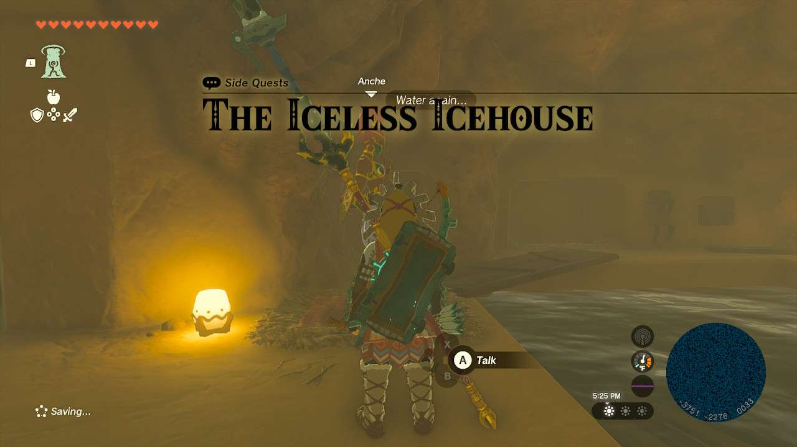
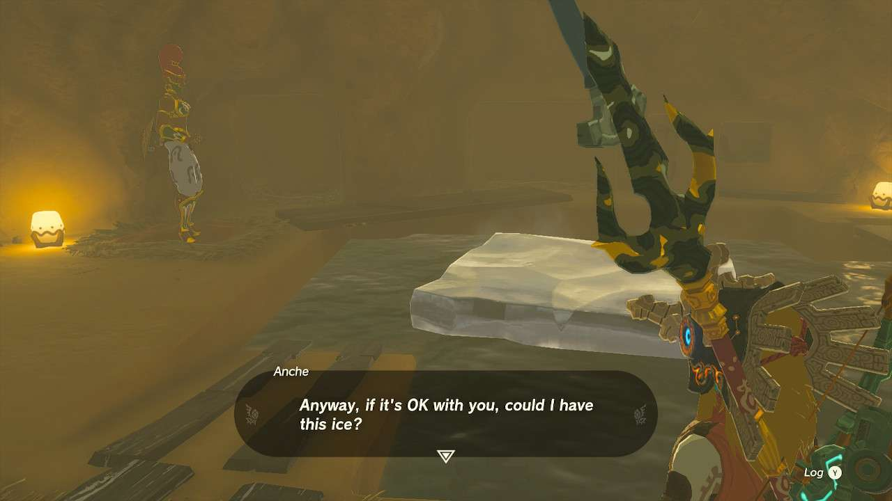
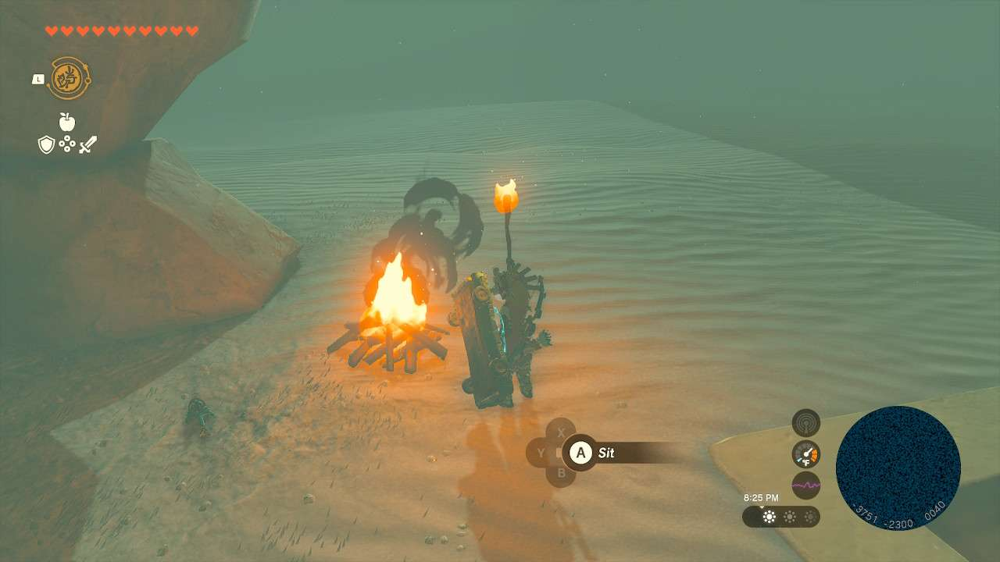
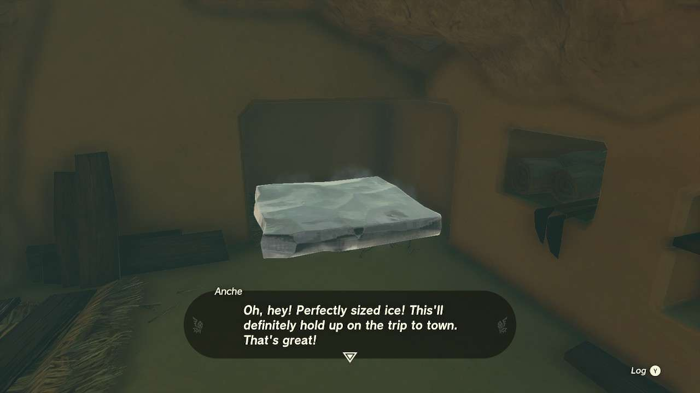

**The Iceless Icehouse** is one of the many Side Quests to complete in The Legend of Zelda: Tears of the Kingdom. In this guide, we will teach you everything you need to know to complete The Iceless Icehouse, including where to find it and what you will get as a reward. 

  * **Side Quest Location** : Gerudo Highlands, Northern Icehouse
  * **Prerequisites** : n/a
  * **Rewards** : 50 Rupees

The Northern Icehouse is located just south and a little west of the **Birida Lookout Chasm** and past some cliffs. Once there, get underneath the rock structure and find the bonfire. Past that is a basement where you can find **Anche** , who you can speak to to begin the quest. 

She’ll complain that the pool of water was once ice and they need more. If you have an ice weapon or can combine something with a **sapphire** , if you strike the water, it will create a slate of ice. You can also do this with arrows and **ice fruit** or **white chuchu jelly**. 

Once the block of ice is there, Anche will ask you to make it small enough to fit on a shelf. Go back outside and grab the torch and light it at the campfire. Bring the torch back near the ice and it will start to get smaller. Once it’s at a good size, Ultrahand it and put it on the shelf to see if it fits. If it does, speak to Anche once again. 

This will complete the mission and she will reward you with **50 rupees** and the possibility of making more ice for her in the future for more coin. 

The Iceless Icehouse

See the complete List of Side Quests and Side Adventures

### Up Next: Walkthrough

Previous

About IGN's Zelda TotK Guide Writers

Next

Walkthrough

### Top Guide Sections

  * Walkthrough
  * Zelda: Tears of The Kingdom Switch 2 Edition Guide
  * Zelda Notes Voice Memories
  * List of Side Quests and Side Adventures

### Was this guide helpful?

Leave feedback

Go to comments