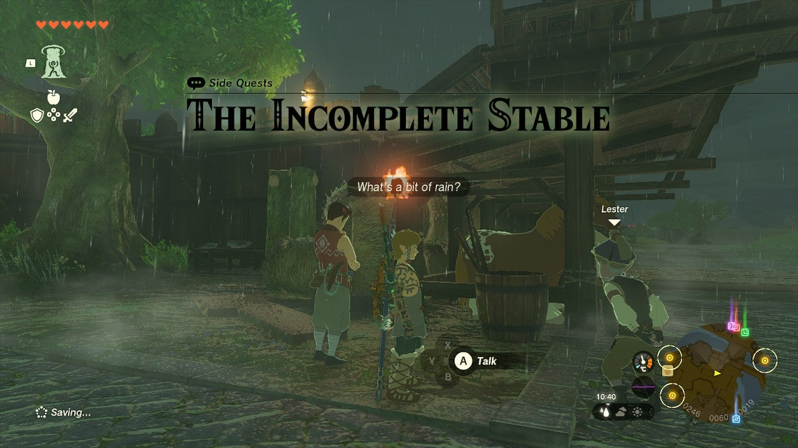
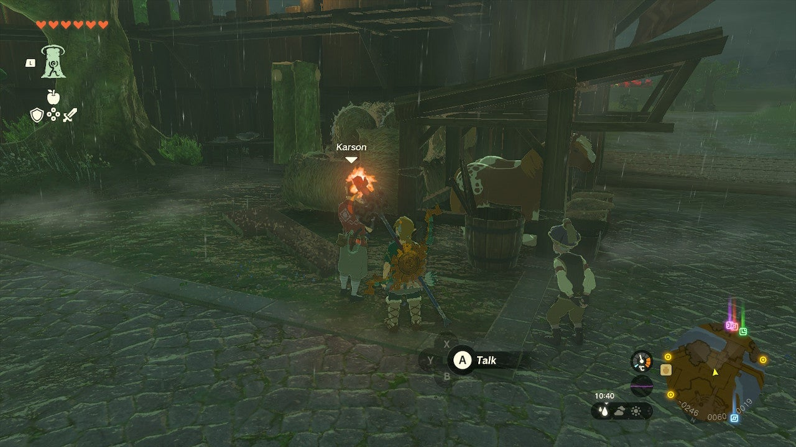
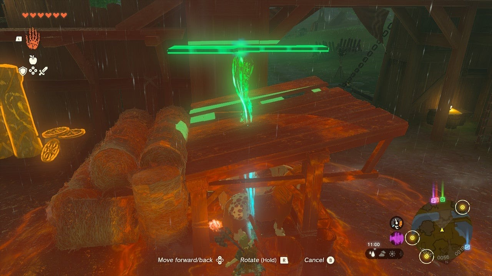

**The Incomplete Stable** is the Side Quest that enables you to unlock and use the Stable in Lookout Landing. This guide will teach you everything you need to know to unlock this handy location, including where to find the Stable and how to rebuild it. 

You can only get this quest after completing one of the **Regional Phenomena** Main Questline quests. 

Once you’ve ticked that off your to-do list, head back to Lookout Landing and speak to Lester, the Stablehand. 

At Lookout Landing’s **Southern entrance** , you will find Lester and Karson, an employee of Hudson’s Building Company, discussing how to complete repairs on the Stable. 

Speak to Karson to trigger the quest, and walk over to the back of the Stable. There, you will find a plank of wood that fits perfectly in the hole in the roof. 

Lift the plank of wood with your **Ultrahand** ability and place it in its rightful position to complete The Incomplete Stable Side Quest. This quest is incredibly easy to complete and provides you with an almost priceless reward. That is, of course, the only Stable location in the Hyrule Field area. 

The Incomplete Stable

See the complete List of Side Quests and Side Adventures

### Up Next: Walkthrough

Previous

About IGN's Zelda TotK Guide Writers

Next

Walkthrough

### Top Guide Sections

  * Walkthrough
  * Zelda: Tears of The Kingdom Switch 2 Edition Guide
  * Zelda Notes Voice Memories
  * List of Side Quests and Side Adventures

### Was this guide helpful?

Leave feedback

### In This Guide

The Legend of Zelda: Tears of the KingdomNintendo EPD

Initial Release: May 12, 2023

Learn more

Go to comments