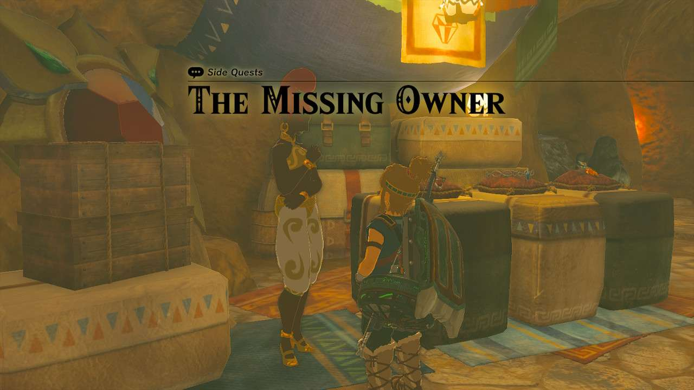
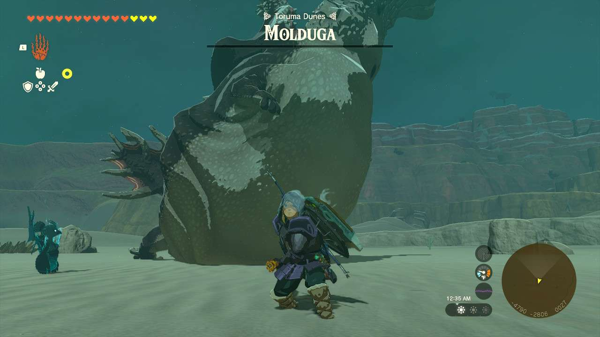
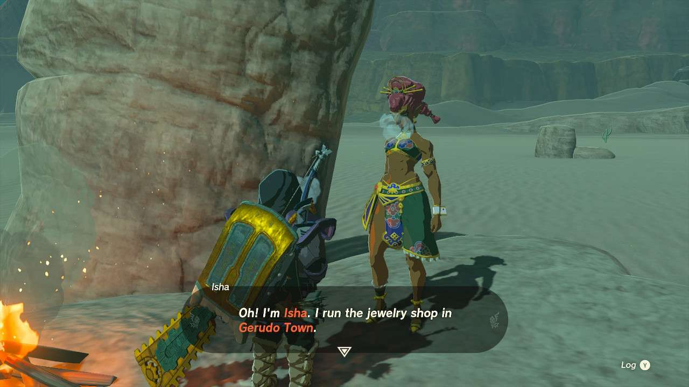

**The Missing Owner** is one of the many Side Quests to complete in The Legend of Zelda: Tears of the Kingdom. In this guide, we will teach you everything you need to know to complete The Missing Owner, including where to find it and what you will get as a reward. 

  * **Side Quest Location** : Gerudo Town
  * **Prerequisites** : n/a
  * **Rewards** : Diamond

You can start this quest either before or after the sand shroud clears up. If you do it before, you can find **Cara** virtually as soon as you walk into the Gerudo Shelter. Otherwise, she’s at the jewel and accessories shop when Gerudo Town opens up proper.**It is highly recommended you clear up the Gerudo part of****Regional Phenomena****before trying to finish it.**

Once you speak to Cara, she’ll let you know that the missing owner, **Isha** , is somewhere near the **Toruma Dunes** in the western part of the desert. If you head over there, you’ll also discover this is smack in the middle of a **Molduga**’s territory. 

You can find Isha cowering on a high rock near a campfire, but you can’t get her to leave until you defeat the Molduga. This same spot she’s at is safe from Molduga attacks, thankfully, so you can assess your strategy from here. A great strategy is to use Time Bombs to draw the Molduga out, then lay into it when it feasts on the explodent. 

Once you defeat the Molduga, Isha will commend your bravery and return to Gerudo. Head back there and speak to she and Cara where you will get your Diamond reward. The Collectables Side Quest **Pride of the Gerudo** will also become available, which allows Isha to craft for you the Scimitar of the Seven. 

The Missing Owner

See the complete List of Side Quests and Side Adventures

### Up Next: Walkthrough

Previous

About IGN's Zelda TotK Guide Writers

Next

Walkthrough

### Top Guide Sections

  * Walkthrough
  * Zelda: Tears of The Kingdom Switch 2 Edition Guide
  * Zelda Notes Voice Memories
  * List of Side Quests and Side Adventures

### Was this guide helpful?

Leave feedback

Go to comments