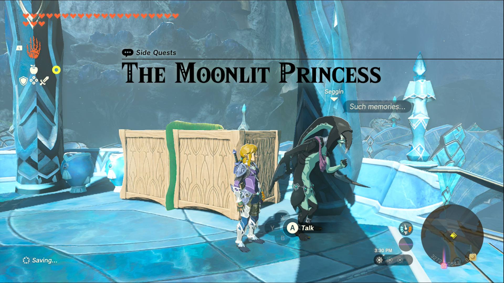
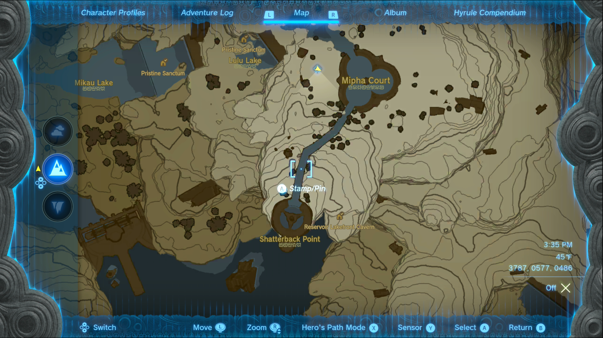
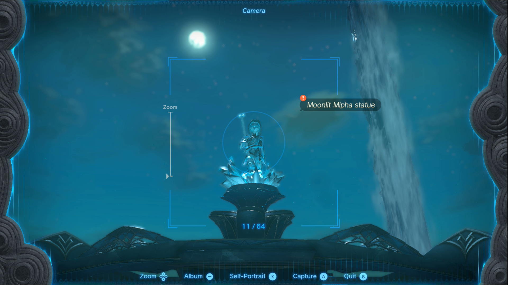

The Moonlit Princess is one of the Side Quests you’ll discover in the Lanayru Great Spring region. Side Quests are quests in The Legend of Zelda: Tears of the Kingdom that are relatively short or simple chores that can earn you small rewards or services. 

## The Moonlit Princess

To start the Side Quest “The Moonlit Princess” you first need to complete the Main Quest “Sidon of the Zora.” Then head to the bridge leading west from Zora’s Domain, and speak to Seggin. 

He laments the loss of the Zora Princess Mipha, and would like to see her wielding her trident in the moonlight just one more time. Luckily, there’s a statue of her that will serve to fulfill this request. The statue is located at Shatterback Point and can be accessed more easily from Ihen-a Shrine at Mipha Court, which is east of Zora’s Domain, or by dropping from Wellspring Island. 

Once you’ve located the statue, you just need to wait until night time, around midnight, to take a picture. If the Blood Moon is active, you’ll have to wait until it triggers and reverts to a normal moon for the picture to count. 

You’ll know if it’ll count when it has the quest tag when you’re about to take the picture. Once you have the picture, return to Seggin to show him, and he’ll give you a Zora Sword for completing the quest. 

The Moonlit Princess

See the complete List of Side Quests and Side Adventures

### Up Next: Walkthrough

Previous

About IGN's Zelda TotK Guide Writers

Next

Walkthrough

### Top Guide Sections

  * Walkthrough
  * Zelda: Tears of The Kingdom Switch 2 Edition Guide
  * Zelda Notes Voice Memories
  * List of Side Quests and Side Adventures

### Was this guide helpful?

Leave feedback

Go to comments