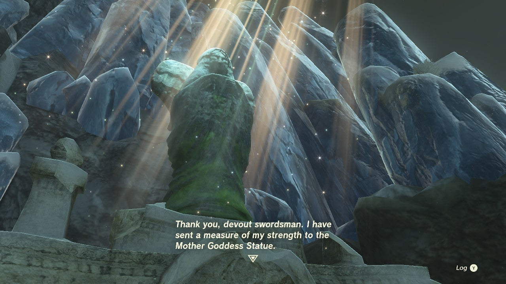

**The Mother Goddess Statue** is one of many side quests in Zelda: Tears of the Kingdom and is the last part of multiple quests involving the three goddess statues hidden around Hyrule. Below is what happens when you finally unlock The Mother Goddess Statue quest in TotK. 

  * **Quest Giver** : Goddess Statues
  * **Prerequisite** : Complete the **three Goddess Statues side quests** around Hyrule
  * **Reward** : Tap to Reveal

If you haven't found or completed the **three prerequisite quests** you can find full walkthroughs for each at the links below: 

  * Goddess Statue of Wisdom
  * Goddess Statue of Power
  * Goddess Statue of Courage

You may complete them in any order. Once you've finished your final of the three, you'll receive **The Mother Goddess Statue** side quest prompt that'll lead you back to the Forgotten Temple in Tabantha Frontier's Tangar Canyon. 

At this point, you can fast travel to The Forgotten Temple's Mayausiy Shrine to get to the Mother Goddess Statue quickly. 

As you approach you'll notice the Mother Goddess Statue is no longer toppled. **Make sure you have a space open in your weapon inventory.** Approach and pray at the base of the statue. 

The Mother Goddess Statue thanks you for assisting the statues at the three springs and awards you the White Sword of the Sky. 

With that, your quest is complete! You can return to the Mother Goddess Statue to spend Light of Blessings and Sage's Wills. 

The Mother Goddess Statue

See the complete List of Side Quests and Side Adventures

### Up Next: Walkthrough

Previous

About IGN's Zelda TotK Guide Writers

Next

Walkthrough

### Top Guide Sections

  * Walkthrough
  * Zelda: Tears of The Kingdom Switch 2 Edition Guide
  * Zelda Notes Voice Memories
  * List of Side Quests and Side Adventures

### Was this guide helpful?

Leave feedback

### In This Guide

The Legend of Zelda: Tears of the KingdomNintendo EPD

Initial Release: May 12, 2023

Learn more

Go to comments