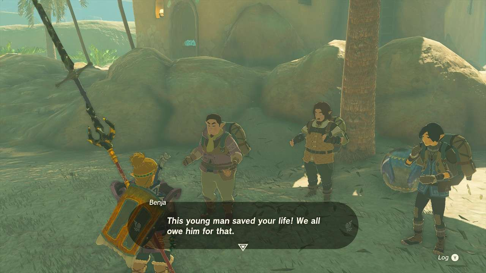
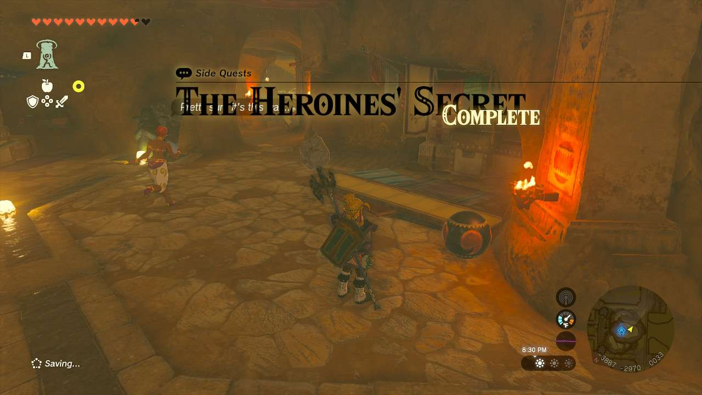
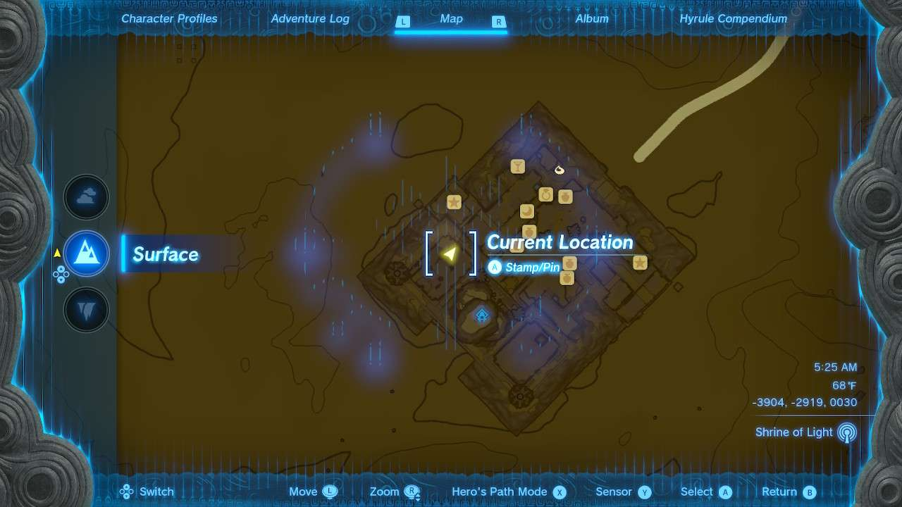
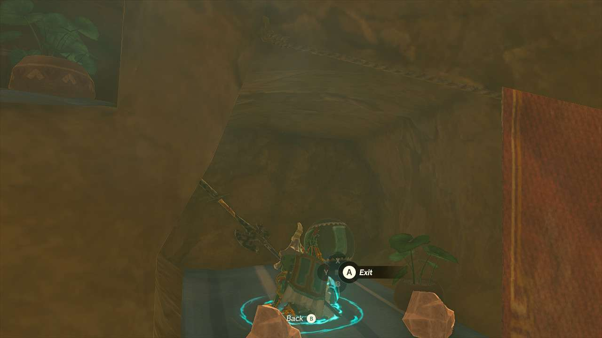
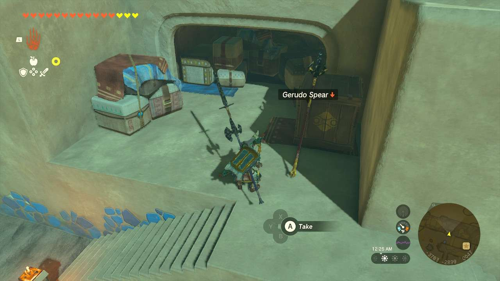
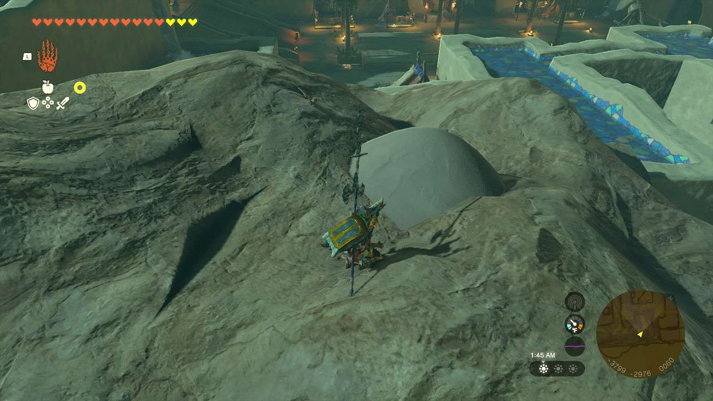
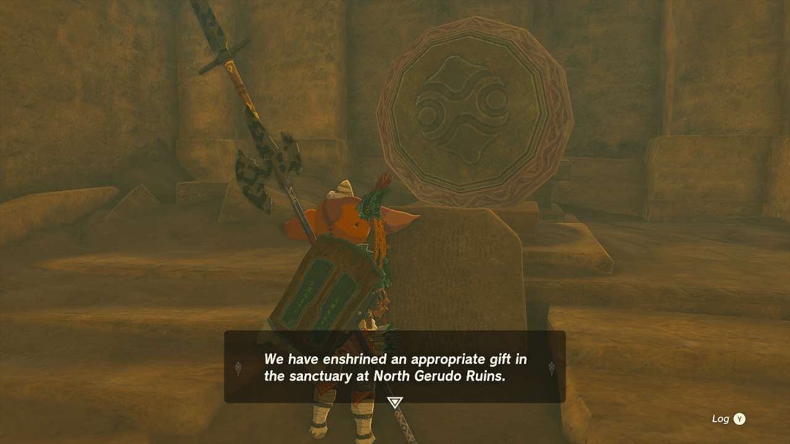
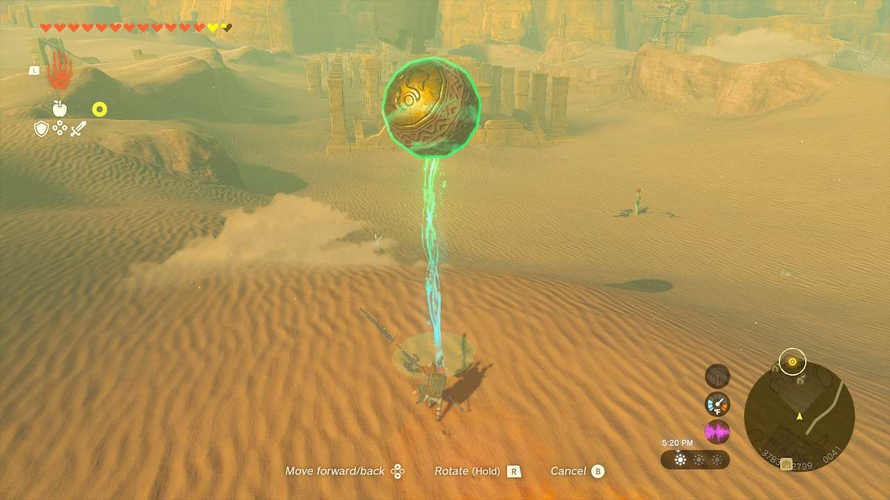
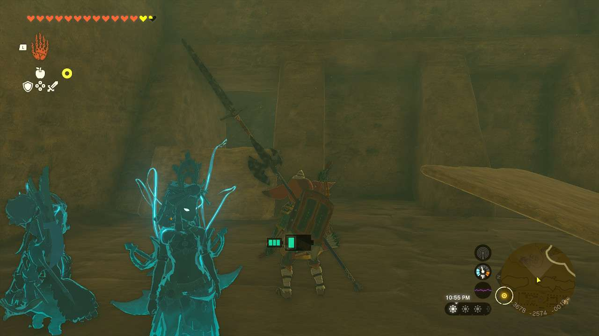

**The Mysterious Eighth** is one of the many Side Quests to complete in The Legend of Zelda: Tears of the Kingdom. In this guide, we will teach you everything you need to know to complete The Mysterious Eighth, including where to find it and what you will get as a reward. This guide has been tested by IGN and confirmed to work for all versions of TOTK, including the Tears of the Kingdom Switch 2 Edition released in 2025. 

  * **Side Quest Location** : Gerudo Shelter, Gerudo Town
  * **Prerequisites** : Finishing **The Heroines’ Secret**
  * **Rewards** : Diamond, Hydromelon x7 (Although gain access to Ruby, Sapphire, Topaz, Gerudo Bow, Gerudo Spear, Gerudo Claymore, Gerudo Shield, Gerudo Scimitar, and 300 Rupees)

Upon finishing **The Heroines’ Secret** , you and **Rotana** discover that there were eight heroes in Gerudo’s past, not just seven. Speak to her again to start this mission, where you’ll gather those mysterious heavy orbs you may have seen all over town and put them in the arms of the statues in the room Rotana is in. **There are 7 in total**. For each orb you bring back, Rotana will give you a Hydromelon. 

5 of the orbs can be obtained fairly easily around town, but two are tied to two other Side Quests: Lost in the Dunes and **Dalia’s Game**. 

Likely the first orb you’ll encounter is the one in Kara Kara Bazaar. Finishing Lost in the Dunes earns you this orb, which you’ll have to trek across the desert. Get a little creative to bring it back. 

Orb #1: Sapphire Flame Orb 

Another orb is near the market area towards a town entrance. If you try to pick it up (during the day; you can’t take it at night), you’ll be met with a young Gerudo named **Dalia** who will challenge you to a game. Entertain her in **Dalia’s Game** to get this one. 

Orb #2: Gold Ring Orb 

One orb is where Rotana was standing before in the shelter. 

Orb #3: Ruby Comma Orb 

Another orb is in the Gerudo Shelter towards the far west side. Head back towards the room with a vase banner over it (on the other side of where the spa inn was). Find it in the bar back here. 

Orb #4: Crystal Colon Orb 

The last Gerudo Shelter orb is in what was the spa area. Stand on one of the beds and Ascend to the shelf above. You’ll find some Rock Salt, Topaz, and another orb. 

Orb #5: Emerald I Orb 

In town, right next to a Gerudo Spear near the entrance, is another orb. 

Orb #6: Amber Triangle Orb 

Along the top of the eastern side of town is a pile of sand. Blow it away to find another orb. 

Orb #7: Amethyst Rods Orb 

Once you find them all and place them in the statues’ arms, a new chamber will open, revealing another giant orb. Read the slab in front of it to summon Rotana, who will tell you the next leg of the mission is to take the giant orb to the **North Gerudo Ruins** and drop it in a slot to open the northern **Gerudo Sanctuary** door. 

Make your way across the dunes here, however you would like. The easiest might be just Ultrahanding it and taking it over, though be careful of the Bokoblins and Lizfols you’ll meet at the Sanctuary entrance. Drop the orb into the hole it fits into to get let inside. When you find three slabs in the middle of the floor, move them and head down. A Gibdo will greet you, so take care of it. 

In the next area, the platform you step on will fall. In this room, climb up or Ascend to the opening to continue. Keep going here past a Chuchu and another Gibdo. When you’re met with three slabs up against the wall, move the far left one with a crack in it. To the right, the other two hold another Gibdo and some arrows respectively. Hustle across the next platform bridge, as they’re going to fall. 

Enter the **Statue of the Eighth Heroine Room** and read the slab to discover the final secret. Treat yourself to the loot in this room, which includes: **Ruby, Topaz, Sapphire, Gerudo Bow, Gerudo Spear, Gerudo Claymore, Gold Rupee, Gerudo Shield,** and **Gerudo Scimitar**. 

Head back to Rotana where she’ll reward you with a **Diamond** for your efforts. 

The Mysterious Eighth

See the complete List of Side Quests and Side Adventures

### Up Next: Walkthrough

Previous

About IGN's Zelda TotK Guide Writers

Next

Walkthrough

### Top Guide Sections

  * Walkthrough
  * Zelda: Tears of The Kingdom Switch 2 Edition Guide
  * Zelda Notes Voice Memories
  * List of Side Quests and Side Adventures

### Was this guide helpful?

Leave feedback

Go to comments