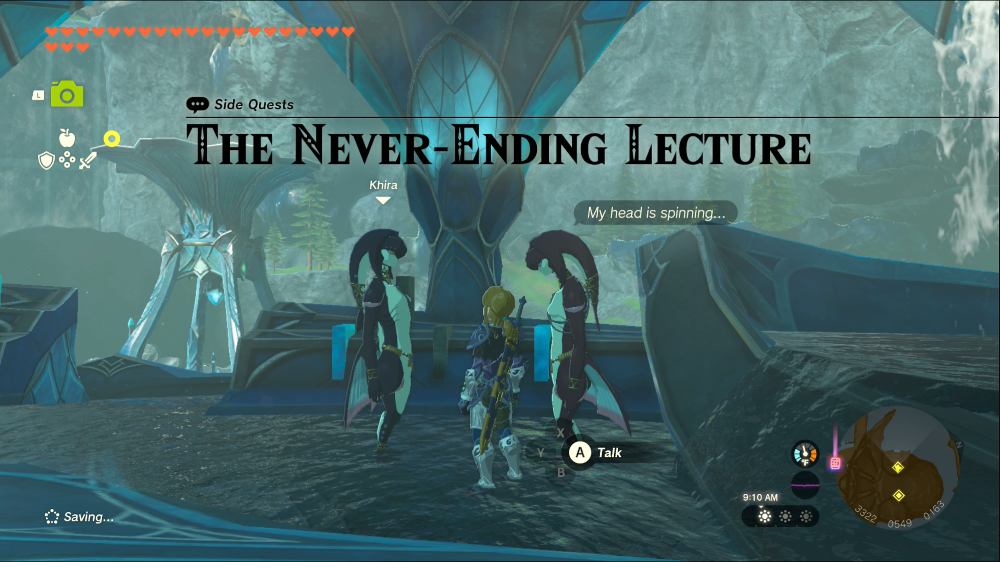
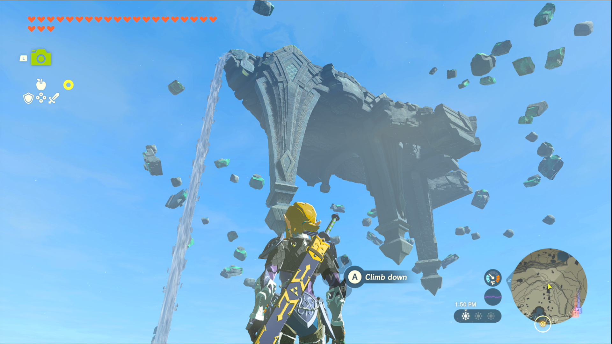
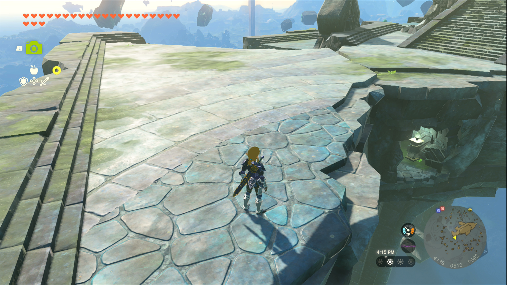

The Never-Ending Lecture is one of the Side Quests you’ll discover in the Lanayru Great Spring region. Side Quests are quests in The Legend of Zelda: Tears of the Kingdom that are relatively short or simple chores that can earn you small rewards or services. 

## The Never-Ending Lecture

To start the Side Quest “The Never-Ending Lecture” you first need to complete the Main Quest “Sidon of the Zora.” Then head to the Throne Room in Zora’s Domain and speak to Chroma, a Zora standing off to the left side of Dorephan. She’s being lectured incessantly by Khira, the Zora standing beside her, but the lectures hint at the location of the Zora Helm. 

The only clue they have is that it resides within a sky fish, which is vague, but since you’ve completed the Water Temple it should sound familiar. Floating Scales Island, to the east, is a large fish-shaped sky island that you had to utilize to reach the Water Temple. 

You can access the sky island by using Zora Armor to swim up the waterfall east of Mipha Court, but the easier solution is to float over from Wellspring Island. Once you’ve landed on the island, head for the ‘tail’ of the fish, the southeast side of the island. From there, look at the northern edge of the island to spot a lantern highlighting a small hidden passage. 

Follow the short path to discover a chest with the Zora Helm inside, bringing the quest to a close. If you want the Zora Greaves to complete the set, speak to Yona to start the quest “A Token of Friendship.” 

The Never-Ending Lecture

See the complete List of Side Quests and Side Adventures

### Up Next: Walkthrough

Previous

About IGN's Zelda TotK Guide Writers

Next

Walkthrough

### Top Guide Sections

  * Walkthrough
  * Zelda: Tears of The Kingdom Switch 2 Edition Guide
  * Zelda Notes Voice Memories
  * List of Side Quests and Side Adventures

### Was this guide helpful?

Leave feedback

### In This Guide

The Legend of Zelda: Tears of the KingdomNintendo EPD

Initial Release: May 12, 2023

Learn more

Go to comments