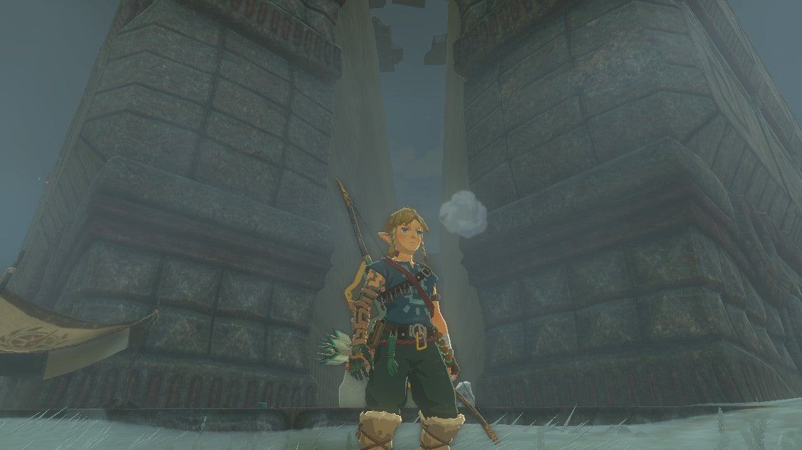
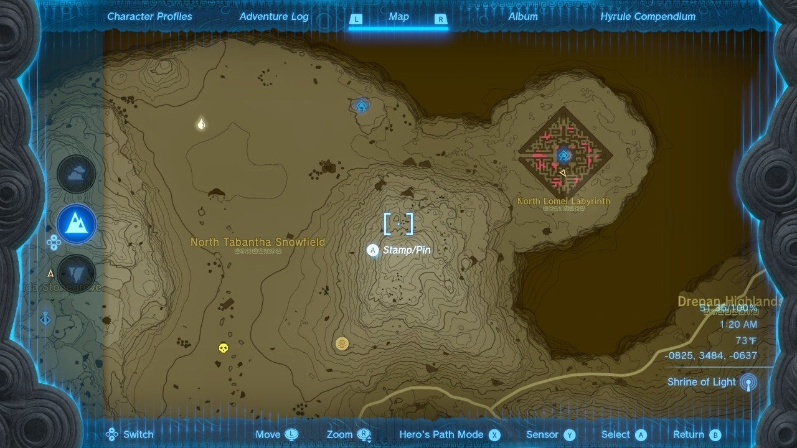
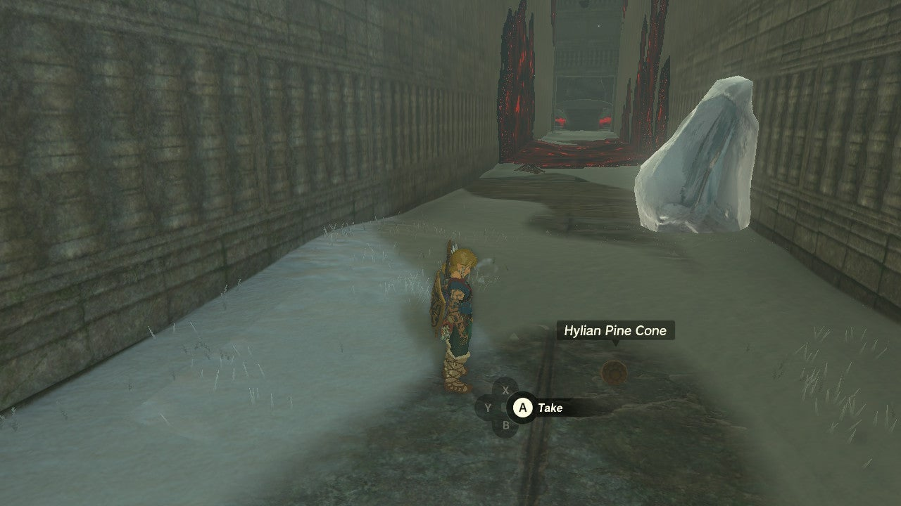
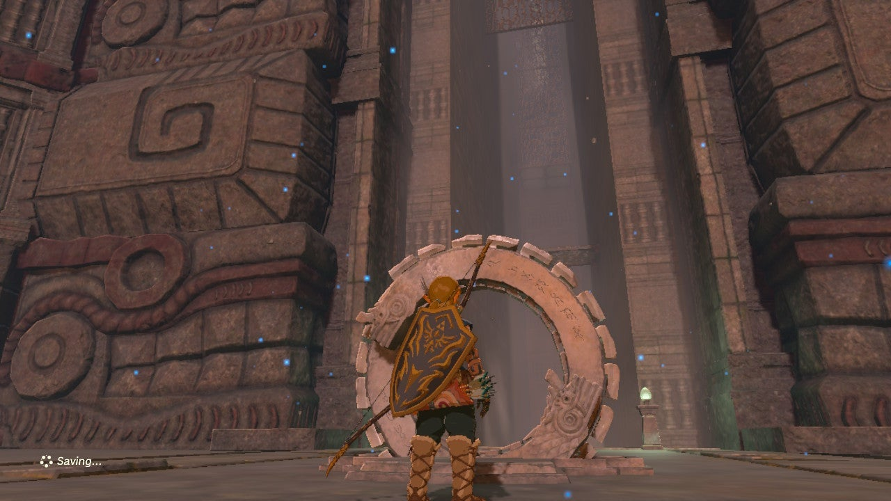
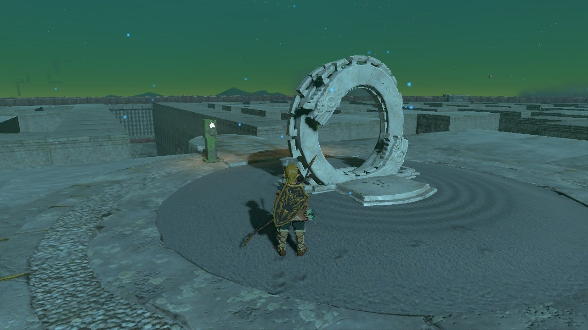
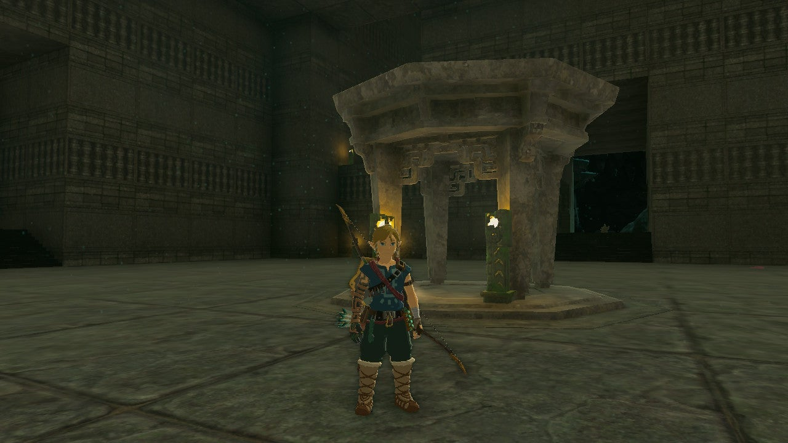
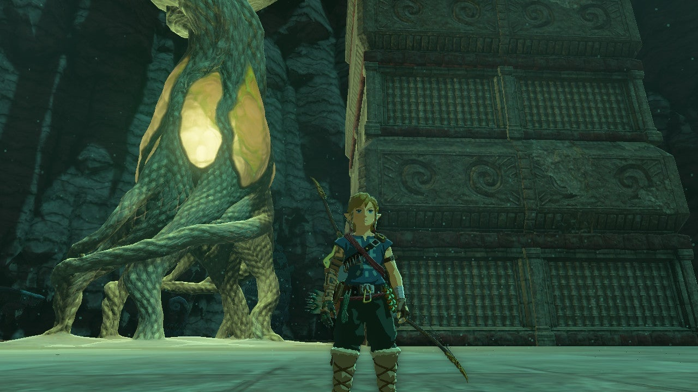

**North Lomei Labyrinth** is one of three labyrinths in The Legend of Zelda: Tears of the Kingdom. This page will help you get to the shrines in both the North Lomei Labyrinth and the sky labyrinth directly above it. Be prepared for a dive into the Depths as well, and a boss battle once you're down below. Labyrinths in Tears of the Kingdom have three different parts that must be completed in the following order: Surface, Sky, Depths. Completing all three will reward you with a special piece of armor. 

## North Lomey Labyrinth Location

The North Lomei Labyrinth is located in the Hebra region at the northern most edge of the map just left of the center. It is accessible from the west by going through the North Tabantha Snowfield. 

## North Lomei Labyrinth Shrine Solution

There are a couple of different ways to get to the shrine at the center of the labyrinth, depending on how you want to go about it. The simplest solution is to start at the entrance and follow a path of pine cones that a Zonai Research team NPC has left leading to the end. 

**Having trouble following the trail?** If you’ve unlocked the improved tracker on your Purah Pad, you can take a picture of the item you are following and then set it to be tracked so that you always have an indication as to where the next closest one is waiting.

However, following that path is far from the most direct route. The Ascend ability allows you to quickly get on top of the labyrinth walls by finding one of the many alcoves or underpasses in the maze, or you can use hit Flint with a metal weapon next to a pile of Wood in order to make a fire, then throw one of those pine cones into the fire to create an updraft strong enough to ride up with your paraglider. From there you can explore the area more safely and quickly. 

The quickest way to bypass the maze entirely is to use one of these tricks to reach the top of the walls, run to the southeast corner of the larger middle section (shown below), then hop back down. From there you can climb a short ladder and follow the path of pine cones to the central chamber and activate the shrine. 

The **Mayaotaki Shrine****doesn’t have a challenge inside it** , so you can easily enter, take the treasure chest, and collect your Blessing of Light. Make sure you also activate the Zonai panel in the room with the shrine in order to unlock the Sky Labyrinth directly above it. 

**Don’t forget the loot!** There is a treasure chest in each corner of this labyrinth that is easily accessible from the top of it, and each one holds a powerful weapon that may be worth grabbing.

## Unlock the North Lomei Castle Top Floor

Once you’ve completed the Labyrinth on the surface, the one in the sky above it will open up and have a shrine waiting for you as well. The quickest way to reach the entrance on the west side is to use the Pikida Stonegrove Skyview Tower and glide to the nearby East Hebra Sky Archipelago. 

From their you can build a flying machine out of a Zonai wing glider and a few fans to soar the rest of the way. You’ll able to complete the Tenbez Shrine outside its entrance at this point, as well as activate the Zonai panel in order to enter a labyrinth with no floor to it. 

## Completing the North Lomei Castle Top Floor Labyrinth

The best way to get through this maze is hover with your paraglider while using using your map as a guide. While this might seem intimidating, the low gravity and strong wind keeps you in the air for substantially longer than usual. There are also plenty of platforms to land on and refill your stamina along the way. Make your way to each of the four panels you need to activate, which should be marked on your map as part of the labyrinth’s side quest. 

Once you have done so, the wind will start to blow harder, allowing you to fly above the walls of the labyrinth and to one final panel near the center. Activating that will unluck a chasm down in the surface maze, letting you dive off this upper one, all the way down, and straight into the depths for one final labyrinth challenge. 

## Completing the North Lomei Depths Labyrinth

While it’s called a Labyrinth, this final area isn’t actually much of a maze. There are some chests with powerful weapons hiding in the corners to find, but ultimately you just throw out some Brightbloom seeds to help find your way to a nearby central chamber with a Flux Construct III waiting to be defeated. 

Once you take it down, activate one final panel and you’ll be rewarded with a chest containing a piece of the Evil Spirit Armor Set: the Evil Spirit Greaves which gives you a stealth boost and mimics the look of Phantom Ganon from Ocarina of Time. The other two pieces can be found in the same way, but at the Lomei Labyrinth Island to the northeast and the South Lomei Labyrinth to the southwest. 

That’s it! But before you leave, don’t forget to go to the top of the Depths labyrinth either by climbing the exterior or using Ascend inside in order to activate a Lightroot on its roof. 

The North Lomei Prophecy

Check out our full overview of the rest of the Labrynths and how to complete them! 

  * Labyrinth Shrines and Solutions
  * Lomei Labyrinth Island
  * South Lomei Labyrinth

See the complete List of Side Quests and Side Adventures

### Up Next: Lomei Labyrinth Island

Previous

Labyrinth Shrines and Solutions

Next

Lomei Labyrinth Island

### Top Guide Sections

  * Walkthrough
  * Zelda: Tears of The Kingdom Switch 2 Edition Guide
  * Zelda Notes Voice Memories
  * List of Side Quests and Side Adventures

### Was this guide helpful?

Leave feedback

Go to comments