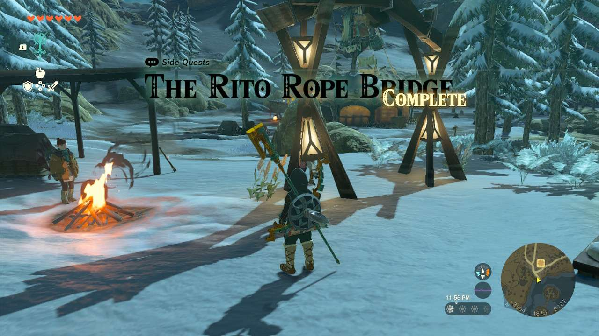
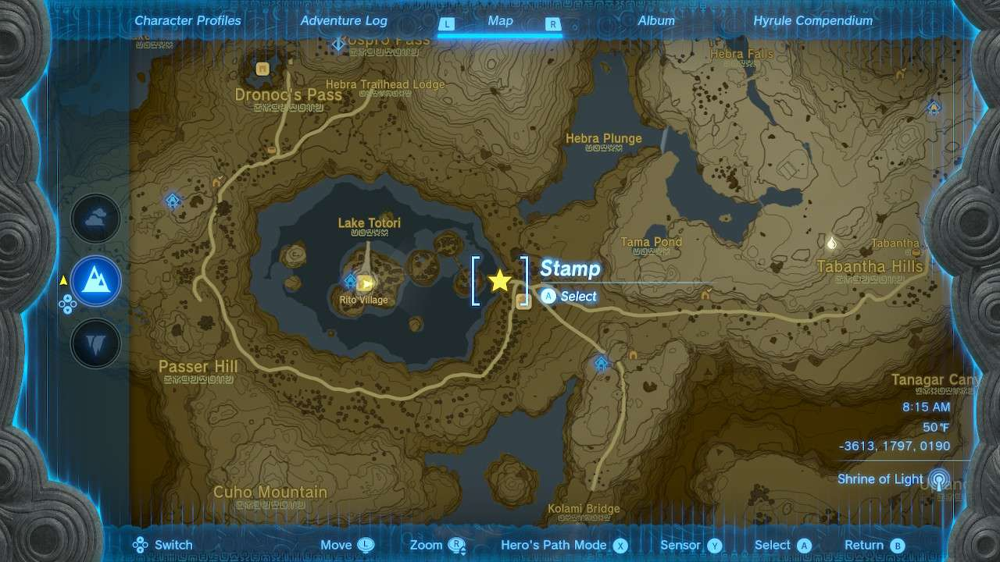
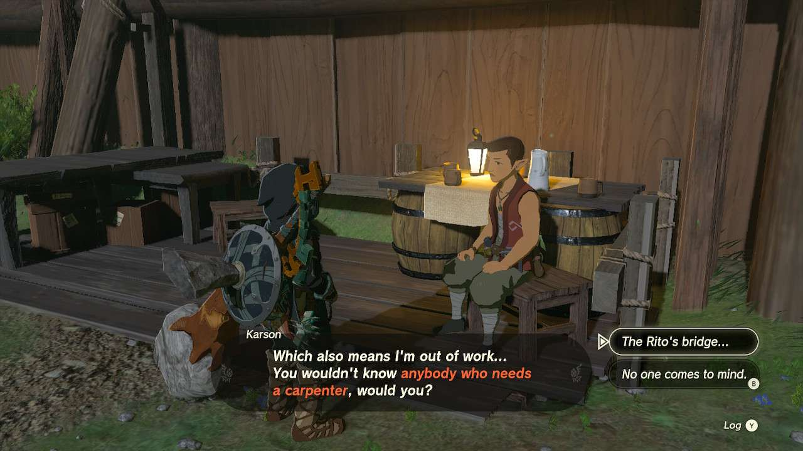
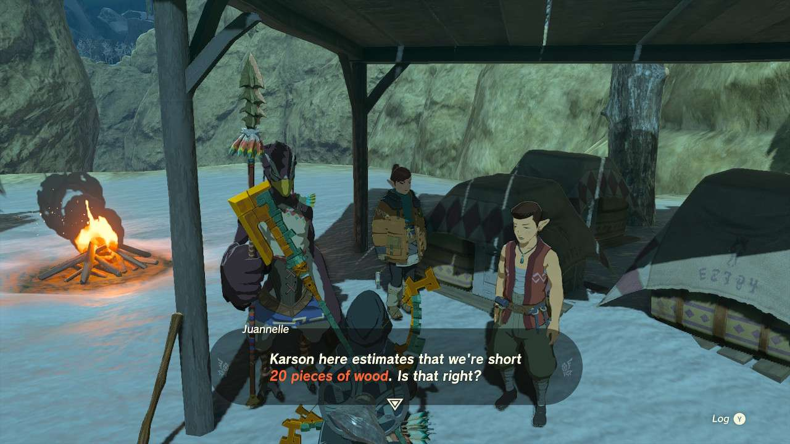
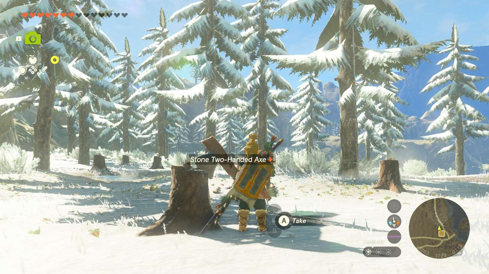
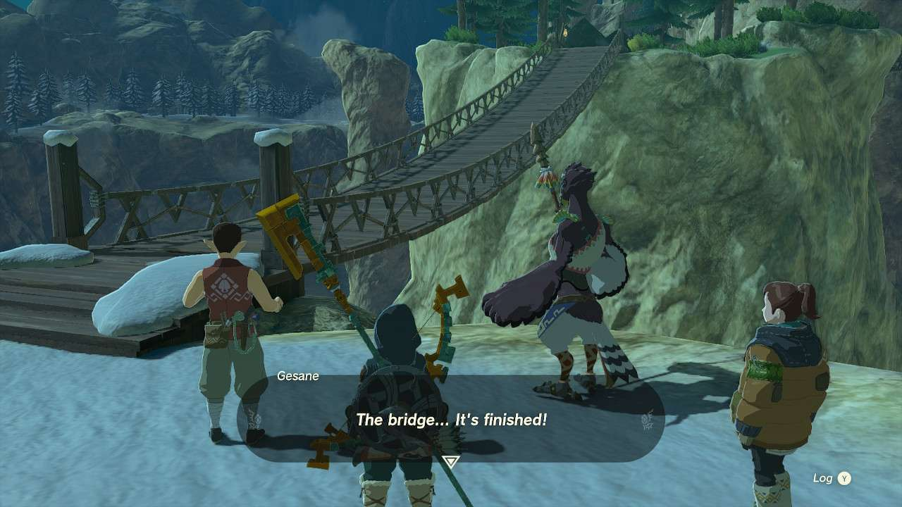

**The Rito Rope Bridge** is one of the many Side Quests to complete in The Legend of Zelda: Tears of the Kingdom. In this guide, we will teach you everything you need to know to complete he Rito Rope Bridge, including where to find it and what you will get as a reward. 

  * **Side Quest Location** : Lucky Clover Gazette, Tabantha Frontier
  * **Prerequisites** : Finish The Incomplete Stable and the Hebra Mountains portion of Regional Phenomena
  * **Rewards** : 100 Rupees

After you finish Tulin of Rito Village and free the region of the snowstorm, you can complete this quest. Between the entry to **Rito Village** and **Lucky Clover Gazette** is a bridge that’s been snapped. With the snowstorm gone, talk to **Gesane** right at the edge of the cliff where they’ll lament at needing to fix the bridge and if someone can fix it. 

The answer to this is to speak to **Karson** , who is back at **Lookout Landing**. If you have completed The Incomplete Stable, Karson will lament how he’s out of work now that the stable is finished. Tell him about the bridge, and he’ll be on his way out there. 

Unfortunately when you return to the bridge, a bit of reality sets in because while they have a craftsman, they don’t have supplies. Karson estimates that it’ll take around **20 wood** in order to fix the bridge. 

If you don’t have those kind of resources on you at the moment, you actually don’t have to look too far for help. Right behind the Lucky Gazette is a stone axe and many trees that you can chop down to make the bundles of wood you need. There is also a stack of wood not too far from them either to give you three or four free pieces of wood to help out. 

Once you have your wood, simply talk to Juanelle and Karson again for the bridge to be completely fixed. You’ll be rewarded with a silver rupee, worth **100 rupees** , as a reward. 

The Rito Rope Bridge

See the complete List of Side Quests and Side Adventures

### Up Next: Walkthrough

Previous

About IGN's Zelda TotK Guide Writers

Next

Walkthrough

### Top Guide Sections

  * Walkthrough
  * Zelda: Tears of The Kingdom Switch 2 Edition Guide
  * Zelda Notes Voice Memories
  * List of Side Quests and Side Adventures

### Was this guide helpful?

Leave feedback

### In This Guide

The Legend of Zelda: Tears of the KingdomNintendo EPD

Initial Release: May 12, 2023

Learn more

Go to comments